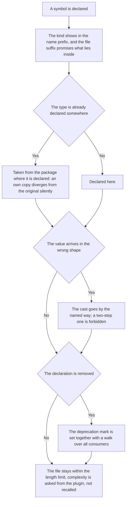

<!-- rt-kit v0.25.0 · rules/typescript-conventions.md · 09d9b5fd6153 · правится надстройкой, не здесь -->

# Code structure — how it works here

Rule under the law `docs/constitution/code-structure.md`. The law says what must be true about
declarations; here — how that is written in this tree.

## What it is called here

| In the law                    | Here                                                                 |
| ----------------------------- | -------------------------------------------------------------------- |
| the kind sign in the name     | a prefix: `I` on an interface, `E` on an enum, `T` on a type         |
| a watched source              | the `$` suffix on an observable and `Source` on a subject            |
| a private field               | `#field`, not `private field`                                        |
| a backend procedure           | a class with the `@ConnectProcedure()` decorator, one per procedure  |

## Where it lives

In this tree — the table in `implementation.md` next to it. Paths live there, not here: the rule
travels between repositories, the layout does not, and a path named in the rule lies in the
first tree that keeps its code differently.

## Flow

The flow of declaring a symbol: what sets the name, where the type comes from and what is done
with a removed declaration.



## How the law applies here

- **The kind of a declaration shows in the name prefix, and three linter rules hold that.** The
  interface, the type and the enum each have their own; all three are raised for all `.ts`.
      <!-- rt-when: *.ts -->

- **A watched source is named by a suffix.** The subject and the observable raised from it differ
  at the place of use, not by jumping to the declaration.
      <!-- rt-when: *.ts -->

- **The file name suffix finds the promised declaration inside.** The list of suffixes is closed:
  a word not in it does not count as a suffix, and the rule does not judge such a file.
      <!-- rt-when: *.ts -->

- **A file is no longer than 500 lines, and all lines count — blank ones and comments too.** A
  file that does not fit on one screen whole is read in parts, and an edit in it is made without
  seeing the rest. For `.ts` a linter rule holds this; harness files — scenarios and scripts — do
  not reach it and are judged by a separate check of the tree. What had accumulated by the day of
  enabling is listed by name, and a line leaves that list together with the split of its file.
      <!-- rt-when: *.ts -->

- **A value from a closed set arrives as an enum `E<Name>`, not as a string or a number at the
  place of use.** The key of a translatable field, a tab name, a cover slot, a record kind — all
  these are sets: the form, the store, the markup and the draft comparison name them, and a value
  written in place is neither found across the tree nor edited in one go. The enum lives in the
  `util` layer of the domain that owns the set, and what is shared by several applications — in
  the shared lib. A single address, a separator and a signature sign do not become an enum: they
  have no closed set, and they are declared as a file constant with a telling name.
      <!-- rt-when: *.ts -->

- **A type is taken from the package where it is declared.** An own copy of a foreign type
  diverges from the original silently, and only one of them compiles.
      <!-- rt-when: *.ts -->

- **A value declared by one side of an exchange is not recomputed by the other side but taken
  from the first.** Two computations of one value diverge silently: the tree trait was computed by
  both the send and the mark — each with its own copy — the copies diverged, and the mark never
  once found a single record of its own. Both sides answered as usual all the while, and the miss
  was found only from a third side: by reading what actually landed.
      <!-- rt-when: *.ts -->

- **The two-step cast `as unknown as` is forbidden by a linter rule.** Instead — an honest type,
  narrowing by a check or reading the field by shape (`Reflect.get`); a place where nothing else
  works is marked with a spot disable and the reason on the same line.
      <!-- rt-when: *.ts -->

- **A deprecation mark is set together with a walk over the consumers.** All rules of
  `eslint-plugin-sonarjs` are raised to refusal at once, and a mark on a type paints every place
  that still calls it: one `@deprecated` per file gave seventeen findings in foreign domains.
      <!-- rt-when: *.ts -->

## What of the law is not here

A one-step cast stays unchecked — that is `Q-CS-4` in the law: of seventy-six casts eight are
mandatory, and a blanket ban would refuse them.

Tests are taken out from under the ban entirely: a hand-written database double is an accepted
technique here, and the ban would have to be bypassed in each of the thirty-five.

The file-name rule judges a promise, not its absence: `menu.items.ts` and `sign-in.ts` do not
fall under it at all — that is `Q-CS-3` in the law. Of the two mapper forms accepted here — a
class on the front end and pure functions on the backend — the rule accepts both: it judges the
name, not the structure, and that there are two forms remains the question `Q-S-1` in the
shared-code law.

On `libs/api/**` and `apps/api/**` the rule applies whole, but the signal API and `inject` do
not belong there: that is NestJS with constructor DI.

## Patterns

- `ts-procedure` — create a Connect procedure on the backend: class, decorator, right,
  registration.

## Pitfalls

- **Function complexity limits are asked from the plugin, not recalled.** Where the tree raised
  the `sonarjs` rules at once, to refusal, the branching and nesting numbers come as plugin
  defaults and are not written by a line of their own in the config: they change with its
  version while looking like a tree agreement. Over one task they were asked three times, each
  time anew, and twice named from memory — both times wrong.

    ```bash
    node -e 'const s = require("eslint-plugin-sonarjs");
        for (const n of ["cyclomatic-complexity", "cognitive-complexity", "nested-control-flow"])
            console.log(n, JSON.stringify(s.rules[n].meta.defaultOptions));'
    ```

- A cast through `as Type` in a mapper is forbidden but watched by nothing: it accepts any value
  and compiles. Instead — `this.typeCast`.
- An unused parameter is removed, not renamed: an underscore before the name hides the finding,
  but the parameter stays in the signature.
- A Prisma aggregate is not annotated with its own type: its generated type is wider than the
  query result, and the annotation lies.
- A linter rule of one's own is enabled together with converting everyone it catches: enabled on
  top of what has accumulated, it gives a red run on files the edit did not touch.
- `#field` is visible only inside the class and is not accepted by `viewChild` — there the field
  is declared `protected`.
- The linter does not count a logical assignment as a read of a private field: where `??=` is the
  only access to the field, the unused-private-members rule answers "is defined but never used".
  The field is live, and the message says the opposite, and whoever read the refusal goes to
  remove the declaration. The replacement — an explicit early return and an assignment after it.
