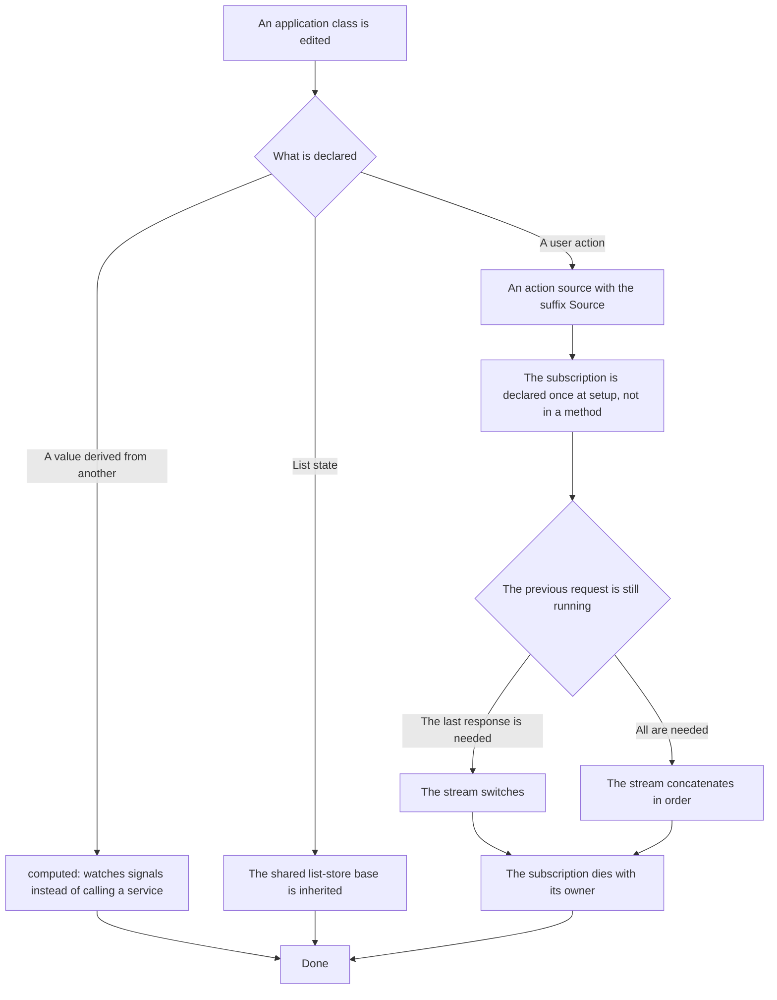

# Screen reactivity — how it works here

Rule under the law `docs/constitution/frontend-application.md`. The law says what must be true; here
— what it stands on in this tree. The layout of the component file — `component-structure`, styles —
`styling-bem`, the browser environment — `platform-access`, the layer that talks to the server —
`api-layer`. All five under one law.

The rule is about the frontend: `libs/api/**` and `apps/api/**` are NestJS, with an environment of
their own, and nothing listed applies there.

## What it is called here

| In the law                   | Here                                                                                              |
| ---------------------------- | ------------------------------------------------------------------------------------------------- |
| state that recomputes itself | `signal()` and `computed()`; Angular without Zone.js (`provideZonelessChangeDetection()`)         |
| component input and output   | `input()`, `input.required()`, `output()`; `viewChild()`, `contentChild()` and their plural pairs |
| redraw on demand             | `ChangeDetectionStrategy.OnPush` — on every component                                             |
| owner of a subscription      | `takeUntilDestroyed(this.#destroyRef)`                                                            |
| action source                | a `Subject` with the suffix `Source` in the field name                                            |

## Where it lives

In this tree — the table in `implementation.md` next to it. Paths live there, not here: the rule
travels between repositories, the layout does not, and a path named in the rule lies in the first
tree that keeps its code differently.

## Flow

The flow of editing an application class: where the executor starts, where the fork is between a
derived value and an action, and how each branch ends.

## How the law applies here

- **A subscription is declared once, not in the action method.** The method pushes a value into the
  source, and the long-lived subscription with `switchMap`, `exhaustMap` or `concatMap` is declared
  in the constructor, in `ngOnInit` or in a field initializer.
- **A subscription dies with its owner.** `takeUntilDestroyed` goes into the same stream where the
  subscription is declared.
- **An action source carries the suffix `Source` in its name.** Otherwise the stream and the value
  cannot be told apart in code, and `next` goes to the wrong place.
- **A service call inside `computed` does not become a dependency.** A derived value watches only
  the signals it read, and an ordinary method is not a signal: the value stays what it was at the
  first computation. The current language, the current property, the current environment sign are
  read from a service signal — then the derived value rebuilds with their change. Neither the build
  nor the linter sees this.
- **A list store inherits the shared base.** Records, page, order, filter conditions, search string
  and query config are already there, and the heir is left with four lines.

## What of the law is not here

Neither `OnPush`, nor the signal input API, nor the absence of getters in components is checked by
anything: `@Input()` and a getter compile and work, and the divergence is seen only by reading.
Access to the browser environment is not checked either — that is `Q-FA-1` in the law.

## Patterns

- `angular-patterns-state` — signals, derived values, service state, subscription.

## Pitfalls

- **A derived value is computed with `computed`, not with an effect.** An `effect` that puts a value
  into a signal is a manual recomputation, and sooner or later it lags behind the source.
- **There are no getters in components.** A getter is recomputed on every redraw, and its cost is
  visible nowhere in the code.
- **A static attribute without a value sets the input to an empty string, not to the default.**
  `<ng-template someControl>` gives `''`, and an input with a meaningful default loses it silently.
  A signal input with an alias is no different from `@Input()` here. An input whose default means
  something coerces the empty string to it itself — a `transform` or a check in `computed`.
- **A subscription on every method call gives no way to choose what to do with the previous
  request.** Fast presses give a race of responses, and the one that returned last wins, not the one
  pressed last.
- The ban on a subscription in a method goes by the name `subscribe`, not by type: a call with that
  name on anything counts as a subscription, and `const fn = stream$.subscribe` without a call does
  not. Allowed are the constructor, `ngOnInit`, a field initializer and everything declared outside
  the class; forbidden are the other methods, including private ones with `#`, getters and
  `ngAfterViewInit`.
- DOM initialization after the first render — `afterNextRender()`, not `ngAfterViewInit`: the site
  is served by the server, and the DOM appears there later.
- Angular does not accept `viewChild` on a `#` field — the field is declared `protected`.
