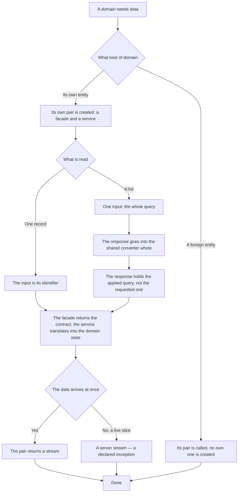

# Server access — how it works here

Rule under the law `docs/constitution/frontend-application.md`. The law says what must be true; here
— what the server access layer is made of. State — `angular-patterns`, the component file —
`component-structure`, styles — `styling-bem`, the browser environment — `platform-access`. All five
under one law.

The rule is about both front-end families: `libs/admin/*/api/**` and `libs/site/*/api/**`. On the
backend the word `api` means an exit to a foreign service and is arranged differently — there it is
`typescript-conventions`.

## What it is called here

| In the law      | Here                                                                         |
| --------------- | ---------------------------------------------------------------------------- |
| page of records | `IPageModel` — `pageNumber`, `pageSize`, `totalCount`                        |
| list query      | `IList.Query.State` — page, order, filter conditions, search string          |
| list response   | `data`, `pageModel`, `sortModel`, `filterModel`, `searchTerm`                |
| request path    | screen → store → `<Entity>ApiService` → `<Entity>ApiFacade` → Connect client |

## Where it lives

In this tree — the table in `implementation.md` next to it. Paths live there, not here: the rule
travels between repositories, the layout does not, and a path named in the rule lies in the first
tree that keeps its code differently.

## Flow

The flow of a domain fetching data: the pair of classes, the type boundaries between them and the
fork between a list and a single record.

## How the law applies here

- **A domain fetches data by a pair of classes: the facade calls the procedure, the service
  translates the models.** One class for both jobs would mean that replacing the source drags the
  translation along.
- **The facade knows only the contract, the service returns only `State`.** A type from the contract
  does not reach the store and the template.
- **A list has one input — the query.** The object the list is bound to, the feed type, the
  subscription state — those are filter conditions like any other, and they lie in `filterModel`.
- **The list response goes into the shared converter whole.** The contract returns the page in the
  same shape as the model, and no intermediate object remains in the service.
- **Order and filter fields are domain enums, not a bare string.** A bare string means that a name
  the server does not sort by compiles and fails as a request.
- **The pair returns a stream, not a promise.** The base of the list store works with streams, and a
  promise service does not fit into it.

## What of the law is not here

Only the lists the server returns a page for go by the shared query — the `page_model` sign in the
procedure response. Requests and objects arrive whole: they have no procedure with a page yet, and
those are debts `Q-L-5` and `Q-L-7`, not another shape of the layer.

Stores that still hold the previous signature call the stream through `firstValueFrom` and carry a
comment above the class saying when the bridge goes away. A new store does not create a bridge.

## Patterns

- `api-layer-pair` — a ready-made facade, service and query translation.

## Pitfalls

- **The query in the response is the applied one, not the requested one.** Otherwise the screen will
  not see the default order and a condition the server dropped.
- **One pair — one entity.** An object, its previous addresses and its calendar subscriptions have
  pairs of their own, although the procedures lie in one proto service.
- **A method the domain does not have is not declared.** Everyone reads the list, not everyone
  edits.
- **A server stream is the exception to the rule about the stream:** the live slice of metrics and
  the feed of incoming records arrive as an async iterator, and there is nothing to wrap it into.
- A domain does not create its own copy of the shared page, order and filter mappers — the second
  instance is caught by `npm run check:dupes`.
