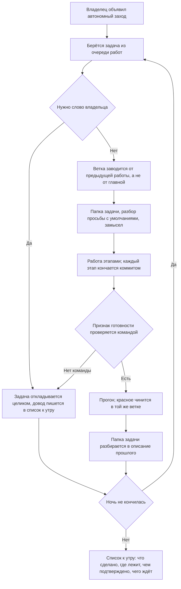

# Автономный заход — как это устроено здесь

Правило под закон `docs/constitution/autonomous-work.md`. Закон говорит, что должно быть верно,
когда владельца нет рядом; здесь — чем это названо в дереве и что меняется в обычном ходе
работы. Сам ход работы — правило `task-flow`, конец хода — `turn-conduct`, поставка —
`git-workflow`: автономный заход их не отменяет, а сужает.

## Как это называется здесь

| В законе                      | Здесь                                                                        |
| ----------------------------- | ---------------------------------------------------------------------------- |
| автономный заход              | просьба владельца работать без него, названная словами и границей по времени |
| умолчание вместо вопроса      | строка «Решения» в разборе просьбы: принятое, довод и цена ошибки            |
| работа, видная снаружи        | пуш ветки, открытие заявки, слияние, публикация пакета, отправка груза       |
| череда                        | ветка каждой следующей работы заводится от ветки предыдущей                  |
| список к утру                 | последняя реплика захода: работа, ветка, чем подтверждена, чего ждёт         |
| отложенная работа             | задача, которой нужно слово владельца: состояние на борде не двигается       |

## Где это лежит

В этом дереве — таблица в `implementation.md` рядом: чем объявляется автономный заход, где
ведётся список к утру и какой ключ у задач череды. Пути живут там, а не здесь: правило
переносится между репозиториями, а раскладка у каждого дерева своя.

## Ход

## Как закон применяется здесь

- **Ветка следующей работы заводится от предыдущей, а не от главной.** Первая — от главной,
  каждая следующая — от вершины прошлой: `git checkout -b <ключ>-<номер>-<slug> <прошлая ветка>`.
  Владелец вливает их по очереди снизу вверх, и заявка каждой стоит на предыдущей.
- **Наружу за ночь не уходит ничего.** Ни пуша, ни заявки, ни слияния, ни публикации, ни
  отправки груза в приём: всё это видно другим, а отменяет их человек. Отметки груза,
  требующие слияния, тоже ждут — они утверждают то, чего в главной ветке ещё нет.
- **Задача, которой нужно слово владельца, не берётся вовсе.** Её состояние на борде не
  двигается: взятая и отложенная задача выглядит начатой, а следующий заход её пропускает.
- **Умолчание записывается там же, где записался бы ответ владельца.** Строкой в разборе
  просьбы: что принято, почему и что будет стоить ошибка. Молчаливое умолчание неотличимо от
  знания.
- **Признак готовности называется командой до начала этапа.** Взгляд исполнителя в автономном
  заходе не подтверждает ничего: проверить его некому до утра.
- **Красный прогон чинится в той же ветке, а не откладывается.** Отложенный, он достаётся
  владельцу вместе с веткой, которую нельзя влить.
- **Отказ стража — шаг работы, а не конец захода.** Он называет пропущенное; пропущенное
  делается, и работа идёт дальше. Обход стража остаётся запрещённым и в автономном заходе.
- **Список к утру пишется по ходу, а не вспоминается в конце.** Каждая закрытая работа
  дописывает свою строку: ночь длиннее окна, и вспомнить её целиком к утру нечем.

## Чего из закона здесь нет

Границы захода по времени не проверяет ничто: заход кончается тогда, когда кончилась работа или
владелец сказал слово. Соблюдение запрета на видимое снаружи держится тем же — правилом, а не
стражем: команда пуша ничем не отличается от той, что делается днём.

## Паттерны

- `autonomous-work-run` — готовый цикл ночи: череда веток, запись умолчания, список к утру,
  разбор отказа стража.

## Ловушки

- **Ветка, заведённая от главной по привычке, ломает череду.** Заметно это только у владельца и
  только на втором вливании; чинится перезаведением ветки, пока работа не ушла далеко.
- **Задача, отложенная без строки в списке, теряется.** Утром её не видно ни на борде, ни в
  ветках: она выглядит просто не взятой.
- **Умолчание, записанное в теле коммита, до владельца не доходит.** Он читает список и папку
  задачи, а не историю ветки.
