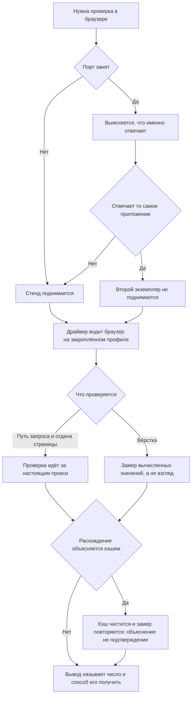

# Проверка работающего приложения — как это устроено здесь

Правило под закон `docs/constitution/verifiability.md`. Закон говорит, что считается
подтверждением; здесь — где живут приложения, чему на них можно верить и чем измерять. Тесты
под тем же законом — правило `testing`.

## Как это называется здесь

| В законе                          | Здесь                                                                                           |
| --------------------------------- | ----------------------------------------------------------------------------------------------- |
| работающее приложение             | то, что поднято в этом дереве; перечень и порты — в `implementation.md` рядом                   |
| место, где его видит пользователь | прод-сборка за настоящим прокси дерева, а не дев-сервер                                         |
| замер                             | `getComputedStyle`, `getBoundingClientRect`, контраст, совпадение центров, попадание во вьюпорт |
| драйвер браузера                  | `claude-in-chrome` на закреплённом профиле этого дерева                                         |

## Где это лежит

В этом дереве — таблица в `implementation.md` рядом. Пути живут там, а не здесь: правило
переносится между репозиториями, раскладка — нет, и путь, названный в правиле, врёт в первом
же дереве, которое держит код иначе.

## Ход

Ход проверки через браузер: что выясняется до первого запроса, где развилка между поднятым и
не поднятым приложением и чем подтверждается вывод.

## Как закон применяется здесь

- **Второй экземпляр уже поднятого приложения не поднимается.** До первого запроса выясняется,
  кто отвечает на порту: поднятый заново экземпляр отвечает своей сборкой, а не той, которую
  проверяют. Кто поднимает стенд — владелец или агент, — сказано в именах дерева. Занятый порт,
  обнаруженный поздно, означает, что стенд уже есть: запущенное поверх него останавливается по
  идентификатору процесса, а не по имени команды — у обоих экземпляров оно одно.
- **Браузер водится одним драйвером на закреплённом профиле.** Остальные двери — второй
  драйвер, `open`, `osascript`, запуск бинарника — закреплённый профиль не спрашивают вовсе.
- **Выбор браузера протухает и требует повторного вызова.** Выбор, сделанный в начале
  сессии, не держится: после паузы следующий вызов открывает вкладку в другом профиле молча.
- **Профиль не выбирается из списка и не спрашивается у владельца.** Список отдаёт неустойчивые
  имена, которые не опознают ничего, а выбор из него ведёт на профиль без входа.
- **Прод-конфигурация проверяется только за настоящим прокси.** Голый сервер отдачи страниц
  про кэш, перенаправления и заголовки не знает ничего.
- **Первый заход на публичный экран метится признаком служебного посещения.** Драйвер водит
  обычный браузер, и счётчик посещений не отличает проверку от гостя: `navigator.webdriver` у
  него `false`, строка `User-Agent` — живого браузера. Чем метится заход, сказано в именах
  дерева; признак, который живёт в хранилище браузера, дописывается один раз на профиль, а не
  к каждому адресу.

Вывод о вёрстке подкрепляется числом: «выглядит нормально» результатом проверки не является.
Этого не стережёт ничто — как измерять, разобрано в паттерне `browser-verification-measure`.

## Чего из закона здесь нет

Проверки на прямое обращение к окружению браузера нет — это `Q-FA-1` в законе о фронтовом
приложении: такое обращение компилируется и падает только при отдаче страницы сервером.

## Паттерны

- `browser-verification-stand` — честный стенд из прод-сборки, вход в закрытое приложение,
  разбор порта.
- `browser-verification-measure` — замер вместо взгляда, ловушки инструмента `computer`.

## Ловушки

- **Сначала выяснить, что отвечает на порту:** `lsof -nP -iTCP:<порт> -sTCP:LISTEN` до первого
  запроса. На порту приложения регулярно висит собранный артефакт из прошлой сессии — он
  отвечает 200 старым кодом, а заведённого в ветке обработчика у него нет вовсе, и 404 читается
  как дефект регистрации. Таких процессов бывает несколько; снятие по шаблону команды не
  попадает ни в один — убивать по PID из `lsof`, каждый.
- **Шаблон имени команды не годится ни чтобы попасть, ни чтобы не задеть.** Два экземпляра
  одного стенда — уже поднятый и только что запущенный — по тексту команды неотличимы: она у них
  одна и та же. Снятие по шаблону уносит оба, и разобрать это потом нечем: снятым оказывается
  ровно тот стенд, ради которого всё затевалось. Своё и чужое различает только идентификатор
  процесса, снятый разбором порта; им и останавливают, поштучно. Обратный промах тот же по
  природе — оболочка запускает процесс под именем, которого в шаблоне нет, и снятие не попадает
  ни во что.
- Инкрементальная сборка протухает поштучно: разметка бывает уже новая, а клиентский чанк — от
  компиляции до правки. Признак дев-сборки — имена бандла без хеша (`main.js`). Расхождение
  между `curl` и страницей после гидратации — повод пересобрать, а не искать дефект в коде.
  Отсюда же нельзя делать вывод «такого маршрута нет»: сверяться с объявлением маршрутов.
- **Кэш объясняет расхождение, но не подтверждает его.** В `.angular/cache/…/vite/deps` лежат
  только пакеты из `node_modules`, кода репозитория там нет вовсе. Вывод «дефекта нет, это
  кэш» закрывает разбор, поэтому принимается только после проверки на чистой сборке — три
  круга ушло на застрявшую панель ленты событий, пока дефект лежал в снятии аутлета.
- Сообщение `Angular debugging APIs are not available` в консоли принадлежит расширению
  Chrome, а не приложению: прод-сборка не публикует `window.ng`. Лечить правкой кода не надо —
  `window.ng` в проде это карта внутренностей в руках любого, кто откроет консоль.
- Поведение роутера воспроизводится нажатиями: подстановка адреса и заход по прямой ссылке
  поднимают приложение заново, и накопленного состояния у него нет.
- Замер отвечает только на заданный вопрос. Строки попапа профиля сошлись с образцом по
  отступам, кеглю и скруглению, а фон на наведении образец в этом месте не красит вовсе —
  полноширинная подсветка держалась два круга при верных числах.
- **Если сменилась версия пакета, который рисует вёрстку, экраны обходят руками.** Тесты
  нажимают по `qa-dataid` и остаются зелёными, даже когда отступ съехал, размер пропал, а
  строка стала другой высоты: они проверяют переходы, а не вид. Пары скриншотов тут тоже мало
  — смотрят по очереди все экраны, которые этот пакет рисует.
- **Путей запуска здесь три, и проверять их надо порознь:** локальная команда, образ
  `deploy/api.Dockerfile` и состав `docker-compose.prod.yml`. Переменная, заданная в команде
  проверки, не говорит про образ ничего: в составе прода она есть, а ручной прогон того же
  образа идёт без неё. Пути перечисляются до проверки, а не после того, как один из них
  сошёлся.
