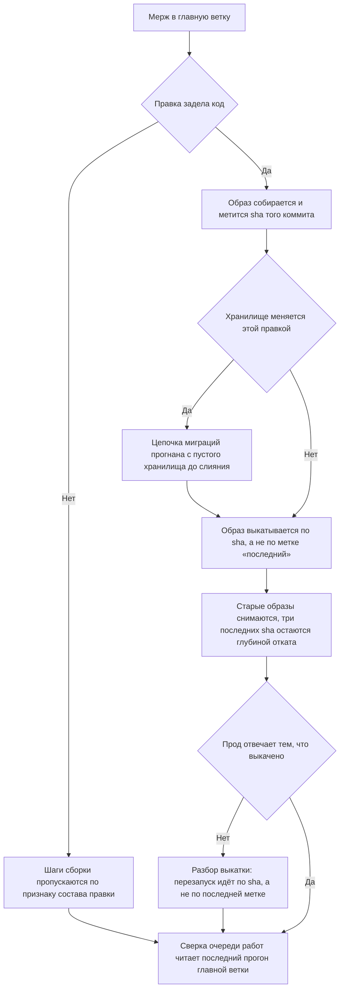

# Выкатка — как это устроено здесь

Правило под закон `docs/constitution/delivery.md` — та его часть, что про прод. Закон
говорит, что должно быть верно; здесь — каким приёмом это держится в дереве, лежащем
на GitHub. Работа с очередью, ветка, коммит и заявка — правило `git-workflow` под тем же
законом.

## Как это называется здесь

| В законе                         | Здесь                                                    |
| -------------------------------- | -------------------------------------------------------- |
| попадание правки в главную ветку | мерж PR; чем запускается выкатка — слиянием или ручным запуском, — называет компаньон рядом                                                                                                                               |
| образ того коммита               | `IMAGE_TAG=<sha>` в командах `docker compose` на сервере                                                                                                                                        |
| изменение хранилища              | миграция в `prisma/migrations/<метка>_<имя>/`                                                                                                                                                   |

## Где это лежит

В этом дереве — таблица в `implementation.md` рядом. Пути живут там, а не здесь: правило
переносится между репозиториями, раскладка — нет, и путь, названный в правиле, врёт в первом
же дереве, которое держит код иначе.

## Ход

Ход выкатки: что уезжает на прод, чем помечен образ и что делается со старыми.

## Как закон применяется здесь

- **Конвейер судит по составу правки, а не гоняет всё подряд.** Шаги, которым нечего проверять,
  пропускаются по признаку, посчитанному от главной ветки: ветка, не тронувшая ни строки кода,
  не поднимает стенда, не снимает кадров и не собирает образов. Признак считается один раз и
  объявляется выводом шага, а не переспрашивается в каждом условии. Пропущенный шаг виден в
  прогоне пропущенным — молча выпавший читается как пройденный.
- **Чем запускается выкатка, называет дерево, а не правило.** У одного дерева прод едет от
  мержа, у другого — ручным запуском, и сказанное здесь безусловно врёт про второе: правило
  приходит в контекст каждой сессии, и прочитавший его считает влитое выкаченным. Прод,
  отставший от главной ветки на сотни коммитов, так и читался поломкой приложения. Строка стоит
  в компаньоне рядом, вместе со способом спросить, что выкачено на самом деле.
- **Выкатка идёт от мержа — переменные окружения, секреты и записи имён ставятся до него.**
  Исключения по путям покрывают только документы. Дерево с ручным запуском эту статью читает
  иначе: там граница — сам запуск, и до него ставится то же самое.
- **Признак режима объявлен в образе, а не только в составе прода.** Значение, заданное
  составом, действует лишь на контейнер, поднятый этим составом; ручной прогон того же образа
  идёт с пустым значением, а пусто здесь означает локалхост — со всеми отладочными
  умолчаниями, которые он разрешает. Умолчание образа задаётся в самом образе.
- **Состав прода поднимается на своей машине до слияния, а не после.** Собранный образ говорит
  только о том, что сборка прошла: шаг наката, вход в хранилище, порядок подъёма и то, что
  каждому контейнеру хватает положенного внутрь, видны одним запуском состава. На своей машине
  это стоит одной команды, а на узле стоит выкатки, которую уже не отменить, — отказ наката
  вылезает логом контейнера на узле.

- **Образ несёт все файлы, которые читают его собственные шаги запуска.** Схема хранилища,
  настройка клиента, шаблон окружения — всё, что лежит рядом в репозитории, внутрь образа само
  не попадает, а сборка отвечает только на вопрос, собрался ли он. Отказ приходит на первом
  подъёме, то есть уже на выкаченном.
- **Образы выкатываются по sha коммита, а не по метке «последний».** Метка в реестре отстаёт
  от главной ветки, и прод молча возвращается к прежней версии, продолжая отвечать.
- **Убирает за собой и та машина, которая образы собирает.** Отбор у обеих один — своё имя
  реестра, три последних sha, поднятые контейнеры остаются, — и зовётся он одним сценарием:
  разойдясь, две чистки начали бы оставлять разное, а заметить это нечем. Отличаются они
  хвостом: сервер снимает следом висячие слои и кэш сборки, машина сборки оставляет их себе,
  иначе каждая сборка идёт как первая. Чистка на сборке не ждёт мержа: образ ветки занимает
  столько же места, в реестр не уезжает вовсе и точкой отката не бывает.
- **Выкатка убирает за собой старые образы, оставляя три последних sha.** Помеченный sha образ
  висячим не бывает никогда, и чистка висячего его не касается: за полгода они съедают диск
  сервера целиком. Три sha — это глубина отката, и меньше брать нельзя: поломка, замеченная
  через две выкатки, откатывается уже некуда.
- **Состоявшаяся поломка прода разбирается записью, а не одной починкой.** Починка уезжает
  веткой, задача закрывается — и причина, по которой приложение встало, остаётся знанием одного
  исполнителя. Запись называет, что сломалось, чем это стало видно и почему починка чинит
  причину, а не признак; лежит она среди описаний состоявшегося, каталог называет компаньон
  правила слога.
- **Правка самой выкатки прогоняется до слияния, а «проверю после слияния» решением исполнителя
  не бывает.** Прогнать её иначе нечем: она исполняется только там, где выкатывает. Прогнать
  нечем и вручную — тогда это говорится владельцу словами, вместе с тем, чего проверка стоила бы,
  и решение отложить принимает он.
- **Описание прода правится вместе с составом прода.** Устройство, путь запроса, гейты и
  бэкапы описаны текстами вне слоёв правил, и ни линтер, ни сборка их не читают: расхождение
  копится молча, а читают эти тексты как действующие. Пару стережёт гард документов.
- **Правка конвейера прогоняется до мержа ручным запуском.** `workflow_dispatch` у выкатки
  запускает её на любой ветке, а сама выкатка прибита условием к главной: прогон ради проверки
  доходит до сборок и там кончается. Триггер регистрируется по главной ветке, поэтому правку,
  которая его заводит или переносит, ручной запуск не покрывает. Прогон команд задания на своей
  машине не покрывает её тоже: он проверяет команды, а не файл конвейера, — верность самого
  файла читается только по списку прогонов после пуша.
- **PR проверяется до мержа тем же конвейером, что и главная ветка.** Проверки и сборки
  образов идут на событии `pull_request`, выкатка — нет: её держит условие по главной ветке у
  своего задания, а образ PR в реестр не уезжает.
- **Расхождение прода с главной веткой видно сверкой очереди работ.** Задача уходит из очереди
  мержем, но мерж — ещё не прод: отказавшая или незапущенная выкатка не трогает ни задачу, ни её
  колонку, и заметить её неоткуда. Сверка спрашивает последнюю успешную выкатку и считает, на сколько от неё ушла главная
  ветка. Прогон главной ветки для этого не годится: там, где выкатку запускают рукой, слияние
  прод не двигает вовсе, и прогон о нём не говорит ничего — прод отставал на 476 коммитов, а
  сверка молчала. Дерево, не назвавшее рабочего потока выкатки, сверки не получает, и она
  говорит об этом вслух.
- **Цепочка миграций прогоняется с пустого хранилища до мержа.** Порядок применения
  лексикографический по имени каталога, а метку времени ставит момент создания: миграция из
  ветки, начатой раньше, встаёт перед той, от которой зависит.
- **Расхождение миграций со схемой меряется на теневом хранилище, а не на том, где работает
  тот, кто пушит.** Оно законно несёт след любой недоделанной ветки, и сверка с ним держала бы
  чужую правку. Гейт и выкатка зовут одну и ту же проверку — иначе «сошлось» станет значить в
  двух местах разное.
- **Пропуск сверки схемы законен, пока ветка не трогала хранилища.** Погашенная база — состояние
  машины, а не повод отбить пуш документации; но ветка, правившая схему или миграции, без прогона
  цепочки уезжает в главную вслепую, и падает не она, а выкатка. Проверка в такой ветке отказывает
  и называет, чем базу поднять.
- **Упавшая выкатка видна сверкой очереди работ отдельно от отставшего прода.** Слияние — ещё не
  выкатка: отказавшая оставляет главную ветку впереди сервера, и слияния поверх уедут туда же.
  Отставание считается по последней успешной выкатке и «не запускали» от «упала» не отличает.

- **Проверка, стоящая в наборе гейта, отказывает, когда не сумела отработать.** «Проверять
  негде» и «проверка сломана» — разные вещи: первое дерево называет само — нет предмета, не задан
  адрес, служба не отвечает, — и каждый такой выход отдаёт ноль своей строкой. Второе —
  недостающий пакет, пустое имя в настройке, непредвиденное исключение — отдаёт ненулевой код и
  говорит, что сломалась сама проверка, а не предмет. Общий ноль на оба делает сломанную проверку
  неотличимой от сошедшейся: сверка схемы с миграциями простояла так в наборе гейта, не сверяя
  ничего, и прятала за своим нулём сразу три причины.

## Чего из закона здесь нет

Состояние прода машине не видно: сверка очереди работ спрашивает последний прогон главной
ветки и судит по нему, а отвечает ли прод той сборкой, которую он выкатил, не спрашивает
никто. Держится это тем, кто выкатывал.

Полноту чистки реестра не считает ничто: сценарий оставляет три последних sha, и промах в
его отборе виден только тогда, когда диск сервера кончился.

## Паттерны

- `git-workflow-migration` — правка схемы хранилища и её миграций.
- `git-workflow-restart` — ручной перезапуск прода.
- `git-workflow-docker` — образы на своей машине: демон, реестр, сборка под платформу сервера.
- `git-workflow-secrets` — ключи внешних служб: где лежат, как заводятся, что говорит их состояние.
