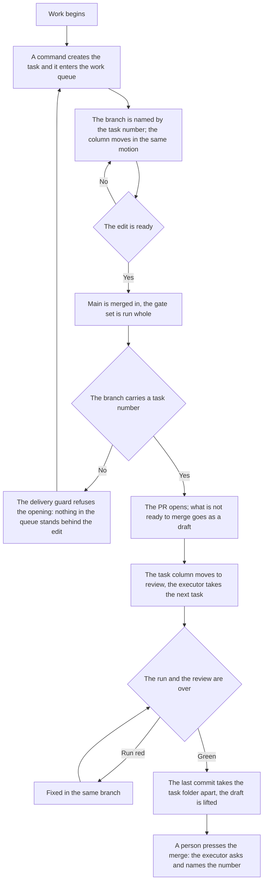

# Delivery — how it works here

Rule under the law `docs/constitution/delivery.md`. The law says what must be true; here — by which
technique it is held in a tree that lives in Azure DevOps. The organisation, the project, the
machine account and the commit scopes are this tree's, in `implementation.md` next to it: they
cannot be guessed and are never shared.

**Cold part:** `pitfalls.md` next to it — traps already stepped on. Loaded on demand, not together
with the rule.

## What it is called here

| In the law                   | Here                                                                                                                                                                                                                     |
| ---------------------------- | ------------------------------------------------------------------------------------------------------------------------------------------------------------------------------------------------------------------------ |
| main branch                  | `main`                                                                                                                                                                                                                   |
| separate branch              | `<номер рабочего элемента>-<короткий-slug>`; the form — in `implementation.md`. A name without a number (`feat/…`, `fix/…`) is legitimate locally: no PR opens from it                                                   |
| task                         | a work item of kind `Task` or `Bug`, title `[<номер>] <Что не так>`, assignee the machine account; the PR attaches at creation by the `--work-items` flag, a commit by the line `AB#<номер>`                             |
| work queue                   | the project's Azure Boards. A work item lands on the board by being created: the board shows the items of its area and iteration                                                                                         |
| task state in the work queue | the work item's `State` field: `New` when created, `Active` in progress, `Resolved` in review. The state set depends on the project process and is named in `implementation.md`; a closed task leaves the queue by merge |
| PR about a task              | PR title `[<номер>] <Что сделано>` — the work item's number and title turned into the done; commit type and scope stay out                                                                                               |
| discussion of an edit        | PR review: reviewer — the repository owner, assignee — the machine account, labels — the same as on the work item                                                                                                        |
| record of an edit            | `type(scope): description`, types `feat`, `fix`, `refactor`, `docs`, `style`, `test`, `chore`, `perf`; scopes: `implementation.md`                                                                                       |
| author of machine work       | a separate account; its name and the token's place — in `implementation.md`. The token lies outside the repository                                                                                                       |

## Where it lives

In this tree — the table in `implementation.md` next to it. Paths live there, not here: the rule
travels between repositories, the layout does not, and a path named in the rule lies in the first
tree that keeps its code differently.

## Flow

The flow from task to merge: where the guard stands, what moves the work queue column and how the
work ends.

## How the law applies here

- **A commit into the main branch is refused by the guard.** The guard looks for a commit call
  anywhere in the command and reads the current branch at launch, so a compound "create a branch and
  commit at once" is rejected whole: the branch does not exist yet at review.
- **A branch without a work item number opens no PR.** The delivery guard refuses `az repos pr
  create` from such a branch: locally it is legitimate, but an edit from it is a rollout with
  nothing behind it in the work queue. A work item is created, and the work moves to a branch with
  its number.
- **The main branch is merged into the work item branch before the PR opens.** The delivery guard
  refuses the opening until main's tip is an ancestor of the current branch, and names the
  divergence as a commit count. A PR from a diverged branch shows the reviewer the edit mixed with
  someone else's, and everything the author checked before publishing was checked from a base that
  main no longer has.
- **Unmet delivery conditions are named in one refusal, not one by one.** The guard collects them
  all and prints them at once. An executor refused on the first miss fixes the base, repeats the
  call, hits the title, fixes the title, hits the work item — and every round costs one more call,
  though everything unmet was known on the first.
- **A condition known at the start of work is asked at the start.** Creating a branch refuses a base
  without main's tip, and a working copy that signs commits with an email other than the one the
  tree declared. At push and at PR opening the same checks stay as a second line, but there they
  cost more: the base is fixed by a merge with conflict resolution, the signature by rewriting the
  whole branch.
- **The base judged is the one named by the command, not the tip of the working copy.** A branch is
  also created straight from main's tip — that very command takes the base fresh — and a guard
  reading only the current tip would refuse it like a branch off yesterday's tree. A base the tree
  knows nothing of is not judged at all.
- **A branch without a work item number gets no delivery conditions.** A local trial branch is
  legitimate, and demanding a fresh base of it would refuse work that will not go to main: no PR
  opens from such a branch.
- **A code edit is handed to a person by an open PR, not by a pushed branch.** A branch is not shown
  to them in the branch list, reaches no to-do list of theirs and has no discussion: before the PR
  opens there is no edit for a person. It opens in the turn in which the executor says the work is
  handed over, and the reply names it by number.
- **What is not ready to merge opens as a draft — `az repos pr create --draft true`.** The host
  itself locks a draft's complete button, so the state "put up for viewing" and the state "may be
  merged" stop looking alike. Everything waiting for a pipeline run, a rework or an answer goes as a
  draft; the question is asked in the PR itself. The check pipeline does not run on a draft by
  default — until the draft is lifted it stays silent, and that silence is not taken for a green
  run.
- **`--hard` is not taken to drop a commit — that is `--soft`.** `reset --hard`, `checkout --
  <path>`, `restore <path>` and `clean -f` erase what is not committed. On a dirty tree the guard
  refuses and names the files; the bypass is `# discard: <reason>` in the command.
- **The working tree is emptied before the PR opens, not after.** `git status --porcelain` is asked
  in the same turn as the opening: what is uncommitted goes to the host by a commit before it, or
  is named. A push after the opening moves the tip past the green run the body names, and for that
  stretch the PR invites merging a tip nothing has checked.
- **A push into a branch that has an open PR is followed by rereading its body.** The statement
  about a green run names the tip by its sha, and moving the tip makes it false in silence: no check
  reads a PR body.
- **The draft is lifted by a separate call — `az repos pr update --id <номер> --draft false`.** With
  it the executor answers for readiness: checks passed, no rework left, the work matches the work
  item. Lifting the draft and asking to merge are one turn, not two days.
- **A created work item is confirmed by the work queue's answer, not by the creation command's
  output.** The command answers for its calls: it can create an item and not bring it to the board,
  and its own error handling names that case. A printed number means "the call went through", not
  "the work is visible to whoever comes by it". The queue is asked — by number, in one call — and
  the answer is read from the item's presence on the board, its state and its assignee.
- **The branch number and the PR title number are checked on the spot, the state — by the board.**
  The format is read from the command text and works offline; the work item's existence, its state,
  assignee and that it is still open — only with something to ask with. No network or no token — the
  second tier is skipped silently: a check that fails on a plane stops meaning anything.
- **The work item's state moves in the same motion as the work.** Branch created — the item is moved
  to `Active`, PR opened — to `Resolved`; the move command does it, not a set of calls from memory.
  The move follows the step that caused it at once: the work queue is read between steps, not after.
- **A work item left in the initial state opens no PR.** The delivery guard names that state and the
  move command: by the work queue such an item reads as not taken, though the work on it is done and
  published. At branch creation the state is not asked — nothing has moved it yet, and the
  requirement would refuse the first command of the work together with the one that lifts it. The
  tree names the initial state itself; unnamed — the state is not judged at all.
- **The board holds work items, not PRs about them.** The board shows what is done and what is left;
  a PR answers another question — how exactly it was done — and opens from the item, where the link
  to it stands by itself. Here that link is set at PR creation, so a separate card is not needed at
  all, and one created lives its own life: there is no state for it, it never leaves the queue and
  stays in it after the merge forever. The queue audit finds such cards, a line each.
- **A lagging state is found by the queue audit, not by eye.** The audit judges the state by the PR
  both ways: an open PR with the item not in review, and review with no open PR — both
  discrepancies. The moment a task is taken into work it cannot see: the branch is not on the board.
- **A branch with an open PR lags behind main silently.** The guard judges the base once — at
  opening; what merged into main during the run a green run never sees, and a PR merged from there
  brings main a combination nobody checked. The lag is found by the work queue audit: it asks the
  repository how many commits each open PR's branch is behind main, and names the number.
- **Tasks fixed by one edit are merged before the branch merge.** The second is closed as a
  duplicate, and the missing from it is added to the first. The law orders the second erased, and
  this is the second declared deviation: a work item here has a native "duplicate" link, deletion
  takes the edit history and attachments with it, and the number is not reused after it — a link to
  an erased item from someone else's commit leads into a void. After the merge there is no merging
  them: the branch went in, and it rolls back whole.
- **Work that one session cannot close is marked in two places, and they are audited.** The label on
  the board and the line about sessions with a handover in the epic plan say the same to two
  readers: the executor opens the card before the epic plan, and plans by the plan. One mark without
  the other lies silently, so the queue audit judges the pair both ways. Only what legitimately does
  not split is marked: a mark of volume grants no right to split.
- **A document goes in the same commit as the edit.** The bypass is the line `Docs-skip: <reason>`
  in the commit body; an empty reason is not accepted.
- **The commit subject is checked against the format on the spot.** A subject parsed by type and
  scope is read as a list, free text — only whole.
- **Before a push all linters are run, not one.** The code linter usually does not read style files
  at all; without a second run nothing checks the styling rules.
- **The build is in the set on a par with lint and unit tests.** The linter does not read types, and
  unit tests read only what a test imports: a type error in uncovered code lives until the image
  build — that is, the merge. Four merges in a row went into main that way, breaking the rollout.
- **On a machine with several runners, any path from the home directory is shared.** A ready-made
  step's default is dangerous precisely because it is shared: a neighbouring run rewrites it to its
  own version while ours stands between steps. Install directory, container name and builder name
  are therefore per project and fixed, and a temporary directory is never the answer — the package
  store lives there.
- **The push gate set is never narrower than the pipeline set.** The gate is a promise that the push
  will not arrive red; a set with the build and the snapshots thrown out promises what it does not
  check. A pipeline step with neither a line in the gate set nor a declared exclusion with a reason
  refuses the push instead of printing next to it: a printed warning the executor reads as
  permission. Twice in a row an edit that passed the gate whole was refused by the pipeline — and
  both times the green gate was read as "all green locally".
- **The final set before a push is read from the state review, not assembled in the head.** It is
  assembled from the package default and the tree's override, and there was nothing to read the
  assembly with: the "set before push" section prints it whole, one command per line, and names
  beside it what the default printed and the set did not take. A tree writing its override blind
  added a repeat to it.
- **An exclusion reason naming a task is judged on whether that task is alive.** A deferral with a
  term and one without look the same until someone asks the number; a dead number in the reason
  makes the exclusion perpetual without saying a line about it. Asked by the same tier as the task
  state at the delivery guard: something to ask with — it asks, no network or access — it skips
  silently.
- **The layout audit stands in the push gate set on a par with lint and the build.** An edit put
  into the laid-out copy past the source breaks nothing on the day it is made: the tree works, the
  checks are green, and the discrepancy is visible only to whoever calls the audit themselves. It
  piles up silently and surfaces on someone else's work — the layout refuses the edited file whole
  and lays out no other, so the price is paid by whoever edited a neighbouring resource. The article
  above does not cover this line: the audit is not in the pipeline, so there is no step it would
  close — it is put into the set directly, not derived from the set's completeness.
- **After merging main in, the check set is revised by what the branch now carries.** The merge
  changes the makeup of the edit: checking by what the author edited means checking half, and the
  branch answers whole. A branch that touched no line of the showcase runs showcase snapshots from
  the moment the merge brought someone else's styling edit.
- **A statement about the main branch is made by the remote ref, not the local one.** The local one
  goes stale the minute it was last pulled, and says nothing about it: it is not empty and not
  broken, it describes yesterday. A branch comparison is written from `origin/main` whole — mixing
  the remote ref for one side and the local one for the other in one command, the miss looks right
  from inside.
- **The remote ref is taken not only by words but by actions.** A new branch's base, the count of
  the merged and pulling main are judged by it too: the local one is a snapshot of the last pull,
  and work started from it starts from a base main no longer has. A merged branch counts as unmerged
  by it, and cleanup ends with a list of unmerged that is not there.
- **A work item is bound to the PR at creation, not after.** `az repos pr create` takes
  `--work-items`; binding by a second command is bypassed silently when the token has no right to
  edit someone else's item, and the PR stays bound to nothing.
- **A merge with auto-complete does not replace the checks before a push.** Auto-complete sees only
  the pipeline, and the pipeline sees only what is pushed: a red branch occupies the work queue and
  looks ready for review.
- **The state set is taken from the project process, not assigned by the rule.** Agile, Scrum and
  Basic name the same three steps differently, and a move to a state the process lacks answers with
  a refusal on every task in a row.
- **Guard scenarios set the git settings themselves, not take them from the machine.** A commit in
  the scenario's temporary repository inherits the shared config: with signing on, git goes to the
  key agent, and a locked agent brings the whole set down — from outside it looks like a broken
  guard. Author, email and signature are passed as `-c` flags straight into the command.

## What of the law is not here

This host has no task key, and the name form is built from the number alone. The law demands the
number be written the same everywhere — "key, hyphen, number" — and this is a deviation from it,
declared here: a work item number is unique across the whole project, and the host's native link
form — `AB#<номер>` — carries no key at all, and one attached to it breaks the linking of a commit
to the item. The `board.taskKey` setting a tree on this host does not set; the checks that look for
a key in the title judge the bare number here.

The delivery guard stands on the agent's commands, so it does not see a branch created by hand in
the editor: its name is held by memory. The requirement is no weaker for that — only no separate
check is made for it: work is recognised by the work item title and the PR, and that is audited for
everyone. The queue audit never judges the branch name: an open PR's branch cannot be renamed.

The guard does not move a work item to in progress: it does not edit the board — a board edit during
command review would fall with the connection and refuse the work instead of the miss. The move is
held by memory and by the hint the creation command prints. An item left in the initial state the
guard names at PR opening — that is, after it should have been moved; other state discrepancies the
queue audit finds.

The guard does not ask for a reviewer here: lifting the draft is an edit of the PR itself — the same
call as its other fields — and to a machine it cannot be told from other edits. This is held by the
vocabulary above, where the PR review is led by the reviewer, and by the memory of whoever lifts the
draft.

The freshness of main's tip itself the guard asks by the second tier — the same technique as the
task state: something to ask with — it asks; no network or access — it skips silently. The first
tier stays and works offline: the local ref answers the question "has the base lagged what already
lies in the tree", the remote one — "has the ref itself gone stale". Without the second tier the
guard's silence meant only the first and was read as the second.

## Patterns

- `git-workflow-commit` — work item, branch, commit and push as the machine account.
- `git-workflow-pr` — opening a PR, the draft and lifting it, the body, reviewer, binding to the
  item.
- `git-workflow-merge` — main merged into the task branch, the conflict resolved.
