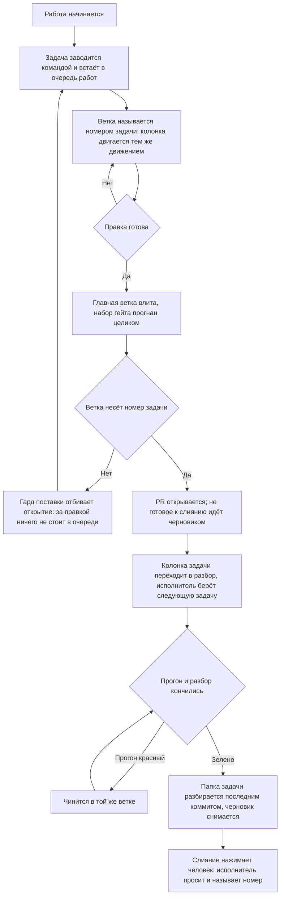

# Поставка — как это устроено здесь

Правило под закон `docs/constitution/delivery.md`. Закон говорит, что должно быть верно;
здесь — каким приёмом это держится в дереве, лежащем в Azure DevOps. Организация, проект,
учётная запись машинной работы и области коммита — при этом дереве, в `implementation.md`
рядом: их не угадать, и общими они не бывают.

## Как это называется здесь

| В законе                         | Здесь                                                                                                                                                                                                                                  |
| -------------------------------- | -------------------------------------------------------------------------------------------------------------------------------------------------------------------------------------------------------------------------------------- |
| главная ветка                    | `main`                                                                                                                                                                                                                                 |
| отдельная ветка                  | `<номер рабочего элемента>-<короткий-slug>`; форма — в `implementation.md`. Имя без номера (`feat/…`, `fix/…`) законно, пока ветка живёт локально: PR с неё не откроется                                                               |
| задача                           | рабочий элемент (work item) рода `Task` или `Bug`, заголовок `[<номер>] <Что не так>`, исполнитель — учётная запись машинной работы; PR прикрепляется к нему при создании флагом `--work-items`, а коммит — строкой `AB#<номер>`       |
| очередь работ                    | Azure Boards проекта. Рабочий элемент попадает на доску тем, что заведён: доска показывает элементы своей области и итерации                                                                                                           |
| состояние задачи в очереди работ | поле `State` рабочего элемента: `New` у заведённого, `Active` у взятого в работу, `Resolved` у ждущего разбора. Набор состояний зависит от процесса проекта и назван в `implementation.md`; закрытая задача уходит из очереди слиянием |
| PR о задаче                      | заголовок PR `[<номер>] <Что сделано>` — тот же номер, что у рабочего элемента, и его название, переведённое в сделанное; тип и область коммита сюда не идут                                                                           |
| обсуждение правки                | разбор PR: ревьювер — владелец репозитория, исполнитель — учётная запись машинной работы, метки — те же, что у рабочего элемента                                                                                                       |
| попадание правки в главную ветку | слияние PR; оно же запускает выкатку — `azure-pipelines.yml`                                                                                                                                                                           |
| образ того коммита               | `IMAGE_TAG=<sha>` в командах `docker compose` на сервере                                                                                                                                                                               |
| изменение хранилища              | миграция в `prisma/migrations/<метка>_<имя>/`                                                                                                                                                                                          |
| запись о правке                  | коммит формата `type(scope): description` — типы `feat`, `fix`, `refactor`, `docs`, `style`, `test`, `chore`, `perf`; области — в `implementation.md`                                                                                  |
| автор машинной работы            | отдельная учётная запись; её имя и место токена — в `implementation.md`. Токен лежит вне репозитория                                                                                                                                   |

## Где это лежит

В этом дереве — таблица в `implementation.md` рядом. Пути живут там, а не здесь: правило
переносится между репозиториями, раскладка — нет, и путь, названный в правиле, врёт в первом
же дереве, которое держит код иначе.

## Ход

Ход работы от задачи до слияния: где стоит гард, что двигает колонку очереди работ и чем
работа кончается.

## Как закон применяется здесь

- **Коммит в главную ветку отбивается гардом.** Гард ищет вызов коммита в любом месте команды
  и смотрит текущую ветку на момент запуска, поэтому составная «создать ветку и сразу
  коммитить» отклоняется целиком: ветки в момент разбора ещё нет.
- **Ветка без номера рабочего элемента PR не открывает.** Гард поставки отбивает
  `az repos pr create` с такой ветки: локально она законна, но правка из неё — это выкатка, за
  которой в очереди работ ничего не стоит. Заводится рабочий элемент, и работа переносится в
  ветку с его номером.
- **Главная ветка влита в ветку рабочего элемента до открытия PR.** Гард поставки отбивает
  открытие, пока вершина главной ветки не стала предком текущей, и называет расхождение числом
  коммитов. PR с разошедшейся ветки показывает ревьюверу свою правку вперемешку с чужой, а всё,
  что автор проверил до публикации, он проверил от основания, которого в главной ветке уже нет.
- **Несошедшиеся условия поставки называются одним отказом, а не по одному.** Гард копит их все
  и печатает разом. Отбитый по первому промаху исполнитель правит основание, повторяет вызов,
  упирается в заголовок, правит заголовок, упирается в рабочий элемент — и каждый круг стоит
  ещё одного вызова, хотя всё несошедшееся было известно уже на первом.
- **Условие, известное в начале работы, спрашивается в начале.** Заведение ветки отбивает
  основание, в котором нет вершины главной ветки, и рабочую копию, подписывающую коммиты не той
  почтой, что объявило дерево. На пуше и на открытии PR те же проверки остаются вторым рубежом,
  но там они стоят дороже: основание чинится вливанием с разбором конфликта, подпись —
  переписыванием всей ветки.
- **Ветка без номера рабочего элемента условий поставки не получает.** Локальная ветка под пробу
  законна, и требовать от неё свежего основания значило бы отбивать работу, которая в главную
  не поедет: PR с такой ветки не откроется.
- **Правка кода отдаётся человеку открытым PR, а не запушенной веткой.** Ветка в списке ветвей
  ему не показывается, в его дела не приходит и обсуждения не имеет: до открытия PR правки для
  человека нет. Открывается он тем же ходом, которым исполнитель говорит, что работу отдаёт, и
  в ответе называется номером.
- **Не готовое к слиянию открывается черновиком — `az repos pr create --draft true`.** Кнопка
  завершения у черновика заблокирована самим хостингом, поэтому состояние «выложено на
  обозрение» и состояние «можно вливать» перестают выглядеть одинаково. Черновиком идёт всё,
  что ждёт прогона конвейера, доработки или ответа на вопрос; вопрос задаётся в самом PR.
  Конвейер проверок черновика по умолчанию не запускает — до снятия черновика он молчит, и это
  молчание за зелёный прогон не принимается.
- **Черновик снимается отдельным вызовом — `az repos pr update --id <номер> --draft false`.**
  Им исполнитель отвечает за готовность: проверки пройдены, доработок не осталось, работа
  сходится с рабочим элементом. Снятие черновика и просьба влить — один ход, а не два разных
  дня.
- **Заведённый рабочий элемент подтверждается ответом очереди работ, а не выводом команды
  заведения.** Команда отвечает за свои вызовы: она может завести элемент и не довести его до
  доски, и её собственный разбор ошибок этот случай называет. Напечатанный номер значит «вызов
  прошёл», а не «работа видна тому, кто по ней придёт». Спрашивается очередь — по номеру, одним
  вызовом, — и ответ читается присутствием элемента на доске, его состоянием и исполнителем.
- **Номер ветки и номер в заголовке PR сверяются на месте, а состояние — по доске.** Формат
  читается из текста команды и работает без сети; существование рабочего элемента, его
  состояние, исполнитель и то, что он ещё открыт, — только когда есть чем спросить. Нет сети
  или нет токена — второй ярус молча пропускается: проверка, падающая в самолёте, перестаёт
  что-либо значить.
- **Состояние рабочего элемента двигается тем же движением, что и работа.** Ветка заведена —
  элемент переводится в `Active`, PR открыт — в `Resolved`; делает это команда перевода, а не
  набор вызовов по памяти. Перевод идёт сразу за шагом, который его вызвал: очередь работ
  читают между шагами, а не после них.
- **Рабочий элемент, оставшийся в начальном состоянии, к поставке не готов.** Гард поставки
  называет это состояние и команду перевода: по очереди работ такой элемент читается как
  невзятый, хотя работа по нему сделана и выложена. Имя начального состояния дерево называет
  само — не названо, состояние не судится вовсе: свои состояния каждое дерево зовёт своими
  словами, и выдуманное имя не совпало бы ни с чем.
- **На доске стоят рабочие элементы, а не PR о них.** Доска показывает, что сделано и что
  осталось; PR отвечает на другой вопрос — как именно сделано, — и открывается из элемента, где
  связь с ним стоит сама. Здесь эта связь ставится при создании PR, поэтому отдельная карточка
  не нужна вовсе, а заведённая живёт своей жизнью: состояния под неё нет, из очереди она не
  уходит и остаётся в ней после слияния навсегда. Находит такие сверка очереди — строкой на
  каждую.
- **Конвейер судит по составу правки, а не гоняет всё подряд.** Шаги, которым нечего проверять,
  пропускаются по признаку, посчитанному от главной ветки: ветка, не тронувшая ни строки кода,
  не поднимает стенда, не снимает кадров и не собирает образов. Признак объявляется переменной
  задания и считается один раз, а не переспрашивается в каждом условии. Пропущенный шаг виден в
  прогоне пропущенным — молча выпавший читается как пройденный.
- **Отставшее состояние находится сверкой очереди, а не глазами.** Сверка судит состояние по
  PR в обе стороны: открытый PR при элементе не в разборе и разбор без открытого PR — оба
  расхождения. Момента, когда задачу берут в работу, ей не видно: ветки на доске нет.
- **Задачи, чинящиеся одной правкой, сливаются до слияния ветки.** Вторая закрывается как
  дубликат, а недостающее из неё дописывается в первую. После слияния слить уже нельзя: ветка
  въехала, и откатывается она целиком.
- **Работа, которую одним заходом не закрыть, помечена в двух местах, и они сверяются.** Метка
  на доске и строка о заходах с передачей в замысле эпика говорят одно и то же двум читателям:
  исполнитель открывает карточку раньше, чем замысел эпика, а планирует по замыслу. Одна пометка без
  другой лжёт молча, поэтому сверка очереди судит пару в обе стороны. Помечается только то, что
  законно не делится: пометка объёма правом делить не становится.
- **Слияние в главную ветку выкатывает прод.** Фильтры путей конвейера покрывают документы
  отдельно, поэтому переменные окружения, секреты и записи имён ставятся до слияния, а не
  после.
- **Признак режима объявлен в образе, а не только в составе прода.** Значение, заданное
  составом, действует лишь на контейнер, поднятый этим составом; ручной прогон того же образа
  идёт с пустым значением, а пусто здесь означает локалхост — со всеми отладочными
  умолчаниями, которые он разрешает. Умолчание образа задаётся в самом образе.
- **Образы выкатываются по sha коммита, а не по метке «последний».** Метка в реестре отстаёт
  от главной ветки, и прод молча возвращается к прежней версии, продолжая отвечать.
- **Выкатка убирает за собой старые образы, оставляя три последних sha.** Помеченный sha образ
  висячим не бывает никогда, и чистка висячего его не касается: за полгода они съедают диск
  сервера целиком. Три sha — это глубина отката, и меньше брать нельзя: поломка, замеченная
  через две выкатки, откатывается уже некуда.
- **Описание прода правится вместе с составом прода.** Устройство, путь запроса, гейты и
  бэкапы описаны текстами вне слоёв правил, и ни линтер, ни сборка их не читают: расхождение
  копится молча, а читают эти тексты как действующие. Пару стережёт гард документов.
- **Правка конвейера прогоняется до слияния ручным запуском.** Конвейер запускается на любой
  ветке, а задание выкатки прибито условием к главной: прогон ради проверки доходит до сборок и
  там кончается. Прогон команд задания на своей машине его не покрывает: он проверяет команды,
  а не файл конвейера, — верность самого файла читается только по списку прогонов после пуша.
- **PR проверяется до слияния тем же конвейером, что и главная ветка.** Проверки и сборки
  образов идут на конвейере проверки PR, выкатка — нет: её держит условие по главной ветке у
  своего задания, а образ PR в реестр не уезжает.
- **Расхождение прода с главной веткой видно сверкой очереди работ.** Рабочий элемент уходит из
  очереди слиянием, но слияние — ещё не прод: отказавшая выкатка не трогает ни элемент, ни его
  состояние, и заметить её неоткуда. Сверка спрашивает последний прогон главной ветки и судит
  только завершённый: идущий ещё может кончиться выкаткой.
- **Цепочка миграций прогоняется с пустого хранилища до слияния.** Порядок применения
  лексикографический по имени каталога, а метку времени ставит момент создания: миграция из
  ветки, начатой раньше, встаёт перед той, от которой зависит.
- **Документ едет в том же коммите, что и правка.** Обход — строка `Docs-skip: <причина>` в
  теле коммита; пустая причина не принимается.
- **Заголовок коммита сверяется с форматом на месте.** Разобранный по типу и области
  заголовок читается списком, а свободный текст — только целиком.
- **Перед пушем прогоняются все линтеры, а не один.** Линтер кода обычно не читает файлы
  стилей вовсе, и правила оформления без второго прогона не проверяет ничто.
- **Сборка входит в набор наравне с линтом и юнитами.** Линтер типов не читает, а юниты читают
  только то, что импортировано тестом: ошибка типов в непокрытом коде доживает до сборки
  образа, то есть до слияния. Четыре слияния подряд так и уехали в главную ветку, ломая
  выкатку.
- **Набор гейта пуша не бывает уже набора конвейера.** Гейт — обещание, что пуш не приедет
  красным; набор, из которого выкинуты сборка и снимки, обещает то, чего не проверяет. Шаг
  конвейера, которому в наборе гейта нет ни строки, ни объявленного исключения с причиной,
  отбивает пуш, а не печатается рядом с ним: напечатанное предупреждение исполнитель читает как
  разрешение. Дважды подряд правка, прошедшая гейт целиком, была отбита конвейером — и оба раза
  зелёный гейт был прочитан как «локально всё зелено».
- **Сверка раскладки стоит в наборе гейта пуша наравне с линтом и сборкой.** Правка, положенная
  в разложенную копию мимо источника, в день, когда её делают, не ломает ничего: дерево
  работает, проверки зелёные, а расхождение видно только тому, кто позовёт сверку сам. Копится
  оно молча и всплывает на чужой работе — раскладка отказывает по правленому файлу целиком и не
  кладёт ни одного другого, так что цену платит тот, кто правил соседний ресурс. Статьёй выше
  эта строка не покрывается: сверки нет в конвейере, а значит нет и шага, который она бы
  закрывала, — в набор она ставится прямо, а не выводится из его полноты.
- **После вливания главной ветки набор проверок пересматривается по тому, что ветка везёт
  теперь.** Вливание меняет состав правки: проверять по тому, что правил автор, — значит
  проверять половину, а отвечает ветка целиком. Ветка, не тронувшая ни строки показа, прогоняет
  снимки витрин с того момента, как вливание принесло чужую правку оформления.
- **Утверждение о главной ветке делается по удалённой ссылке, а не по локальной.** Локальная
  протухает в ту минуту, когда её подтянули в последний раз, и молчит об этом: она не пуста и не
  сломана, она описывает вчерашний день. Сравнение веток пишется от `origin/main` целиком —
  смешав в одной команде удалённую ссылку для одной стороны и локальную для другой, промах
  изнутри выглядит правильным.
- **Рабочий элемент привязывается к PR при создании, а не после.** `az repos pr create`
  принимает `--work-items`; привязка второй командой обходится молча, когда у токена нет права
  править чужой элемент, и PR остаётся ни с чем не связанным.
- **Слияние с автозавершением не заменяет проверок до пуша.** Автозавершение видит только
  конвейер, а конвейер видит только отправленное: красная ветка занимает очередь работ и
  выглядит готовой к разбору.
- **Набор состояний берётся у процесса проекта, а не назначается правилом.** Agile, Scrum и
  Basic называют одни и те же три шага по-разному, и перевод в состояние, которого в процессе
  нет, отвечает отказом на каждой задаче подряд.
- **Сценарии гардов задают настройки git сами, а не берут их с машины.** Коммит во временном
  репозитории сценария наследует общий конфиг: если включена подпись, git идёт в агент ключей,
  а заблокированный агент роняет весь набор — со стороны это выглядит сломанным гардом. Автор,
  почта и подпись передаются флагами `-c` прямо в команду.
- **Расхождение миграций со схемой меряется на теневом хранилище, а не на том, где работает
  тот, кто пушит.** Оно законно несёт след любой недоделанной ветки, и сверка с ним держала бы
  чужую правку. Гейт и выкатка зовут одну и ту же проверку — иначе «сошлось» станет значить в
  двух местах разное.

## Чего из закона здесь нет

Гард поставки стоит на командах агента, поэтому ветку, заведённую руками в редакторе, он не
видит: имя такой ветки держится памятью. Требование от этого не слабеет — просто отдельной
проверки под него не заводится: работа опознаётся заголовком рабочего элемента и PR, а это
сверяется у всех. Сверка очереди имя ветки не судит вовсе: у открытого PR его не переименовать.

Рабочий элемент в работу гард не переводит: доску он не правит — правка доски в разборе команды
падала бы вместе со связью и отбивала бы работу вместо промаха. Перевод держится памятью и
подсказкой, которую печатает команда заведения. Элемент, оставшийся в начальном состоянии, гард
при этом называет — и на заведении ветки, и на открытии PR; прочие расхождения состояния находит
сверка очереди, уже после того, как PR открыт.

Ревьювера гард здесь не спрашивает: снятие черновика идёт правкой самого PR — тем же вызовом, что
и остальные его поля, — и от прочих правок машине оно неотличимо. Держится это словарём выше, где
разбор PR ведёт ревьювер, и памятью того, кто черновик снимает.

Свежесть самой вершины главной ветки гард не проверяет: он судит по тому, что лежит в дереве, и
вершину недельной давности от сегодняшней не отличает. Сетевой вызов сюда не заводится по той же
причине, что и выше, — он падал бы вместе со связью. Поэтому гард ловит ветку, отставшую
заведомо, а `git fetch` перед вливанием стоит первым пунктом чеклиста и держится тем же, чем
держатся остальные его пункты.

## Паттерны

- `git-workflow-commit` — рабочий элемент, ветка, коммит, пуш и PR от учётной записи машинной
  работы.
- `git-workflow-merge` — главная ветка влита в ветку задачи, конфликт разобран.
- `git-workflow-migration` — правка схемы хранилища и её миграций.
- `git-workflow-restart` — ручной перезапуск прода.
- `git-workflow-docker` — образы на своей машине: демон, реестр, сборка под платформу сервера.
- `git-workflow-secrets` — ключи внешних служб: где лежат, как заводятся, что говорит их состояние.

## Ловушки

- **Одна работа — одна задача, сколько бы файлов она ни задела.** Числа, за которым правка
  становится вторым рабочим элементом, здесь нет: делится то, что придётся откатывать порознь.
  Сплошная правка текстов дерева была заведена тремя задачами «по объёму» — пришлось стирать
  два рабочих элемента, закрывать два PR и переносить коммиты по одному с двумя конфликтами.
  Одна из трёх не дала коммита вовсе: правка тел уже заведённых задач веткой не бывает и задачей
  под ветку тоже.
- **Рабочий элемент заводится командой, а не вызовами подряд.** Доска показывает элементы своей
  области и итерации, и заведённый мимо них в очереди работ не виден: со стороны это выглядит
  так же, как незаведённый. Команда заведения ставит все поля разом — род, состояние,
  исполнителя, область и итерацию, — и печатает готовую строку заведения ветки. Замеченный по
  ходу дефект проходит тот же путь.
- **Ветка заводится вторым вызовом, а не тем же.** Гард главной ветки отклоняет составную
  «создать ветку и сразу коммитить» целиком: ветки в момент разбора ещё нет.
- **Сторона конфликта бывает удалением, и «сохранить обе стороны» заводит второе объявление.**
  Главная ветка снимает объявление, потому что символ переехал, — в конфликте это выглядит как
  сторона, которая ничего не дописала. Разбирается чтением версии главной ветки целиком, а не по
  хунку, и сверяется проверкой повторов: обе копии сами по себе исправны, сборка и линт зелёные.
- **Учётная запись для пуша и автор PR выбираются отдельно.** Если пушить пришлось из-под другой
  записи, на следующий вызов это не переносится: PR открывают токеном учётной записи машинной
  работы, и от того, чьей записью он открыт, зависит, кого можно назначить ревьювером. Однажды
  смена записи ради пуша утекла в публикацию — PR вышел от владельца.
- **Невалидный файл конвейера виден прогоном нулевой длительности сразу после пуша.** Прогон
  заводится и кончается на разборе файла, не начав ни одного задания: в списке он стоит
  отказом, а внутри нет ни задания, ни лога — читается только длительность. Поэтому список
  прогонов ветки смотрится тем же движением, что и пуш: `az pipelines runs list` по своей
  ветке.
- **`online` у агента на своей машине означает запущенный процесс, а не работающий конвейер.**
  Две стороны сходятся отдельно: требования заданий и возможности самого агента в его пуле.
  Пока пересечения нет, агент стоит `online` и не берёт ничего, а задания ждут размещённого
  пула — по состоянию это выглядит настроенным. Владельцу называют выполненное задание с его
  номером, а не строку состояния.
- **Вход в реестр образов из агента, запущенного службой, отказывает молча.** Служба идёт без
  сеанса пользователя, а клиент реестра уходит в системный помощник хранения ключей и получает
  отказ во взаимодействии — задание падает до сборки. Свой каталог настроек с пустым помощником
  не спасает: клиент переписывает пустое значение обратно сам. Готовые команды — паттерн
  `git-workflow-docker`.
- **Новое рабочее дерево получает только то, что лежит в индексе.** `git worktree add`
  разворачивает коммит, а настройки, ключи, локальные разрешения и зависимости в коммит не
  входят: свежее дерево выглядит готовым и упирается в нехватку не сразу, а на первом гарде,
  которому нужен ключ. Что именно переносится руками, названо списком в компаньоне правила, и
  список пополняется тем же движением, которым заводится новый файл вне индекса.
