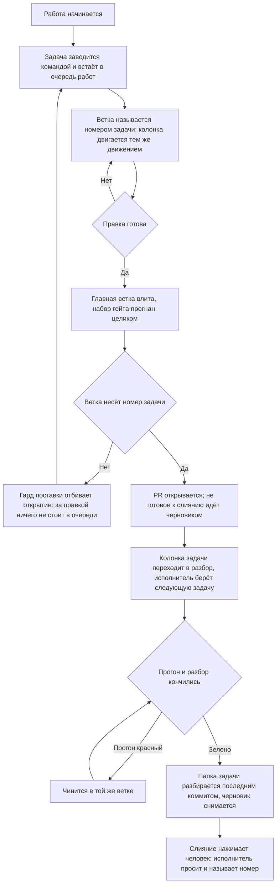

# Поставка — как это устроено здесь

Правило под закон `docs/constitution/delivery.md`. Закон говорит, что должно быть верно;
здесь — каким приёмом это держится в дереве, лежащем на GitHub. Ключ задач, адрес борды,
учётная запись машинной работы и области коммита — при этом дереве, в `implementation.md`
рядом: их не угадать, и общими они не бывают.

## Как это называется здесь

| В законе                         | Здесь                                                                                                                                                                                           |
| -------------------------------- | ----------------------------------------------------------------------------------------------------------------------------------------------------------------------------------------------- |
| главная ветка                    | `main`                                                                                                                                                                                          |
| ключ задач                       | короткое слово, которым дерево зовёт свои задачи; задаётся ключом `board.taskKey` в `.claude/rt-kit/checks.json`, а в `implementation.md` называется для читателя                               |
| отдельная ветка                  | `<КЛЮЧ>-<номер задачи>-<короткий-slug>`. Имя без номера (`feat/…`, `fix/…`) законно, пока ветка живёт локально: PR с неё не откроется                                                           |
| задача                           | issue репозитория, заголовок `[<КЛЮЧ>-<номер>] <Что не так>`, исполнитель — учётная запись машинной работы; PR прикрепляется к нему строкой `Closes #<номер>` в теле                            |
| очередь работ                    | борда GitHub Projects. К репозиторию она не привязана: `projectsV2` у него пуст, и задача попадает на борду только явным добавлением                                                            |
| состояние задачи в очереди работ | колонка борды — поле «Status»: заведённая, взятая в работу, ждущая разбора. Имена колонок — в `implementation.md`; закрытая задача уходит из очереди мержем, а не переводом в последнюю колонку |
| PR о задаче                      | заголовок PR `[<КЛЮЧ>-<номер>] <Что сделано>` — тот же номер, что у задачи, и её название, переведённое в сделанное; тип и область коммита сюда не идут                                         |
| обсуждение правки                | разбор PR: ревьювер — владелец репозитория, исполнитель — учётная запись машинной работы, метки — те же, что у задачи                                                                           |
| попадание правки в главную ветку | мерж PR; он же запускает выкатку — `.github/workflows/deploy.yml`                                                                                                                               |
| образ того коммита               | `IMAGE_TAG=<sha>` в командах `docker compose` на сервере                                                                                                                                        |
| изменение хранилища              | миграция в `prisma/migrations/<метка>_<имя>/`                                                                                                                                                   |
| запись о правке                  | коммит формата `type(scope): description` — типы `feat`, `fix`, `refactor`, `docs`, `style`, `test`, `chore`, `perf`; области — в `implementation.md`                                           |
| автор машинной работы            | отдельная учётная запись; её имя и место токена — в `implementation.md`. Токен лежит вне репозитория                                                                                            |

## Где это лежит

В этом дереве — таблица в `implementation.md` рядом. Пути живут там, а не здесь: правило
переносится между репозиториями, раскладка — нет, и путь, названный в правиле, врёт в первом
же дереве, которое держит код иначе.

## Ход

Ход работы от задачи до слияния: где стоит гард, что двигает колонку очереди работ и чем
работа кончается.

## Как закон применяется здесь

- **Коммит в главную ветку отбивается гардом.** Гард ищет вызов коммита в любом месте команды
  и смотрит текущую ветку на момент запуска, поэтому составная «создать ветку и сразу
  коммитить» отклоняется целиком: ветки в момент разбора ещё нет.
- **Ветка без номера задачи PR не открывает.** Гард поставки отбивает `gh pr create` с такой
  ветки: локально она законна, но правка из неё — это выкатка, за которой в очереди работ
  ничего не стоит. Заводится задача, и работа переносится в ветку с её номером.
- **Главная ветка влита в ветку задачи до открытия PR.** Гард поставки отбивает открытие, пока
  вершина главной ветки не стала предком текущей, и называет расхождение числом коммитов. PR с
  разошедшейся ветки показывает ревьюверу свою правку вперемешку с чужой, а всё, что автор
  проверил до публикации, он проверил от основания, которого в главной ветке уже нет.
- **Ключ задач задаётся один раз, и все три формы имени выводятся из него.** Заголовок задачи,
  имя ветки и заголовок PR строит один и тот же ключ: команда заведения задачи собирает по
  нему заголовок, гард поставки достаёт по нему номер из имени ветки, сверка очереди — из
  заголовка. Форма ветки в профиле дерева пишется той же парой `<КЛЮЧ>-<номер>`, а не своей
  похожей: разойдясь, они не отказывают, а перестают узнавать номер, и проверка, искавшая
  работу без задачи, пропускает всё подряд.
- **Незаданный ключ отбивает работу с очередью на месте.** Модуль борды отказывает при первом
  же вызове и называет, где ключ задаётся. Умолчания у ключа нет намеренно: собранный из
  пустого значения заголовок `[-317]` не совпадает ни с чем, и сверка очереди помечает
  неправильно названной каждую задачу — настоящее расхождение тонет среди этих строк.
- **Заведённая задача подтверждается ответом очереди работ, а не выводом команды заведения.**
  Команда отвечает за свои вызовы: она может завести задачу и не довести её до борды, и её
  собственный разбор ошибок этот случай называет. Напечатанный номер значит «вызов прошёл», а не
  «задача видна тому, кто по ней работает». Спрашивается очередь — по номеру, одним вызовом, — и
  ответ читается присутствием задачи на борде, её колонкой и исполнителем.
- **Номер ветки и номер в заголовке PR сверяются на месте, а состояние задачи — по борде.**
  Формат читается из текста команды и работает без сети; существование задачи, её присутствие
  на борде, исполнитель и то, что она ещё открыта, — только когда есть чем спросить. Нет сети
  или нет токена — второй ярус молча пропускается: проверка, падающая в самолёте, перестаёт
  что-либо значить.
- **Колонка задачи двигается тем же движением, что и работа.** Ветка заведена — задача
  переставляется во взятые в работу, PR открыт — в ждущие разбора; делает это команда
  перевода, а не набор вызовов GraphQL по памяти. Перевод идёт сразу за шагом, который его
  вызвал: очередь работ читают между шагами, а не после них.
- **На борде стоят задачи, а не PR о них.** Борда показывает, что сделано и что осталось; PR
  отвечает на другой вопрос — как именно сделано, — и открывается из карточки задачи, где связь
  с ним заполняется сама полем «Linked pull requests». Карточка PR живёт своей жизнью: колонки
  под неё нет, из очереди она не уходит и остаётся в ней после слияния навсегда. Заводится она
  либо встроенным правилом борды, либо рукой; и то и другое выключается, а накопившееся
  снимается. Находит их сверка очереди — строкой на каждую.
- **Конвейер судит по составу правки, а не гоняет всё подряд.** Шаги, которым нечего проверять,
  пропускаются по признаку, посчитанному от главной ветки: ветка, не тронувшая ни строки кода,
  не поднимает стенда, не снимает кадров и не собирает образов. Признак считается один раз и
  объявляется выводом шага, а не переспрашивается в каждом условии. Пропущенный шаг виден в
  прогоне пропущенным — молча выпавший читается как пройденный.
- **Отставшая колонка находится сверкой очереди, а не глазами.** Сверка судит колонку по
  PR в обе стороны: открытый PR при задаче не в разборе и разбор без открытого PR — оба
  расхождения. Момента, когда задачу берут в работу, ей не видно: ветки на борде нет.
- **Задачи, чинящиеся одной правкой, сливаются до мержа.** Вторая стирается вместе с номером,
  а недостающее из неё дописывается в первую. После мержа слить уже нельзя: ветка въехала, и
  откатывается она целиком.
- **Работа, которую одним заходом не закрыть, помечена в двух местах, и они сверяются.** Метка
  на борде и строка о заходах с передачей в замысле эпика говорят одно и то же двум читателям:
  исполнитель открывает карточку раньше, чем замысел эпика, а планирует по замыслу. Одна пометка без
  другой лжёт молча, поэтому сверка очереди судит пару в обе стороны. Помечается только то, что
  законно не делится: пометка объёма правом делить не становится.
- **Мерж в главную ветку выкатывает прод.** Исключения по путям покрывают только документы,
  поэтому переменные окружения, секреты и записи имён ставятся до мержа, а не после.
- **Признак режима объявлен в образе, а не только в составе прода.** Значение, заданное
  составом, действует лишь на контейнер, поднятый этим составом; ручной прогон того же образа
  идёт с пустым значением, а пусто здесь означает локалхост — со всеми отладочными
  умолчаниями, которые он разрешает. Умолчание образа задаётся в самом образе.
- **Образы выкатываются по sha коммита, а не по метке «последний».** Метка в реестре отстаёт
  от главной ветки, и прод молча возвращается к прежней версии, продолжая отвечать.
- **Убирает за собой и та машина, которая образы собирает.** Отбор у обеих один — своё имя
  реестра, три последних sha, поднятые контейнеры остаются, — и зовётся он одним сценарием:
  разойдясь, две чистки начали бы оставлять разное, а заметить это нечем. Отличаются они
  хвостом: сервер снимает следом висячие слои и кэш сборки, машина сборки оставляет их себе,
  иначе каждая сборка идёт как первая. Чистка на сборке не ждёт мержа: образ ветки занимает
  столько же места, в реестр не уезжает вовсе и точкой отката не бывает.
- **Выкатка убирает за собой старые образы, оставляя три последних sha.** Помеченный sha образ
  висячим не бывает никогда, и чистка висячего его не касается: за полгода они съедают диск
  сервера целиком. Три sha — это глубина отката, и меньше брать нельзя: поломка, замеченная
  через две выкатки, откатывается уже некуда.
- **Описание прода правится вместе с составом прода.** Устройство, путь запроса, гейты и
  бэкапы описаны текстами вне слоёв правил, и ни линтер, ни сборка их не читают: расхождение
  копится молча, а читают эти тексты как действующие. Пару стережёт гард документов.
- **Правка конвейера прогоняется до мержа ручным запуском.** `workflow_dispatch` у выкатки
  запускает её на любой ветке, а сама выкатка прибита условием к главной: прогон ради проверки
  доходит до сборок и там кончается. Триггер регистрируется по главной ветке, поэтому правку,
  которая его заводит или переносит, ручной запуск не покрывает. Прогон команд задания на своей
  машине не покрывает её тоже: он проверяет команды, а не файл конвейера, — верность самого
  файла читается только по списку прогонов после пуша.
- **PR проверяется до мержа тем же конвейером, что и главная ветка.** Проверки и сборки
  образов идут на событии `pull_request`, выкатка — нет: её держит условие по главной ветке у
  своего задания, а образ PR в реестр не уезжает.
- **Вершина открытого PR без прогона видна сверкой очереди работ.** Страница PR без прогона
  выглядит так же, как страница с зелёным: цвета у неё нет ни там, ни там, — и вершину, за
  которой прогон не встал, замечали только тем, что открывали список прогонов руками. Сверка
  спрашивает вершину, а не ветку, считает сам факт прогона, а не его цвет, и свежей вершине
  даёт время: между пушем и прогоном проходят минуты.
- **Расхождение прода с главной веткой видно сверкой очереди работ.** Задача уходит из очереди
  мержем, но мерж — ещё не прод: отказавшая выкатка не трогает ни задачу, ни её колонку, и
  заметить её неоткуда. Сверка спрашивает последний прогон главной ветки и судит только
  завершённый: идущий ещё может кончиться выкаткой.
- **Цепочка миграций прогоняется с пустого хранилища до мержа.** Порядок применения
  лексикографический по имени каталога, а метку времени ставит момент создания: миграция из
  ветки, начатой раньше, встаёт перед той, от которой зависит.
- **Документ едет в том же коммите, что и правка.** Обход — строка `Docs-skip: <причина>` в
  теле коммита; пустая причина не принимается.
- **Заголовок коммита сверяется с форматом на месте.** Разобранный по типу и области
  заголовок читается списком, а свободный текст — только целиком.
- **Перед пушем прогоняются все линтеры, а не один.** Линтер кода обычно не читает файлы
  стилей вовсе, и правила оформления без второго прогона не проверяет ничто.
- **Сборка входит в набор наравне с линтом и юнитами.** Линтер типов не читает, а юниты читают
  только то, что импортировано тестом: ошибка типов в непокрытом коде доживает до сборки
  образа, то есть до мержа. Четыре мержа подряд так и уехали в главную ветку, ломая выкатку.
- **Набор гейта пуша не бывает уже набора конвейера.** Гейт — обещание, что пуш не приедет
  красным; набор, из которого выкинуты сборка и снимки, обещает то, чего не проверяет. Шаг
  конвейера, которому в наборе гейта нет ни строки, ни объявленного исключения с причиной,
  отбивает пуш, а не печатается рядом с ним: напечатанное предупреждение исполнитель читает как
  разрешение. Дважды подряд правка, прошедшая гейт целиком, была отбита конвейером — и оба раза
  зелёный гейт был прочитан как «локально всё зелено».
- **Сверка раскладки стоит в наборе гейта пуша наравне с линтом и сборкой.** Правка, положенная
  в разложенную копию мимо источника, в день, когда её делают, не ломает ничего: дерево
  работает, проверки зелёные, а расхождение видно только тому, кто позовёт сверку сам. Копится
  оно молча и всплывает на чужой работе — раскладка отказывает по правленому файлу целиком и не
  кладёт ни одного другого, так что цену платит тот, кто правил соседний ресурс. Статьёй выше
  эта строка не покрывается: сверки нет в конвейере, а значит нет и шага, который она бы
  закрывала, — в набор она ставится прямо, а не выводится из его полноты.
- **После вливания главной ветки набор проверок пересматривается по тому, что ветка везёт
  теперь.** Вливание меняет состав правки: проверять по тому, что правил автор, — значит
  проверять половину, а отвечает ветка целиком. Ветка, не тронувшая ни строки показа, прогоняет
  снимки витрин с того момента, как вливание принесло чужую правку оформления.
- **Утверждение о главной ветке делается по удалённой ссылке, а не по локальной.** Локальная
  протухает в ту минуту, когда её подтянули в последний раз, и молчит об этом: она не пуста и не
  сломана, она описывает вчерашний день. Сравнение веток пишется от `origin/main` целиком —
  смешав в одной команде удалённую ссылку для одной стороны и локальную для другой, промах
  изнутри выглядит правильным.
- **Правка кода отдаётся человеку открытым PR, а не запушенной веткой.** Ветка в списке ветвей
  ему не показывается, во входящие не приходит и обсуждения не имеет: до открытия PR правки
  для человека нет. Открывается он тем же ходом, которым исполнитель говорит, что работу
  отдаёт, и в ответе называется номером.
- **Не готовое к слиянию открывается черновиком — `gh pr create --draft`.** Кнопка слияния у
  черновика заблокирована самим хостингом, поэтому состояние «выложено на обозрение» и
  состояние «можно вливать» перестают выглядеть одинаково. Черновиком идёт всё, что ждёт
  прогона конвейера, доработки или ответа на вопрос; вопрос задаётся в самом PR.
- **Черновик снимается отдельным вызовом — `gh pr ready <номер>`.** Им исполнитель отвечает за
  готовность: проверки пройдены, доработок не осталось, работа сходится с задачей. Снятие
  черновика и просьба влить — один ход, а не два разных дня.
- **Мерж PR нажимает человек, а не исполнитель работы.** Кнопка и вызов слияния равны: запрет
  на них один. Исполнитель сливает свой PR только тогда, когда человек сказал это прямо и про
  этот PR; сказанное об одном PR на следующий не переносится, а молчание разрешением не
  бывает. Работа кончается PR, с которого снят черновик, и в ответе называется его номер.
- **Автор PR не может быть его ревьювером.** Запрос разбора на самого себя GitHub принимает и
  молча не создаёт — разбор при этом выглядит запрошенным.
- **Метки, исполнитель и ревьювер PR ставятся вызовами `gh api`, а не `gh pr edit`.** На
  репозитории со старой бордой `gh pr edit` отвечает отказом про Projects (classic) и до
  правки не доходит вовсе.
- **Борда правится запросом GraphQL по идентификатору проекта.** `gh project` с `--owner`
  отвечает `unknown owner type`, когда владелец борды — не та учётная запись, под которой
  идёт вызов.
- **Почта машинного коммита копируется из компаньона, а не набирается по памяти.** Служебный
  адрес GitHub — `<число>+<логин>@users.noreply.github.com`, и сопоставляется он по числу: логин
  рядом с ним не сверяет никто. Коммит с чужим числом уезжает подписанным посторонним человеком,
  а изнутри промах не виден — имя учётной записи в истории то самое. Ту же строку держит профиль
  дерева, и гард поставки отбивает пуш при расхождении.
- **Личность машинной записи подтверждается ответом хостинга, а не узнаванием строки.** Знакомый
  вид строки подтверждением не бывает — промах выглядел знакомо. Спрашивается токеном самой
  записи, ответом о себе: логин и число приходят вместе. Поиск по числу для ограниченной записи
  отвечает «не найдено» и её собственным токеном, поэтому годится только ответ о себе.
- **Сценарии гардов задают настройки git сами, а не берут их с машины.** Коммит во временном
  репозитории сценария наследует общий конфиг: если включена подпись, git идёт в агент ключей,
  а заблокированный агент роняет весь набор — со стороны это выглядит сломанным гардом. Автор,
  почта и подпись передаются флагами `-c` прямо в команду.
- **Расхождение миграций со схемой меряется на теневом хранилище, а не на том, где работает
  тот, кто пушит.** Оно законно несёт след любой недоделанной ветки, и сверка с ним держала бы
  чужую правку. Гейт и выкатка зовут одну и ту же проверку — иначе «сошлось» станет значить в
  двух местах разное.

## Чего из закона здесь нет

Гард поставки стоит на командах агента, поэтому ветку, заведённую руками в редакторе, он не
видит: имя такой ветки держится памятью. Требование от этого не слабеет — просто отдельной
проверки под него не заводится: работа опознаётся заголовком задачи и PR, а это сверяется
у всех. Сверка очереди имя ветки не судит вовсе: у открытого PR его не переименовать.

Взятие задачи в работу не стережёт ничто: борда ветки не видит, а гард поставки её видит, но
борду не правит — сетевой вызов в разборе команды падал бы вместе со связью и отбивал бы
работу вместо промаха. Держится это памятью и подсказкой, которую печатает команда заведения
задачи. Отставшую колонку находит сверка очереди — но уже после того, как PR открыт.

Свежесть самой вершины главной ветки гард спрашивает вторым ярусом — тем же приёмом, что и
состояние задачи: есть чем спросить, спрашивает; нет сети или доступа — пропускает молча.
Первый ярус при этом остаётся, и работает он без сети: локальная ссылка отвечает на вопрос
«отстала ли ветка от того, что уже лежит в дереве», удалённая — на вопрос «не протухла ли сама
ссылка». Без второго яруса молчание гарда значило лишь первое, а читалось как второе.

## Паттерны

- `git-workflow-commit` — задача, ветка, коммит, пуш и PR от учётной записи машинной работы.
- `git-workflow-merge` — главная ветка влита в ветку задачи, конфликт разобран.
- `git-workflow-migration` — правка схемы хранилища и её миграций.
- `git-workflow-restart` — ручной перезапуск прода.
- `git-workflow-docker` — образы на своей машине: демон, реестр, сборка под платформу сервера.
- `git-workflow-secrets` — ключи внешних служб: где лежат, как заводятся, что говорит их состояние.

## Ловушки

- **Одна работа — одна задача, сколько бы файлов она ни задела.** Числа, за которым правка
  становится второй задачей, здесь нет: делится то, что придётся откатывать порознь. Сплошная
  правка текстов дерева была заведена тремя задачами «по объёму» — пришлось стирать две,
  закрывать два PR и переносить коммиты по одному с двумя конфликтами. Одна из трёх не дала
  коммита вовсе: правка тел уже заведённых задач веткой не бывает и задачей под ветку тоже.
- **Задача заводится командой, а не четырьмя вызовами подряд.** Борда к репозиторию не
  привязана, и задача попадает на неё только явным добавлением: две задачи так и простояли вне
  очереди работ, потому что шаг переписывали руками. Команда заведения делает все четыре — issue,
  номер в его заголовке, добавление на борду, начальную колонку, — и печатает готовую строку
  заведения ветки. Замеченный по ходу дефект проходит тот же путь.
- **Ветка заводится вторым вызовом, а не тем же.** Гард главной ветки отклоняет составную
  «создать ветку и сразу коммитить» целиком: ветки в момент разбора ещё нет.
- **Сторона конфликта бывает удалением, и «сохранить обе стороны» заводит второе объявление.**
  Главная ветка снимает объявление, потому что символ переехал, — в конфликте это выглядит как
  сторона, которая ничего не дописала. Разбирается чтением версии главной ветки целиком, а не по
  хунку, и сверяется проверкой повторов: обе копии сами по себе исправны, сборка и линт зелёные.
- **Учётная запись для пуша и автор PR выбираются отдельно.** Если пушить пришлось из-под другой
  записи, на следующий вызов это не переносится: PR открывают токеном учётной записи машинной
  работы, и от того, чьей записью он открыт, зависит, кого можно назначить ревьювером. Однажды
  смена записи ради пуша утекла в публикацию — PR вышел от владельца.
- **Невалидный файл конвейера виден прогоном нулевой длительности сразу после пуша.** GitHub
  заводит такой прогон и на ветке, на которую ни один триггер не подписан: в списке он стоит
  отказом, а внутри у него нет ни задания, ни лога — читается только длительность. Поэтому
  список прогонов ветки смотрится тем же движением, что и пуш — `gh run list --branch <ветка>`.
  Один такой отказ простоял в списке до мержа, и на него никто не посмотрел: выкатка после
  мержа отказала ровно тем же.
- **Прогон, не вставший на пуш, возвращается повтором события, а не разбором ветки.** Замером
  проверены обе законные дороги: и открытие PR, и пуш в уже открытый PR прогон заводят —
  текстовый коммит и учётная запись, которой пушат, тут ни при чём. Пропавшие события пришлись
  на час, когда хостинг отвечал `429` на загрузке действия и `503` на API, а списком прогонов
  «не завёлся» от «не создан» не отличить. Поэтому вершину без прогона называет сверка очереди
  работ, а событие возвращается новым коммитом либо перезакрытием PR.
- **Красное на шаге подготовки задания — отказ хостинга, а не дефект ветки.** Раннер не смог
  скачать действие чекаута и получил `429 Too Many Requests`; до кода прогон при этом не дошёл
  вовсе. Лечится перезапуском прогона, и от красного по существу отличается тем, на каком шаге
  оно встало: три прогона одного дня упали именно так.
- **Контекст `runner` в `env` задания отбивает весь файл конвейера.** Там доступны только
  `github`, `needs`, `strategy`, `matrix`, `vars`, `secrets` и `inputs`; `runner` появляется на
  уровне шага, где то же значение приходит переменной окружения. Такой файл не принимается
  вовсе: прогон кончается за ноль секунд, не начав ни одного задания. Разбор YAML этого не
  ловит — синтаксис верный, а доступность контекстов синтаксисом не является.
- **`online` у раннера на своей машине означает запущенный процесс, а не работающий
  конвейер.** Две стороны сходятся отдельно: `runs-on` у заданий и метки самого раннера. Пока
  пересечения нет, раннер стоит `online` и не берёт ничего, а задания уходят в облако — по
  состоянию это выглядит настроенным. Владельцу называют выполненное задание с его номером, а
  не строку состояния.
- **Раннер на своей машине делает прогон общим ресурсом, и стенд у прогонов один.** Порт,
  имя базы и каталог сборки зашиты в дереве одним значением на всех: два прогона разом
  поднимают два стенда на один порт, и второй падает целиком. Дороже всего не падение, а его
  вид — в отчёте оно выглядит десятком красных спек про экраны, то есть дефектом правки,
  которого нет; три прогона подряд так и упали на трёх ветках, не тронувших кода. Лечится с
  двух сторон сразу: конвейеру объявляется группа очереди на всё дерево, а имена стенда
  читаются из окружения с нынешними значениями в умолчании — иначе прогон и гейт пуша, зовущий
  ту же команду, столкнутся и при очереди. Одной очереди мало, одних имён — тоже: прогоны делят
  ещё диск, кэш сборщика и демон образов.
- **Вход в реестр образов из раннера, запущенного службой, отказывает молча.** Служба идёт без
  сеанса пользователя, а клиент реестра уходит в системный помощник хранения ключей и получает
  отказ во взаимодействии — задание падает до сборки. Свой каталог настроек с пустым помощником
  не спасает: клиент переписывает пустое значение обратно сам. Готовые команды — паттерн
  `git-workflow-docker`.
- **Новое рабочее дерево получает только то, что лежит в индексе.** `git worktree add`
  разворачивает коммит, а настройки, ключи, локальные разрешения и зависимости в коммит не
  входят: свежее дерево выглядит готовым и упирается в нехватку не сразу, а на первом гарде,
  которому нужен ключ. Что именно переносится руками, названо списком в компаньоне правила, и
  список пополняется тем же движением, которым заводится новый файл вне индекса.
