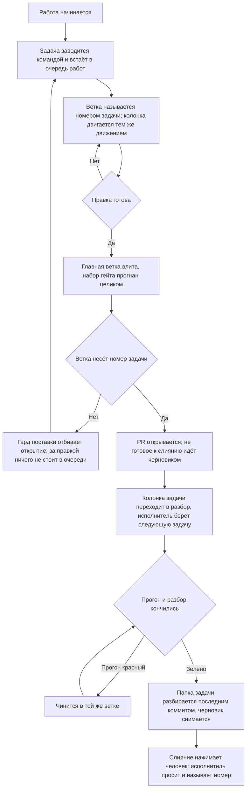

# Поставка — как это устроено здесь

Правило под закон `docs/constitution/delivery.md`. Закон говорит, что должно быть верно;
здесь — каким приёмом это держится в дереве, лежащем на GitHub. Ключ задач, адрес борды,
учётная запись машинной работы и области коммита — при этом дереве, в `implementation.md`
рядом: их не угадать, и общими они не бывают.

**Холодная часть:** `pitfalls.md` рядом — ловушки, грабли, на которые уже наступали.
Грузится по требованию, а не вместе с правилом.

## Как это называется здесь

| В законе                         | Здесь                                                                                                                                                                                           |
| -------------------------------- | ----------------------------------------------------------------------------------------------------------------------------------------------------------------------------------------------- |
| главная ветка                    | `main`                                                                                                                                                                                          |
| ключ задач                       | короткое слово, которым дерево зовёт свои задачи; задаётся ключом `board.taskKey` в `.claude/rt-kit/checks.json`, а в `implementation.md` называется для читателя                               |
| отдельная ветка                  | `<КЛЮЧ>-<номер задачи>-<короткий-slug>`. Имя без номера (`feat/…`, `fix/…`) законно, пока ветка живёт локально: PR с неё не откроется                                                           |
| задача                           | issue репозитория, заголовок `[<КЛЮЧ>-<номер>] <Что не так>`, исполнитель — учётная запись машинной работы; PR прикрепляется к нему строкой `Closes #<номер>` в теле                            |
| очередь работ                    | борда GitHub Projects. К репозиторию она не привязана: `projectsV2` у него пуст, и задача попадает на борду только явным добавлением                                                            |
| состояние задачи в очереди работ | колонка борды — поле «Status»: заведённая, взятая в работу, ждущая разбора. Имена колонок — в `implementation.md`; закрытая задача уходит из очереди мержем, а не переводом в последнюю колонку |
| PR о задаче                      | заголовок PR `[<КЛЮЧ>-<номер>] <Что сделано>` — тот же номер, что у задачи, и её название, переведённое в сделанное; тип и область коммита сюда не идут                                         |
| обсуждение правки                | разбор PR: ревьювер — владелец репозитория, исполнитель — учётная запись машинной работы, метки — те же, что у задачи                                                                           |
| запись о правке                  | коммит формата `type(scope): description` — типы `feat`, `fix`, `refactor`, `docs`, `style`, `test`, `chore`, `perf`; области — в `implementation.md`                                           |
| автор машинной работы            | отдельная учётная запись; её имя и место токена — в `implementation.md`. Токен лежит вне репозитория                                                                                            |

## Где это лежит

В этом дереве — таблица в `implementation.md` рядом. Пути живут там, а не здесь: правило
переносится между репозиториями, раскладка — нет, и путь, названный в правиле, врёт в первом
же дереве, которое держит код иначе.

## Ход

Ход работы от задачи до слияния: где стоит гард, что двигает колонку очереди работ и чем
работа кончается.

## Как закон применяется здесь

- **Коммит в главную ветку отбивается гардом.** Гард ищет вызов коммита в любом месте команды
  и смотрит текущую ветку на момент запуска, поэтому составная «создать ветку и сразу
  коммитить» отклоняется целиком: ветки в момент разбора ещё нет.
- **Ветка без номера задачи PR не открывает.** Гард поставки отбивает `gh pr create` с такой
  ветки: локально она законна, но правка из неё — это выкатка, за которой в очереди работ
  ничего не стоит. Заводится задача, и работа переносится в ветку с её номером.
- **Главная ветка влита в ветку задачи до открытия PR.** Гард поставки отбивает открытие, пока
  вершина главной ветки не стала предком текущей, и называет расхождение числом коммитов. PR с
  разошедшейся ветки показывает ревьюверу свою правку вперемешку с чужой, а всё, что автор
  проверил до публикации, он проверил от основания, которого в главной ветке уже нет.
- **Несошедшиеся условия поставки называются одним отказом, а не по одному.** Гард копит их все
  и печатает разом. Отбитый по первому промаху исполнитель правит основание, повторяет вызов,
  упирается в заголовок, правит заголовок, упирается в задачу — и каждый круг стоит ещё одного
  вызова, хотя всё несошедшееся было известно уже на первом.
- **Условие, известное в начале работы, спрашивается в начале.** Заведение ветки отбивает
  основание, в котором нет вершины главной ветки, и рабочую копию, подписывающую коммиты не той
  почтой, что объявило дерево. На пуше и на открытии PR те же проверки остаются вторым рубежом,
  но там они стоят дороже: основание чинится вливанием с разбором конфликта, подпись —
  переписыванием всей ветки.
- **Судится то основание, которое названо командой, а не вершина рабочей копии.** Ветку заводят
  и от `origin/main` прямо — этой командой основание как раз и берут свежим, — и гард, читающий
  только текущую вершину, отбивал бы её наравне с веткой от вчерашнего дерева. Основание, о
  котором дерево ничего не знает, не судится вовсе.
- **Ветка без номера задачи условий поставки не получает.** Локальная ветка под пробу законна, и
  требовать от неё свежего основания значило бы отбивать работу, которая в главную не поедет:
  PR с такой ветки не откроется.
- **Ключ задач задаётся один раз, и все три формы имени выводятся из него.** Заголовок задачи,
  имя ветки и заголовок PR строит один и тот же ключ: команда заведения задачи собирает по
  нему заголовок, гард поставки достаёт по нему номер из имени ветки, сверка очереди — из
  заголовка. Форма ветки в профиле дерева пишется той же парой `<КЛЮЧ>-<номер>`, а не своей
  похожей: разойдясь, они не отказывают, а перестают узнавать номер, и проверка, искавшая
  работу без задачи, пропускает всё подряд.
- **Незаданный ключ отбивает работу с очередью на месте.** Модуль борды отказывает при первом
  же вызове и называет, где ключ задаётся. Умолчания у ключа нет намеренно: собранный из
  пустого значения заголовок `[-317]` не совпадает ни с чем, и сверка очереди помечает
  неправильно названной каждую задачу — настоящее расхождение тонет среди этих строк.
- **Заведённая задача подтверждается ответом очереди работ, а не выводом команды заведения.**
  Команда отвечает за свои вызовы: она может завести задачу и не довести её до борды, и её
  собственный разбор ошибок этот случай называет. Напечатанный номер значит «вызов прошёл», а не
  «задача видна тому, кто по ней работает». Спрашивается очередь — по номеру, одним вызовом, — и
  ответ читается присутствием задачи на борде, её колонкой и исполнителем.
- **Номер ветки и номер в заголовке PR сверяются на месте, а состояние задачи — по борде.**
  Формат читается из текста команды и работает без сети; существование задачи, её присутствие
  на борде, её колонка, исполнитель, то, что она ещё открыта, и разбор у PR — только когда есть
  чем спросить. Нет сети или нет токена — второй ярус молча пропускается: проверка, падающая в
  самолёте, перестаёт что-либо значить.
- **Колонка задачи двигается тем же движением, что и работа.** Ветка заведена — задача
  переставляется во взятые в работу, PR открыт — в ждущие разбора; делает это команда
  перевода, а не набор вызовов GraphQL по памяти. Перевод идёт сразу за шагом, который его
  вызвал: очередь работ читают между шагами, а не после них.
- **Задача, оставшаяся в первой колонке, PR не открывает.** Гард поставки называет её колонку и
  команду перевода: по очереди работ такая задача читается как невзятая, хотя работа по ней
  сделана и выложена. На заведении ветки колонка не спрашивается — там её ещё не двигали, и
  требование отбивало бы первую же команду работы вместе с той, которая его и снимает. Имя
  первой колонки дерево называет само; не названо — колонка не судится вовсе.
- **На борде стоят задачи, а не PR о них.** Борда показывает, что сделано и что осталось; PR
  отвечает на другой вопрос — как именно сделано, — и открывается из карточки задачи, где связь
  с ним заполняется сама полем «Linked pull requests». Карточка PR живёт своей жизнью: колонки
  под неё нет, из очереди она не уходит и остаётся в ней после слияния навсегда. Заводится она
  либо встроенным правилом борды, либо рукой; и то и другое выключается, а накопившееся
  снимается. Находит их сверка очереди — строкой на каждую.
- **Отставшая колонка находится сверкой очереди, а не глазами.** Сверка судит колонку по
  PR в обе стороны: открытый PR при задаче не в разборе и разбор без открытого PR — оба
  расхождения. Момента, когда задачу берут в работу, ей не видно: ветки на борде нет.
- **Задачи, чинящиеся одной правкой, сливаются до мержа.** Вторая стирается вместе с номером,
  а недостающее из неё дописывается в первую. После мержа слить уже нельзя: ветка въехала, и
  откатывается она целиком.
- **Работа, которую одним заходом не закрыть, помечена в двух местах, и они сверяются.** Метка
  на борде и строка о заходах с передачей в замысле эпика говорят одно и то же двум читателям:
  исполнитель открывает карточку раньше, чем замысел эпика, а планирует по замыслу. Одна пометка без
  другой лжёт молча, поэтому сверка очереди судит пару в обе стороны. Помечается только то, что
  законно не делится: пометка объёма правом делить не становится.
- **Вершина открытого PR без прогона видна сверкой очереди работ.** Страница PR без прогона
  выглядит так же, как страница с зелёным: цвета у неё нет ни там, ни там, — и вершину, за
  которой прогон не встал, замечали только тем, что открывали список прогонов руками. Сверка
  спрашивает вершину, а не ветку, считает сам факт прогона, а не его цвет, и свежей вершине
  даёт время: между пушем и прогоном проходят минуты.
- **Черновик при зелёном прогоне на вершине — расхождение сверки.** У черновика кнопка слияния
  заблокирована самим хостингом: зелёная страница PR владельцу ничего не разрешает, а список, в
  котором всё серое, читается как «работа не сделана». Гард снятия черновика сюда не достаёт —
  он судит один ход и молчит, пока ветка везёт папку своей задачи.
- **Конфликтующий открытый PR — расхождение сверки очереди работ.** Конфликт приезжает в
  отданный PR чужим слиянием, без единого действия автора: основание, проверенное на открытии,
  устаревает в ту минуту, когда владелец влил соседнюю работу. Гард снятия черновика сюда не
  достаёт — он судит один ход, а PR стоит в очереди днями, и по списку конфликт не виден вовсе:
  метку хостинг показывает только внутри самого PR. Непосчитанная сливаемость расхождением не
  считается: хостинг считает её заново после каждой правки главной ветки, и строка на
  «ещё не посчитано» краснела бы на каждой свежей вершине.
- **Документ едет в том же коммите, что и правка.** Обход — строка `Docs-skip: <причина>` в
  теле коммита; пустая причина не принимается.
- **Заголовок коммита сверяется с форматом на месте.** Разобранный по типу и области
  заголовок читается списком, а свободный текст — только целиком.
- **Перед пушем прогоняются все линтеры, а не один.** Линтер кода обычно не читает файлы
  стилей вовсе, и правила оформления без второго прогона не проверяет ничто.
- **Сборка входит в набор наравне с линтом и юнитами.** Линтер типов не читает, а юниты читают
  только то, что импортировано тестом: ошибка типов в непокрытом коде доживает до сборки
  образа, то есть до мержа. Четыре мержа подряд так и уехали в главную ветку, ломая выкатку.
- **Набор гейта пуша не бывает уже набора конвейера.** Гейт — обещание, что пуш не приедет
  красным; набор, из которого выкинуты сборка и снимки, обещает то, чего не проверяет. Шаг
  конвейера, которому в наборе гейта нет ни строки, ни объявленного исключения с причиной,
  отбивает пуш, а не печатается рядом с ним: напечатанное предупреждение исполнитель читает как
  разрешение. Дважды подряд правка, прошедшая гейт целиком, была отбита конвейером — и оба раза
  зелёный гейт был прочитан как «локально всё зелено».
- **Сверка раскладки стоит в наборе гейта пуша наравне с линтом и сборкой.** Правка, положенная
  в разложенную копию мимо источника, в день, когда её делают, не ломает ничего: дерево
  работает, проверки зелёные, а расхождение видно только тому, кто позовёт сверку сам. Копится
  оно молча и всплывает на чужой работе — раскладка отказывает по правленому файлу целиком и не
  кладёт ни одного другого, так что цену платит тот, кто правил соседний ресурс. Статьёй выше
  эта строка не покрывается: сверки нет в конвейере, а значит нет и шага, который она бы
  закрывала, — в набор она ставится прямо, а не выводится из его полноты.
- **После вливания главной ветки набор проверок пересматривается по тому, что ветка везёт
  теперь.** Вливание меняет состав правки: проверять по тому, что правил автор, — значит
  проверять половину, а отвечает ветка целиком. Ветка, не тронувшая ни строки показа, прогоняет
  снимки витрин с того момента, как вливание принесло чужую правку оформления.
- **Утверждение о главной ветке делается по удалённой ссылке, а не по локальной.** Локальная
  протухает в ту минуту, когда её подтянули в последний раз, и молчит об этом: она не пуста и не
  сломана, она описывает вчерашний день. Сравнение веток пишется от `origin/main` целиком —
  смешав в одной команде удалённую ссылку для одной стороны и локальную для другой, промах
  изнутри выглядит правильным.
- **Правка кода отдаётся человеку открытым PR, а не запушенной веткой.** Ветка в списке ветвей
  ему не показывается, во входящие не приходит и обсуждения не имеет: до открытия PR правки
  для человека нет. Открывается он тем же ходом, которым исполнитель говорит, что работу
  отдаёт, и в ответе называется номером.
- **Не готовое к слиянию открывается черновиком — `gh pr create --draft`.** Кнопка слияния у
  черновика заблокирована самим хостингом, поэтому состояние «выложено на обозрение» и
  состояние «можно вливать» перестают выглядеть одинаково. Черновиком идёт всё, что ждёт
  прогона конвейера, доработки или ответа на вопрос; вопрос задаётся в самом PR.
- **Черновик снимается отдельным вызовом — `gh pr ready <номер>`.** Им исполнитель отвечает за
  готовность: проверки пройдены, доработок не осталось, работа сходится с задачей. Снятие
  черновика и просьба влить — один ход, а не два разных дня.
- **Черновик не снимается с ветки, которая не сливается.** Зелёный прогон говорит «не
  сломано», сливаемость — «кнопку можно нажать», и владельцу нужно второе: снятый черновик он
  читает как приглашение влить и идёт нажимать. Спрашивается это у хостинга тем же вызовом, что
  автор и ревьювер, — `mergeable` приходит в том же ответе; выводить сливаемость из того, что
  вливание прошло локально, нельзя: между локальным вливанием и взглядом владельца главная
  ветка успевает уйти вперёд. За один заход так было снято три черновика подряд, и все три
  заявки владелец увидел конфликтующими. Держится это гардом поставки, а не памятью: статья
  стояла здесь и до того, и промах повторился в тот же день. Дерево, чей помощник очереди работ
  о сливаемости не говорит вовсе, работает как прежде — поля нет, требования нет.
- **Указателю, в который ветки только дописывают строки, объявляется сложение обеих сторон.**
  Конфликт там не спор: обе допись нужны целиком, а зовёт он человека при каждом слиянии в
  главную ветку — за один заход одна и та же строка разрешалась шесть раз в шести ветках.
  Объявление снимает ручное разрешение: слияние проходит само. **Метку сливаемости на странице
  заявки оно при этом не снимает** — хостинг считает её своим приёмом и настройки слияния не
  читает. Гаснет метка только после того, как ветка вобрала главную и это уехало на хостинг.
  Обещать по этому объявлению «конфликтов больше не будет» нельзя: не будет ручной работы, а
  вливать главную в открытые ветки после каждого слияния придётся по-прежнему.
- **Разрешённый конфликт, оставшийся незапушенным, хуже неразрешённого.** Владелец видит
  прежнее состояние и читает его как «не сделано ничего», а сделанное лежит в рабочем дереве
  исполнителя, где его не видит никто. Ветка, в которой разрешён конфликт, пушится тем же
  ходом — либо конфликт не разрешается вовсе.
- **Одно и то же вливание главной ветки, сделанное третий раз за заход, останавливает
  работу.** Ветки, дописывающие строку в один и тот же список, роняют друг друга в конфликт при
  каждом слиянии, и вливание главной по кругу — это починка проявления. На третьем круге
  называется причина и спрашивается владелец, а не делается четвёртый круг.
- **Черновик не снимается, пока у PR нет разбора.** Гард поставки смотрит запрошенного ревьювера
  и оставленный отзыв: снятый черновик читается как «можно вливать», а вливать некому. Раньше
  этого хода спросить негде — до открытия PR ревьювера нет вовсе. Судится и вызов без номера:
  без него клиент берёт PR текущей ветки, и требование снималось бы одним пробелом. Возврат PR
  в черновик — `gh pr ready --undo` — требования не получает: он делает то же, чего гард и
  добивается.
- **Мерж PR нажимает человек, а не исполнитель работы.** Кнопка и вызов слияния равны: запрет
  на них один. Исполнитель сливает свой PR только тогда, когда человек сказал это прямо и про
  этот PR; сказанное об одном PR на следующий не переносится, а молчание разрешением не
  бывает. Работа кончается PR, с которого снят черновик, и в ответе называется его номер.
- **Личность вызова, открывающего заявку, стережёт гард поставки, а не память исполнителя.**
  Она приходит окружением, и из текста команды видна только явной подстановкой токена — её гард
  и требует, называя переменную и готовую строку; дерево, не назвавшее машинной записи,
  требования не получает. Ответ хостинга об авторе он спрашивает позже, на снятии черновика:
  это последний ход, где промах ещё исправим — влитую заявку не переоткрыть, а автора у неё не
  сменить. Прежде обе стороны держались статьёй и разбором происшествия, и промах повторился на
  третий день.

- **Автор PR не может быть его ревьювером.** Запрос разбора на самого себя GitHub принимает и
  молча не создаёт — разбор при этом выглядит запрошенным. Поэтому в разборе считаются только
  запрос и отзыв не от автора: гард снятия черновика читает состояние PR именно так.
- **Метки, исполнитель и ревьювер PR ставятся вызовами `gh api`, а не `gh pr edit`.** На
  репозитории со старой бордой `gh pr edit` отвечает отказом про Projects (classic) и до
  правки не доходит вовсе.
- **Борда правится запросом GraphQL по идентификатору проекта.** `gh project` с `--owner`
  отвечает `unknown owner type`, когда владелец борды — не та учётная запись, под которой
  идёт вызов.
- **Почта машинного коммита копируется из компаньона, а не набирается по памяти.** Служебный
  адрес GitHub — `<число>+<логин>@users.noreply.github.com`, и сопоставляется он по числу: логин
  рядом с ним не сверяет никто. Коммит с чужим числом уезжает подписанным посторонним человеком,
  а изнутри промах не виден — имя учётной записи в истории то самое. Ту же строку держит профиль
  дерева, и гард поставки отбивает пуш при расхождении.
- **Личность машинной записи подтверждается ответом хостинга, а не узнаванием строки.** Знакомый
  вид строки подтверждением не бывает — промах выглядел знакомо. Спрашивается токеном самой
  записи, ответом о себе: логин и число приходят вместе. Поиск по числу для ограниченной записи
  отвечает «не найдено» и её собственным токеном, поэтому годится только ответ о себе.
- **Сценарии гардов задают настройки git сами, а не берут их с машины.** Коммит во временном
  репозитории сценария наследует общий конфиг: если включена подпись, git идёт в агент ключей,
  а заблокированный агент роняет весь набор — со стороны это выглядит сломанным гардом. Автор,
  почта и подпись передаются флагами `-c` прямо в команду.

## Чего из закона здесь нет

Гард поставки стоит на командах агента, поэтому ветку, заведённую руками в редакторе, он не
видит: имя такой ветки держится памятью. Требование от этого не слабеет — просто отдельной
проверки под него не заводится: работа опознаётся заголовком задачи и PR, а это сверяется
у всех. Сверка очереди имя ветки не судит вовсе: у открытого PR его не переименовать.

Задачу в работу гард не переводит: борду он не правит — правка борды в разборе команды падала бы
вместе со связью и отбивала бы работу вместо промаха. Перевод держится памятью и подсказкой,
которую печатает команда заведения задачи. Задачу, оставшуюся в первой колонке, гард называет на
открытии PR — то есть после того, как её должны были переставить; прочие расхождения колонки
находит сверка очереди.

Свежесть самой вершины главной ветки гард спрашивает вторым ярусом — тем же приёмом, что и
состояние задачи: есть чем спросить, спрашивает; нет сети или доступа — пропускает молча.
Первый ярус при этом остаётся, и работает он без сети: локальная ссылка отвечает на вопрос
«отстала ли ветка от того, что уже лежит в дереве», удалённая — на вопрос «не протухла ли сама
ссылка». Без второго яруса молчание гарда значило лишь первое, а читалось как второе.

## Паттерны

- `git-workflow-commit` — задача, ветка, коммит и пуш от учётной записи машинной работы.
- `git-workflow-pr` — открытие PR, черновик и его снятие, тело, ревьювер, метки, состояние.
- `git-workflow-merge` — главная ветка влита в ветку задачи, конфликт разобран.
