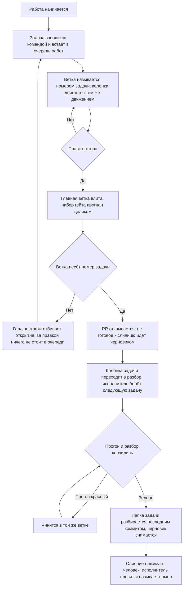

# Поставка — как это устроено здесь

Правило под закон `docs/constitution/delivery.md`. Закон говорит, что должно быть верно;
здесь — каким приёмом это держится в дереве, лежащем на GitLab. Ключ задач, адрес борды,
учётная запись машинной работы и области коммита — при этом дереве, в `implementation.md`
рядом: их не угадать, и общими они не бывают.

**Холодная часть:** `pitfalls.md` рядом — ловушки, грабли, на которые уже наступали.
Грузится по требованию, а не вместе с правилом.

## Как это называется здесь

| В законе                         | Здесь                                                                                                                                                                                                 |
| -------------------------------- | ----------------------------------------------------------------------------------------------------------------------------------------------------------------------------------------------------- |
| главная ветка                    | `main`                                                                                                                                                                                                |
| отдельная ветка                  | `<КЛЮЧ>-<номер задачи>-<короткий-slug>`. Имя без номера (`feat/…`, `fix/…`) законно, пока ветка живёт локально: MR с неё не откроется                                                                 |
| ключ задач                       | короткое слово, которым дерево зовёт свои задачи; задаётся ключом `board.taskKey` в `.claude/rt-kit/checks.json`, а в `implementation.md` называется для читателя                                     |
| задача                           | issue проекта, заголовок `[<КЛЮЧ>-<номер>] <Что не так>`, исполнитель — учётная запись машинной работы; MR прикрепляется к нему строкой `Closes #<номер>` в описании                                  |
| очередь работ                    | доска задач проекта — Issue Board. Задача попадает на неё меткой списка, а не самим фактом заведения: доска показывает те issue, чью метку знает                                                      |
| состояние задачи в очереди работ | список доски, за которым стоит метка: заведённая, взятая в работу, ждущая разбора. Имена меток — в `implementation.md`; закрытая задача уходит из очереди слиянием, а не переносом в последний список |
| PR о задаче                      | заголовок MR `[<КЛЮЧ>-<номер>] <Что сделано>` — тот же номер, что у задачи, и её название, переведённое в сделанное; тип и область коммита сюда не идут                                               |
| обсуждение правки                | разбор MR: ревьювер — владелец проекта, исполнитель — учётная запись машинной работы, метки — те же, что у задачи                                                                                     |
| запись о правке                  | коммит формата `type(scope): description` — типы `feat`, `fix`, `refactor`, `docs`, `style`, `test`, `chore`, `perf`; области — в `implementation.md`                                                 |
| автор машинной работы            | отдельная учётная запись; её имя и место токена — в `implementation.md`. Токен лежит вне репозитория                                                                                                  |

## Где это лежит

В этом дереве — таблица в `implementation.md` рядом. Пути живут там, а не здесь: правило
переносится между репозиториями, раскладка — нет, и путь, названный в правиле, врёт в первом
же дереве, которое держит код иначе.

## Ход

Ход работы от задачи до слияния: где стоит гард, что двигает колонку очереди работ и чем
работа кончается.

## Как закон применяется здесь

- **Коммит в главную ветку отбивается гардом.** Гард ищет вызов коммита в любом месте команды
  и смотрит текущую ветку на момент запуска, поэтому составная «создать ветку и сразу
  коммитить» отклоняется целиком: ветки в момент разбора ещё нет.
- **Ветка без номера задачи MR не открывает.** Гард поставки отбивает `glab mr create` с такой
  ветки: локально она законна, но правка из неё — это выкатка, за которой в очереди работ
  ничего не стоит. Заводится задача, и работа переносится в ветку с её номером.
- **Главная ветка влита в ветку задачи до открытия MR.** Гард поставки отбивает открытие, пока
  вершина главной ветки не стала предком текущей, и называет расхождение числом коммитов. MR с
  разошедшейся ветки показывает ревьюверу свою правку вперемешку с чужой, а всё, что автор
  проверил до публикации, он проверил от основания, которого в главной ветке уже нет.
- **Несошедшиеся условия поставки называются одним отказом, а не по одному.** Гард копит их все
  и печатает разом. Отбитый по первому промаху исполнитель правит основание, повторяет вызов,
  упирается в заголовок, правит заголовок, упирается в задачу — и каждый круг стоит ещё одного
  вызова, хотя всё несошедшееся было известно уже на первом.
- **Условие, известное в начале работы, спрашивается в начале.** Заведение ветки отбивает
  основание, в котором нет вершины главной ветки, и рабочую копию, подписывающую коммиты не той
  почтой, что объявило дерево. На пуше и на открытии MR те же проверки остаются вторым рубежом,
  но там они стоят дороже: основание чинится вливанием с разбором конфликта, подпись —
  переписыванием всей ветки.
- **Судится то основание, которое названо командой, а не вершина рабочей копии.** Ветку заводят
  и от вершины главной ветки прямо — этой командой основание как раз и берут свежим, — и гард,
  читающий только текущую вершину, отбивал бы её наравне с веткой от вчерашнего дерева.
  Основание, о котором дерево ничего не знает, не судится вовсе.
- **Ветка без номера задачи условий поставки не получает.** Локальная ветка под пробу законна, и
  требовать от неё свежего основания значило бы отбивать работу, которая в главную не поедет:
  MR с такой ветки не откроется.
- **Правка кода отдаётся человеку открытым MR, а не запушенной веткой.** Ветка в списке ветвей
  ему не показывается, в дела не приходит и обсуждения не имеет: до открытия MR правки для
  человека нет. Открывается он тем же ходом, которым исполнитель говорит, что работу отдаёт, и
  в ответе называется номером.
- **Не готовое к слиянию открывается черновиком — `glab mr create --draft`.** Кнопка слияния у
  черновика заблокирована самим хостингом, поэтому состояние «выложено на обозрение» и
  состояние «можно вливать» перестают выглядеть одинаково. Черновиком идёт всё, что ждёт
  прогона конвейера, доработки или ответа на вопрос; вопрос задаётся в самом MR. Признак
  черновика здесь — приставка `Draft:` в заголовке, и правится он вместе с ним.
- **Черновик снимается отдельным вызовом — `glab mr update <номер> --ready`.** Им исполнитель
  отвечает за готовность: проверки пройдены, доработок не осталось, работа сходится с задачей.
  Снятие черновика и просьба влить — один ход, а не два разных дня.
- **Черновик не снимается, пока у MR нет разбора.** Гард поставки смотрит запрошенного ревьювера
  и оставленный отзыв: снятый черновик читается как «можно вливать», а вливать некому. Раньше
  этого хода спросить негде — до открытия MR ревьювера нет вовсе. В разборе считаются только
  запрос и отзыв не от автора: разбор на самого себя разбором не бывает. Судится и вызов без
  номера — без него клиент берёт MR текущей ветки, и требование снималось бы одним пробелом;
  возврат MR в черновик требования не получает.
- **Заведённая задача подтверждается ответом очереди работ, а не выводом команды заведения.**
  Команда отвечает за свои вызовы: она может завести задачу и не довести её до доски, и её
  собственный разбор ошибок этот случай называет. Напечатанный номер значит «вызов прошёл», а не
  «задача видна тому, кто по ней работает». Спрашивается очередь — по номеру, одним вызовом, — и
  ответ читается присутствием задачи на доске, её списком и исполнителем.
- **Номер ветки и номер в заголовке MR сверяются на месте, а состояние задачи — по доске.**
  Формат читается из текста команды и работает без сети; существование задачи, её метка
  списка, исполнитель, то, что она ещё открыта, и разбор у MR — только когда есть чем спросить.
  Нет сети или нет токена — второй ярус молча пропускается: проверка, падающая в самолёте,
  перестаёт что-либо значить.
- **Список задачи двигается тем же движением, что и работа.** Ветка заведена — задача
  переставляется во взятые в работу, MR открыт — в ждущие разбора; делает это команда
  перевода, а не набор вызовов по памяти. Перевод идёт сразу за шагом, который его вызвал:
  очередь работ читают между шагами, а не после них.
- **Задача, оставшаяся в первом списке, MR не открывает.** Гард поставки называет её список и
  команду перевода: по очереди работ такая задача читается как невзятая, хотя работа по ней
  сделана и выложена. На заведении ветки список не спрашивается — там его ещё не двигали, и
  требование отбивало бы первую же команду работы вместе с той, которая его и снимает. Имя
  первого списка дерево называет само; не названо — список не судится вовсе.
- **На доске стоят задачи, а не MR о них.** Доска показывает, что сделано и что осталось; MR
  отвечает на другой вопрос — как именно сделано, — и открывается из задачи, где связь с ним
  стоит сама. Карточка MR живёт своей жизнью: метки списка у неё нет, из очереди она не уходит и
  остаётся в ней после слияния навсегда. Здесь она заводится проще, чем где-либо: доска
  собирается по меткам, и метка списка, поставленная на MR, тут же делает его карточкой.
  Находит такие сверка очереди — строкой на каждую.
- **Отставший список находится сверкой очереди, а не глазами.** Сверка судит список по PR
  в обе стороны: открытый MR при задаче не в разборе и разбор без открытого MR — оба
  расхождения. Момента, когда задачу берут в работу, ей не видно: ветки на доске нет.
- **Задачи, чинящиеся одной правкой, сливаются до слияния ветки.** Вторая закрывается как
  дубликат со ссылкой на поглотившую, а недостающее из неё дописывается в первую. Закон велит
  вторую стереть — здесь это объявленное отступление: стереть задачу хостинг не даёт вовсе, а её
  номер остаётся в истории, и ссылка из чужого коммита ведёт в закрытую задачу, а не в пустоту.
  После слияния слить уже нельзя: ветка въехала, и откатывается она целиком.
- **Работа, которую одним заходом не закрыть, помечена в двух местах, и они сверяются.** Метка
  на доске и строка о заходах с передачей в замысле эпика говорят одно и то же двум читателям:
  исполнитель открывает карточку раньше, чем замысел эпика, а планирует по замыслу. Одна пометка без
  другой лжёт молча, поэтому сверка очереди судит пару в обе стороны. Помечается только то, что
  законно не делится: пометка объёма правом делить не становится.
- **Документ едет в том же коммите, что и правка.** Обход — строка `Docs-skip: <причина>` в
  теле коммита; пустая причина не принимается.
- **Заголовок коммита сверяется с форматом на месте.** Разобранный по типу и области
  заголовок читается списком, а свободный текст — только целиком.
- **Перед пушем прогоняются все линтеры, а не один.** Линтер кода обычно не читает файлы
  стилей вовсе, и правила оформления без второго прогона не проверяет ничто.
- **Сборка входит в набор наравне с линтом и юнитами.** Линтер типов не читает, а юниты читают
  только то, что импортировано тестом: ошибка типов в непокрытом коде доживает до сборки
  образа, то есть до слияния. Четыре слияния подряд так и уехали в главную ветку, ломая
  выкатку.
- **Набор гейта пуша не бывает уже набора конвейера.** Гейт — обещание, что пуш не приедет
  красным; набор, из которого выкинуты сборка и снимки, обещает то, чего не проверяет. Шаг
  конвейера, которому в наборе гейта нет ни строки, ни объявленного исключения с причиной,
  отбивает пуш, а не печатается рядом с ним: напечатанное предупреждение исполнитель читает как
  разрешение. Дважды подряд правка, прошедшая гейт целиком, была отбита конвейером — и оба раза
  зелёный гейт был прочитан как «локально всё зелено».
- **Причина исключения, называющая задачу, судится на живость этой задачи.** Отсрочка со сроком
  и отсрочка без срока выглядят одинаково, пока номер никто не спросил; мёртвый номер в причине
  делает исключение бессрочным, не сказав об этом ни строкой. Спрашивается тем же ярусом, что
  состояние задачи у гарда поставки: есть чем спросить — спрашивает, нет сети или доступа —
  пропускает молча.
- **Сверка раскладки стоит в наборе гейта пуша наравне с линтом и сборкой.** Правка, положенная
  в разложенную копию мимо источника, в день, когда её делают, не ломает ничего: дерево
  работает, проверки зелёные, а расхождение видно только тому, кто позовёт сверку сам. Копится
  оно молча и всплывает на чужой работе — раскладка отказывает по правленому файлу целиком и не
  кладёт ни одного другого, так что цену платит тот, кто правил соседний ресурс. Статьёй выше
  эта строка не покрывается: сверки нет в конвейере, а значит нет и шага, который она бы
  закрывала, — в набор она ставится прямо, а не выводится из его полноты.
- **После вливания главной ветки набор проверок пересматривается по тому, что ветка везёт
  теперь.** Вливание меняет состав правки: проверять по тому, что правил автор, — значит
  проверять половину, а отвечает ветка целиком. Ветка, не тронувшая ни строки показа, прогоняет
  снимки витрин с того момента, как вливание принесло чужую правку оформления.
- **Утверждение о главной ветке делается по удалённой ссылке, а не по локальной.** Локальная
  протухает в ту минуту, когда её подтянули в последний раз, и молчит об этом: она не пуста и не
  сломана, она описывает вчерашний день. Сравнение веток пишется от `origin/main` целиком —
  смешав в одной команде удалённую ссылку для одной стороны и локальную для другой, промах
  изнутри выглядит правильным.
- **Слияние по кнопке «Merge when pipeline succeeds» не заменяет проверок до пуша.** Конвейер
  видит только то, что уже отправлено, а отправленная красная ветка занимает очередь работ и
  выглядит готовой к разбору.
- **Метки и исполнитель MR ставятся при создании, а не правкой после.** `glab mr create`
  принимает их флагами; правка открытого MR второй командой обходится молча, когда токен
  учётной записи машинной работы не видит проект целиком.
- **Задача переводится по списку правкой её меток.** Списки доски — это метки: перевод, не
  снявший прежнюю метку, оставляет задачу в двух списках сразу, и очередь читается неверно.
- **Сценарии гардов задают настройки git сами, а не берут их с машины.** Коммит во временном
  репозитории сценария наследует общий конфиг: если включена подпись, git идёт в агент ключей,
  а заблокированный агент роняет весь набор — со стороны это выглядит сломанным гардом. Автор,
  почта и подпись передаются флагами `-c` прямо в команду.

## Чего из закона здесь нет

Гард поставки стоит на командах агента, поэтому ветку, заведённую руками в редакторе, он не
видит: имя такой ветки держится памятью. Требование от этого не слабеет — просто отдельной
проверки под него не заводится: работа опознаётся заголовком задачи и PR, а это сверяется
у всех. Сверка очереди имя ветки не судит вовсе: у открытого MR его не переименовать.

Задачу в работу гард не переводит: доску он не правит — правка доски в разборе команды падала бы
вместе со связью и отбивала бы работу вместо промаха. Перевод держится памятью и подсказкой,
которую печатает команда заведения задачи. Задачу, оставшуюся в первом списке, гард называет на
открытии MR — то есть после того, как её должны были переставить; прочие расхождения списка
находит сверка очереди.

Свежесть самой вершины главной ветки гард спрашивает вторым ярусом — тем же приёмом, что и
состояние задачи: есть чем спросить, спрашивает; нет сети или доступа — пропускает молча. Первый
ярус при этом остаётся, и работает он без сети: локальная ссылка отвечает на вопрос «отстало ли
основание от того, что уже лежит в дереве», удалённая — на вопрос «не протухла ли сама ссылка».
Без второго яруса молчание гарда значило лишь первое, а читалось как второе.

## Паттерны

- `git-workflow-commit` — задача, ветка, коммит и пуш от учётной записи машинной работы.
- `git-workflow-pr` — открытие MR, черновик и его снятие, описание, ревьювер, метки, состояние.
- `git-workflow-merge` — главная ветка влита в ветку задачи, конфликт разобран.
