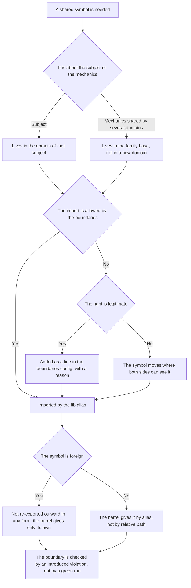

# Imports between libs — how it works here

Rule under the law `docs/constitution/lib-imports.md`. The law says who sees whom; here — how it is
cut in this tree, what it is called and what we do not have.

## What it is called here

| In the law                           | Here                                                                |
| ------------------------------------ | ------------------------------------------------------------------- |
| lib family                           | `libs/site`, `libs/admin`, `libs/api`                               |
| layer                                | `api`, `data-access`, `feature`, `shell`, `ui`, `util`              |
| the right to see a lib               | a tag in `eslint/boundaries/domains/<family>.config.mjs`            |
| lib shared by all three applications | `libs/common/util`, tag `scope:common-util`                         |
| family base                          | `<family>/core`; its tag is in `ADMIN_UNIVERSAL`                    |
| barrel                               | `src/index.ts` of the lib and `index.ts` of the component directory |

A feature domain of the frontend has six layers (`api`, `data-access`, `feature/<screen>`, `shell`,
`ui`, `util`), a common domain the same without `shell`. The backend has no `ui` and no `shell`: it
has nothing to serve markup with or to route by.

## Where it lives

In this tree — the table in `implementation.md` next to it. Paths live there, not here: the rule
travels between repositories, the layout does not, and a path named in the rule lies in the first
tree that keeps its code differently.

## Flow

The flow of declaring a shared symbol: where it must live, what to do with a missing import right
and how the boundary is checked.

## How the law applies here

- **A foreign symbol is not re-exported in either of the two forms.** Both `export { X } from
  '@<scope>/…'` and the pair "import plus `export { X };`" are forbidden. The second looks like an
  own declaration and passed review by eye.
- **A line with a foreign lib alias in a barrel is the same re-export.** A relative path in a barrel
  is legitimate: it collects the lib's own files outward.
- **A missing right is added as a line in the domain config with a comment.** An import that "just
  worked" means the tag is not narrowed yet.
- **`libs/common/util` has an empty dependency list, and Angular does not get in.** The backend
  imports the lib, and the framework would ride into its bundle; a DI token shared by the two
  frontend families lives in `common/platform`.
- **The family base sees only `util`.** Every domain of the family calls it, and any dependency of
  it becomes shared by all at once.
- **Behaviour the family base cannot see comes to it by a token.** The token is declared in the
  `util` of the common domain, and `data-access` puts its implementation there: so the base calls it
  without seeing its lib. Widening the base boundaries for one call opens that lib to every domain
  of the family at once and never narrows back.
- **A domain is started for a subject, not for mechanics.** Mechanics shared by several domains ride
  into the lib that already sees them. On the frontend that is the family base, on the backend the
  `util` layer listed with every domain.
- **The name of a lib is what its manifest declares, and the path only suggests it.** The tag and
  the import alias are derived from that name, and the audit reads all three from the manifest and
  the list of paths instead of assembling them from the directory. Where the manifest declares no
  name, the path says what the name must become.
- **A domain with exactly one non-empty layer is listed as a line with a reason.** Otherwise it
  cannot be told from a slot: both have empty layers, and a barrel lies in both.

## What of the law is not here

Today the family base deviates from the ladder once, and it is named in `CORE_EXCEPTIONS` of the
check: `common/proto` and `common/connect` for `admin/core`, for the sake of Connect transport.

The full set of layers is required of everyone, and an empty layer is not a defect: `api` is empty
in a domain that talks to no one foreign. Only the edge case is judged — exactly one non-empty
layer; such a domain is usually one, and it stands in the exceptions list with a reason.

## Patterns

- `lib-layers-new` — create or remove a lib: generator, tags, alias, README.
- `lib-layers-move` — move code between libs: order, boundaries, imports, README of both.

## Pitfalls

- **A lib nobody imports is checked by nothing.** `nx lint` and `nx test` check the lib itself, not
  its contract with the consumer: a lost field in `*.State` is not an error while there is no
  calling code. The first importer is the first check — the models layer is accepted after `nx
  build` and a live run of the scenario, not by a green `lint test`.
- **A check is accepted on a violation, not on a green run.** The violation is introduced by hand,
  the run turns red, the edit is reverted. The checks in `tools/` have no tests, and this is the
  only acceptance.
- `git rm -r` leaves `node_modules/.vite` inside the removed directory, and the check keeps seeing
  it as a domain without layers. Finish with `rm -rf`.
- A snippet written a second time is caught by `npm run check:dupes` — rule `shared-code`.
