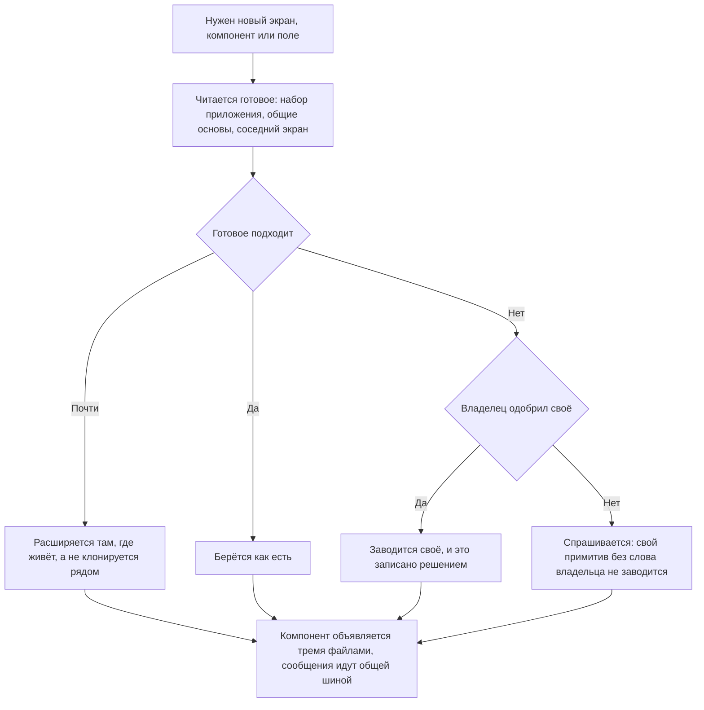

# Единообразие — как это устроено здесь

Правило под закон `docs/constitution/reuse-first.md`. Закон говорит, что одинаковые вещи ведут
себя одинаково; здесь — на чём это стоит в этом дереве и чем названо.

## Как это называется здесь

| В законе                         | Здесь                                                                                                                                                      |
| -------------------------------- | ---------------------------------------------------------------------------------------------------------------------------------------------------------- |
| готовое                          | компоненты кита `@rt-tools/ui-kit-v2` с префиксом `rt-` — сегодня их больше семидесяти — и базовые классы без селектора, наследуемые в `@Component` экрана |
| раскладка страниц, форм и окон   | `apps/<app>/src/styles/`, применяется директивами BEM                                                                                                      |
| оформление части приложения      | файл `.scss` рядом с компонентом                                                                                                                           |
| отступление, решённое владельцем | маркер `native-ok` с объяснением — комментарием строкой выше или в самой строке                                                                            |

## Где это лежит

В этом дереве — таблица в `implementation.md` рядом. Пути живут там, а не здесь: правило
переносится между репозиториями, раскладка — нет, и путь, названный в правиле, врёт в первом
же дереве, которое держит код иначе.

## Ход

Ход заведения нового: с чего начинается работа, где проходит граница между расширением готового
и своим, и чем эта граница держится.

## Как закон применяется здесь

- **Источник вида выбирается по приложению, а не по привычке.** У каждого приложения дерева
  своя опора: у публичного сайта — его дизайн-система, у остальных — кит. Перепутанный источник
  приносит на экран форму, которой в этом приложении больше нигде нет. Какое приложение на что
  опирается, названо в именах дерева.
- **Работа начинается с чтения готового, а не с чистого файла.** Сначала находится опора —
  компонент кита, базовый класс, образец в соседнем домене, — потом пишется своё поверх неё.
- **Ограничение, придуманное на месте, проверяется поиском по дереву прежде, чем стать доводом.**
  «Так делать нельзя» — утверждение о дереве наравне с прочими, и дерево, где приём уже применён,
  отвечает на него одной командой. Названное владельцу до поиска, оно закрывает путь, которым
  дерево пользуется каждый день, и вызывает перебор ненужных вариантов: решение «править класс
  чужого набора из приложения нельзя» не проверялось, пока образец такой правки лежал в том же
  файле — с доводом в соседней строке.
- **Значение интеграции берётся тем же путём, что и соседнее значение той же интеграции.**
  Половина интеграции, сделанная как положено, — готовый образец, и стоит он не в чужом домене,
  а строкой выше: рядом с зашитым в код идентификатором карты жил её же ключ, приходящий
  внедрением. Расхождение соседей — это вопрос «почему один параметр сделан, а второй нет», а не
  выбор между тремя способами починить второй. Не ловится оно ничем: значение синтаксически
  исправно, линт и сборка зелены, а сверка повторов пару констант под свои признаки не берёт.
- **Свой примитив и своя основа заводятся только с явного одобрения владельца.** Спрашивается
  это до того, как написан первый файл.
- **Панель правки записи наследует общую основу, а не собирается своей разметкой.** Тогда она
  открывается, закрывается и спрашивает про несохранённое одинаково во всех разделах.
- **Об удаче и об отказе сообщает общая шина, а не своя разметка на экране.** Своё сообщение
  расходится с соседним видом, местом и временем показа. Готовое сообщение набора, поставленное
  на экран, — та же своя разметка: правило говорит про место показа, а не про тег, и замена
  своего абзаца на готовый компонент нарушения не снимает — она снимает признак.
- **Инлайновое сообщение законно там, где панель правки записи остаётся открытой после отказа.**
  Держит его основа панели; экран, список и публичная страница к этому месту не относятся.
- **Маркер отступления ставится после чтения инвентаря готового, и прочитанное называется рядом.**
  Объяснение при маркере называет компонент кита и то, чего в нём не хватает. Маркер без этого —
  не отступление, а глушитель: он снимает признак, ничего не доказав.
- **Проверка не снимается с гейта ради того, чтобы пуш прошёл.** Расхождение закрывается готовым
  либо объявляется отступлением в самом коде; надстройка профиля для этого не средство.
- **Компонент объявляется тремя файлами: `.ts`, `.html`, `.scss`.** `template:` и `styles:` в
  декораторе, атрибут `style=` и правка размеров через `[ngStyle]` — это стили, до которых не
  дотянется ни кит, ни `stylelint`.
- **У компонента экрана вне кита файл стилей по умолчанию пустой.** Раскладка объявлена один
  раз в общем слое приложения, а экран её только применяет теми же директивами BEM.
- **Готовое расширяется, а не клонируется рядом.** Недостающий вариант заводится в ките или в
  базовом классе, и его видят остальные экраны.
- **Накопленное до гарда сосчитано сплошной проверкой и в список только не растёт.** Признаки у
  неё те же, что у гарда, потому что оба читают одни и те же объявленные наборы, а смотрит она
  файл целиком: гейт падает на новом месте, старое остаётся числом в сводке.
- **Признаки объявляются деревом, а не зашиты в проверку.** Дерево берёт из rt-tools не всё, и
  признак о готовом из пакета, которого здесь нет, отвечает ложно ровно так же, как имя чужого
  приложения.
- **Второе значение той же интеграции повторяет свой род, а не соседа по файлу.** У внешней
  службы редко один параметр: рядом с ключом стоит идентификатор, рядом с адресом — область, и
  первый обычно сделан как положено, а второй остаётся зашитым. Спрашивается при этом не сосед,
  а род: где значения этого рода заводят, кто их правит, каким путём они доезжают до сборки.
  Сосед бывает сам не переехавшим, и повторение разносит устаревший способ дальше; ближайший
  сосед берётся образцом, только когда такого рода в дереве нет вовсе. Зашитое значение не
  отбивают ни линтер, ни сборка, ни тест: оно синтаксически исправно и просто не принадлежит
  этому дереву — так демонстрационное значение из документации поставщика уезжает в прод-сборку.

## Чего из закона здесь нет

Одинаковый ответ поля ввода на ошибку держит кит: `RtFormControlBase` в этом дереве не
наследует никто, потому что поля берутся его готовыми компонентами. Привязать эту статью
закона здесь не к чему.

Инлайновый шаблон стоит у одного компонента, и у него же единственный `styles:` — это шапка
админки. `role="alert"` написан руками в шестнадцати шаблонах, а `rt-message` зовёт один
потребитель. Это долг, а не разрешённое отступление.

## Паттерны

- `reuse-first-extend` — что делать, когда готового не хватило: расширить кит, объявить
  отступление маркером, снять его.

## Признаки, по которым видно, что готовое обошли

Списком их здесь нет: признак — это запись в файле, а не текст правила и не код проверки. Наборы лежат
при пакете, по файлу на пакет rt-tools, и в каждом только то, что везёт он сам. Дерево называет
нужные ему наборы ключом `reuse.bundles` в настройке проверок и дописывает свои признаки файлом,
названным ключом `reuse.signals`; совпавший ключ замещает пакетный, новый дописывается. Там же
дерево называет директивы своей дизайн-системы — ключом `reuse.kitDirectives`: нативный тег,
несущий такую директиву, из признаков вырезается, потому что источник вида в дереве бывает не
один. Гард на
правке и сплошная проверка читают отсюда оба — разойтись им нечем.

Что бывает признаком:

- нативный контрол в шаблоне там, где кит везёт свой;
- отказ, предупреждение или ожидание, собранные руками вместо готового, — признак называет тег,
  а решение принимается по месту показа: готовое сообщение на экране закрывает признак, не
  закрывая нарушения;
- наложение поверх страницы, объявленное своими стилями, — подложка, порядок слоёв, вращение;
- раскладка, объявленная в файле стилей экрана, а не применённая директивами из общего слоя;
- своя реализация того, что даёт основа кита, вместо наследования;
- имя файла, повторяющее имя китового примитива, вне кита.

Признак называет свою область: наследование основы и метка класса в точечную правку не попадают,
и признак, судящий их по добавленному тексту, молчит всегда. Признак называет и отмену — образец,
при котором он не срабатывает: основа уже унаследована, готовое уже позвано.

## Ловушки

- **Образец ищется по именам кита, а не по тому, на чём кит написан.** Поиск по именам
  библиотеки, поверх которой кит собран, не находит ни одного файла: наложение, портал и окно
  закрыты китом и зовутся его именами. Обратное тоже бывает: библиотека стоит прямой
  зависимостью, и то, чего кит не закрывает, зовётся в дереве её собственным именем. Прежде чем
  решать, что имени в дереве нет, его ищут — переделок из-за этого выходит по две на приём.
- Перенос переизобретением не считается: строку, которая уже лежит в файле, гард из
  проверяемого текста вычёркивает, а сверка идёт без отступов — при переезде блок меняет
  отступ, оставаясь тем же кодом.
- Ответ, сказанный до чтения образца, образец отменяет: согласованная форма выборки списка
  переигрывалась вместе с контрактом через два вопроса после того, как была принята.
- **Набор объявляется по тому, что дерево потребляет, а не по тому, что пакет везёт.** Дерево, в
  котором кит написан, а не позван, объявив его набор, получает советы звать кит на файлах самого
  кита: признак верен, но обращён не туда. Такое дерево объявляет только те наборы, чьё готовое
  оно берёт со стороны.
- **Гард, не получивший ни одного признака, неотличим от гарда, которому нечего отбивать.** Он
  говорит об этом сам, и первая же правка в дереве без объявленных наборов это показывает.
  Молчание проверки признаком порядка не считается — сначала смотрят, есть ли ей чем судить.
