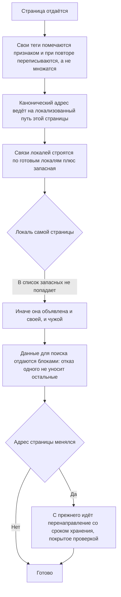

# Видимость в поиске — как это устроено здесь

Правило под закон `docs/constitution/application/search-visibility.md`. Закон говорит, что должно быть
верно; здесь — чем это названо в этом коде, где лежит и что из закона у нас не применяется.

## Как это называется здесь

| В законе                     | Здесь                                                                    |
| ---------------------------- | ------------------------------------------------------------------------ |
| язык страницы                | локаль перевода; их набор — в `implementation.md` рядом                  |
| язык по умолчанию            | `DEFAULT_LOCALE`, то есть `en`; отдаётся из корня, без префикса в адресе |
| язык, перевод которого готов | `readyLocales` — поле объекта, а не список локалей сайта                 |
| канонический адрес           | `${SITE_ORIGIN}${propertyPath(slug, locale)}`                            |
| структурированные данные     | JSON-LD типа `LodgingBusiness`                                           |
| прежний адрес страницы       | прежний slug объекта                                                     |

Локаль по умолчанию отдаётся из корня, остальные — с префиксом `/<код>/`. Префикс — часть
маршрута, а не часть сборки: `<base href>` в разметке всегда `/`.

## Где это лежит

В этом дереве — таблица в `implementation.md` рядом. Пути живут там, а не здесь: правило
переносится между репозиториями, раскладка — нет, и путь, названный в правиле, врёт в первом
же дереве, которое держит код иначе.

## Ход

Ход отдачи страницы поисковику: что ставится в разметку, чем связаны локали и что делается с
прежним адресом.

## Как закон применяется здесь

- **Свои теги помечены атрибутом `data-<префикс>-seo`** и при повторном применении переписываются.
  Чужое в `<head>` не трогается: после гидратации там остаются теги от отдачи сервером.
- **`canonical` ведёт на локализованный путь** `${SITE_ORIGIN}${propertyPath(slug, locale)}`,
  а не на корень и не на адрес локали по умолчанию.
- **`hreflang` строится по `readyLocales`**, плюс `x-default` на локаль по умолчанию. Список
  локалей сайта для этого не годится: переводы контента заполняет бэк, и готовы они не всегда.
- **`og:locale:alternate` не включает локаль самой страницы** — иначе она объявлена и
  основной, и альтернативной сразу.
- **`url` в JSON-LD — канонический адрес страницы объекта**, не корень сайта.
- **Корень локали отдаёт страницу единственного объекта** с каноническим адресом на `/{slug}`;
  посетителя уводит туда nginx ответом 302.
- **Перенаправление с прежнего адреса отдаётся с `Cache-Control: max-age`** и покрыто
  `proxy_cache_valid 200 301`. Ключ кэша строится без `$args`, поэтому запросы со строкой
  запроса идут мимо кэша (`proxy_cache_bypass` / `proxy_no_cache $is_args`).
- **Страница отдаёт блоки JSON-LD каждый своим тегом**, а не одним графом: отказ одного не
  уносит остальные, и в отданной разметке видно, какой из них собрался.
- **Цена уходит и предложением, и диапазоном** — суммой в валюте хранения и с единицей своего
  периода. Цена по датам, скидки и пересчёт в валюту гостя в разметку не идут.
- **Сводная оценка появляется от первого отзыва** и считается из оценок самих отзывов. Ноль
  отзывов — поля нет вовсе: ни нуля, ни пустой строки.
- **Блок вопросов собирается из вопросов записи**, а ноль вопросов блока не даёт.
- **Крошки ведут от корня локали к странице записи** адресами той же локали, что и открытая
  страница. Без названия сайта крошки не выпускаются вовсе.
- **Сохранение записи уведомляет поисковика об изменении её адресов.** В уведомление уходят
  страницы записи на готовых локалях по нынешнему и прежним адресам; корни локалей и карта
  сайта — нет. Отказ приёмника сохранение не отменяет и возвращается владельцу исходом.
- **Приёмников несколько, и каждый получает свой запрос.** Опрашиваются они одновременно, а
  потолок ожидания считается на приёмник: последовательный обход сложил бы все потолки в одно
  ожидание владельца. Переменная окружения перекрывает адреса всех приёмников разом — этим
  отправку и проверяют локальным приёмником.
- **Исход возвращается перечислением по приёмнику, а владельцу показывается списком.** Приёмник
  в нём назван словом, а не адресом. Строка отвечает за приём запроса, а не за осведомлённость
  поисковика: раздаёт полученное любой приёмник, поэтому отказ одного адреса не значит, что его
  поисковик не узнал. Подписью объявляется только полный отказ.
- **Удаление записи уведомляет поисковика теми же адресами.** Отдельного «страница исчезла»
  протокол не знает: площадка приходит по адресу и видит ответ сайта сама. Адреса собираются до
  удаления строки — каскад унесёт прежние вместе с записью, — а исход наружу не выходит:
  страницы уже нет, и читать подпись некому. Снятие с публикации идёт через сохранение и
  уведомляет тем же путём.
- **Переименование адреса и снятие прежнего адреса тоже уведомляют поисковика.**
  Переименование — всеми адресами записи, снятие — одним снятым; готовые локали у снятого
  считаются по текстам записи, которой он принадлежал, и ради них выборка снятия отдаёт не
  только адрес. Исход наружу не выходит ни там, ни там: владелец на странице адресов
  спрашивает про адрес, а не про уведомление.
- **Правка настроек владельца уведомляет поисковика адресами всех действующих записей.**
  Видимой гостю считается та же правка, которой сбрасывается кэш, — а правка невидимого поля
  уведомления не шлёт. Уходят живые адреса, без прежних, и готовые локали считаются по каждой
  записи отдельно; отправка идёт на владеющую сущность — записи разных сущностей в одну не
  попадают. Работа идёт в фоне за сохранением настроек, поэтому исход остаётся в логах:
  показать его владельцу негде.
- **Каждая отправка оставляет запись, и заводится она до обращения к приёмникам.** Повод,
  записи, объявленные адреса и исход по каждому приёмнику ложатся рядом; пустой исход означает
  «отправка идёт», а спустя несколько минут — что процесс упал посреди опроса. Пишут её все
  места, откуда уведомление уходит. Отказ записи отправку не отменяет.
- **Непрошедшие запросы владелец повторяет нажатием, и повтор заводит новую запись.**
  Повторяется последняя отправка записи — у ранней адреса могли устареть, — и запрос уходит
  только тем приёмникам, чей исход не «принял»; у оборванной записи это все её приёмники. Повод
  у новой записи свой, а право строже, чем у чтения: повтор объявляет адреса поисковику.
  Автоповтора по расписанию нет.
- **Записи отправок держит ночная чистка: сперва предел, потом срок.** Тот же порядок, что у
  ленты происшествий: срок, снятый первым, оставил бы предел меряться по уже почищенной
  таблице.

## Чего из закона здесь нет

Листинга объектов нет — корень локали отдаёт единственный объект. Появится листинг —
канонический адрес корня пересматривается; это `Q-SV-1` в законе.

## Паттерны

- `seo-page` — правка разметки страницы: теги, JSON-LD, новый маршрут, новая страница в карте.
- `seo-verify` — проверка отданной разметки на прод-сборке.

## Ловушки

- Тег, добавленный мимо `PropertySeoService`, не помечен `data-<префикс>-seo` — он не будет ни
  переписан, ни удалён при следующем применении и переживёт переход между страницами.
- Новый маршрут сайта без ветки в `app.routes.ts` под каждую локаль существует только в
  локали по умолчанию: `/de/<путь>` отдаст 404 и поисковику, и гостю.
- Новая страница не попадает в `sitemap.xml` сама — карта строится из объектов, а не из
  маршрутов.
- Адрес режется по **первому** `?` и только им: `req.url.split('?')` теряет всё после второго
  знака, и перенаправление приходит на страницу без UTM-хвоста — источник заявки считается
  неверно. Разрез живёт в `splitRequestUrl`
  (слой `util` домена страницы объекта) и покрыт спеками; свой не заводить.
