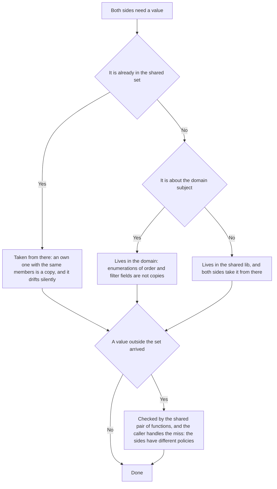

# Shared code — how it works here

Rule under the law `docs/constitution/shared-code.md`. The law says what must be shared; here —
where it comes from in this tree, what it is called and what we do not have.

## What it is called here

| In the law                       | Here                                                                                            |
| -------------------------------- | ----------------------------------------------------------------------------------------------- |
| shared package                   | `@rt-tools/utils` — built without a framework, depends on `tslib` alone, loads under bare Node  |
| shared lib of the project        | `@<scope>/common/util`; its tag is in the `UNIVERSAL` set and visible to all three applications |
| a setting number                 | `DEFAULT_PAGE_SIZE`, `MAX_PAGE_SIZE`                                                            |
| a value set                      | `EFilterOperatorType`, `EListSortOrder`                                                         |
| checking a value against the set | `listSortOrderOf`, `listFilterOperatorOf`                                                       |
| list query                       | `IPageModel`, `ISortModel`, `IFilterModel`, `IListState`                                        |

## Where it lives

In this tree — the table in `implementation.md` next to it. Paths live there, not here: the rule
travels between repositories, the layout does not, and a path named in the rule lies in the first
tree that keeps its code differently.

## Flow

The flow of declaring a shared value: where it lives, what counts as a copy and what the sides check
against.

## How the law applies here

- **A setting number lies in `libs/common/util`, and both sides take it from there.** A default is
  not passed as an argument. While the argument exists, a domain may name its own number, and that
  is how promo codes got `25` against `20` for the rest.
- **A value set from `@rt-tools/utils` is not declared anew.** An own enumeration with the same
  members counts as a copy, even when the names diverge.
- **A value from the set is checked by the pair of shared functions, and the caller handles the
  miss.** The server refuses the request with `InvalidArgument`, the screen takes the default.
- **Only the page mapper became shared.** The sides have different policies on an unknown value, and
  only what has one policy can be shared: a number below one both sides read as the first page.
- **The shared query holds the shape of the request, not the set of conditions.** The names of
  filter fields the domain declares itself as a list of allowed ones, and its own query translates
  them into the storage request. So a condition may lie on related rows, not only on columns of the
  record itself, and a filter by a set of identifiers is not forbidden to it. A sign of a related
  record is a field of the set like the reason and the object. What stays shared here is the parsing
  of page, order and search, not the list of fields itself.
- **Enumerations of the order and filter fields of a domain are not copies.**
  `EActivitySortProperty` and the like repeat the names by which the server of this very domain
  sorts.
- **A string setting and a mapping table are checked by value, not by name.** The name is not a key
  here. `BEM_BLOCK` and `LOG_CONTEXT` are declared by the dozen, each with values of its own, and
  one and the same status translation lives under three different names.
- **Copies that have no shared place by the import boundaries are merged into the layer both sides
  see, not into the shared one.** The shared lib of the application does not see storage values. An
  edge from there would reverse the dependency. Merging "as prescribed" breaks the boundaries here
  rather than fixing the copies. The place for such a copy is the exit layer of the domain whose
  value it translates; no new lib is needed for it, the domain usually already has that layer
  declared and empty.

## What of the law is not here

Entity translation is built differently: the frontend translates with an heir of `BaseMapper`, the
backend with free functions `xxxToProto` without a shared base. That is debt `Q-S-1`, not a choice:
new backend code does not start a shared base, but does not write a second one of its own either.

The matches of strings and tables that were found are accepted as debt in full. The translation of a
booking status into the contract lies in three copies, the set of accepted attachments in two, the
name of the edit event in three. Cutting that down is work by domains, and it is filed as question
`Q-S-3`.

## Patterns

- `shared-code-new` — how to declare a new shared number, function or type and leave no copy.

## Pitfalls

- `typeCast.getAsType` is no good for checking against a set: a value outside the set it writes to
  the console and returns the string `'unknown'`.
- Accumulated repeats lie in `tools/dupes-allowlist.json` under the key `debt` and do not count as a
  refusal — the gate fails only on new ones. The list only shrinks.
- The same logic written anew under another name is not caught by the check, and there will be no
  such check: two checks of the same shape from different domains are not a copy. Only whoever reads
  the edit can notice it — so says the law too.
