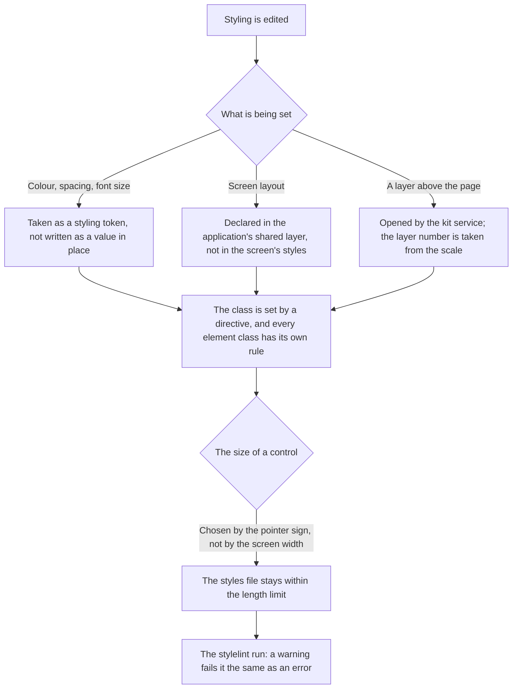

# Styling — how it works here

Rule under the law `docs/constitution/frontend-application.md`. The law says what must be true;
here — what it is called in this tree and where it lives. The layout of a component file —
`component-structure`, state — `angular-patterns`, the browser environment — `platform-access`,
the layer of calls to the server — `api-layer`. All five under one law.

**Cold part:** `pitfalls.md` next to it — traps already stepped on. Loaded on demand, not
together with the rule.

## What it is called here

| In the law                          | Here                                                                                                                                              |
| ----------------------------------- | ------------------------------------------------------------------------------------------------------------------------------------------------- |
| the shared set of styling values    | the kit scales `--rt-*`; one's own on top of them — `--<prefix>-*` in the application's `styles.scss`                                            |
| a class in the markup               | the `rtBlock` and `rtElem` directives from `@rt-tools`, not a string in an attribute                                                              |
| a style rule                        | an `&__<element>` declaration in `.scss` — its own or in the application's shared layer                                                           |
| the shared layout layer             | `apps/<app>/src/styles/`: `<prefix>-page`, `<prefix>-form`, `<prefix>-panel`, `<prefix>-window` in the admin, `<prefix>-site-page` on the site  |

## Where it lives

In this tree — the table in `implementation.md` next to it. Paths live there, not here: the rule
travels between repositories, the layout does not, and a path named in the rule lies in the
first tree that keeps its code differently.

## Flow

The flow of a styling edit: where a value comes from, where the layout lives and what opens an
overlay.

## How the law applies here

- **Styling is taken as a `--rt-*` token, not written as a value in place.** Composite values —
  `box-shadow`, `text-shadow` — are taken as a ready-made token whole, not assembled from parts.
  <!-- rt-when: *.scss *.css -->

- **Every element class has its own style rule.** A class without a rule looks working and
  silently does nothing.
  <!-- rt-when: *.scss *.css -->

- **A class is set by a directive, not by a string in an attribute.** `rtElem` gets the block name
  by injection from the nearest ancestor with `rtBlock`, and there is nothing to repeat that
  resolution by the text of the template.
  <!-- rt-when: *.html *.scss -->

- **The layout is declared in the application's shared layer, not in the screen's styles.** A
  screen component outside the kit has an empty styles file by default.
  <!-- rt-when: *.scss *.css -->

- **One thing is called by one name in every place it occurs.** A layout that keeps three
  vocabularies for the page, the edit panel and the window, with shared names in different
  meanings, does not count as a shared layer: the place of declaration matches, the meaning of the
  name does not. Choosing a name, the executor lands in a foreign vocabulary and brings a foreign
  spacing, and the checks do not see it. Where an element stands is set by the kind of block, not
  by a second set of names.
  <!-- rt-when: *.scss *.css *.html -->

- **The sheet and the window are opened by the kit service, not by a layer number.** The scale's
  numbers compare only between neighbours in the markup; the service moves the markup outside, to
  `<body>`, and there is nothing left to compare it with.
  <!-- rt-when: *.ts *.scss -->

- **The layer number is taken from the scale, not written as a number in the component file.**
  The scale is the only place where the layers are visible side by side: a number written in place
  does not land in it, and the next node takes the same number without learning of it.
  <!-- rt-when: *.scss *.css -->

- **A width limit is declared together with the fate of what did not fit.** A limit and a place in
  a row hide or wrap nothing by themselves: a node that may receive a value longer than its place
  has either ellipsis truncation or wrapping. Without that the text silently runs past the border
  and lies over its neighbour, and allowing an element to shrink does not replace truncation.
  <!-- rt-when: *.scss *.css -->

- **Truncation goes in a pair with a tooltip.** A truncated text without a tooltip reads as the
  whole value: a person has no way to learn where the text actually ends. The whole value they see
  either in the place itself or on hover — and a tooltip given a width limit of its own obeys the
  article above the same as a cell.
  <!-- rt-when: *.scss *.css -->

- **The size of a control is chosen by the pointer sign, not by the screen width.** A tablet in
  landscape is wider than the narrow-viewport threshold, yet it is tapped with a finger:
  `pointer: coarse` answers about the way of pressing, the width — about the room for the layout.
  The steps are taken from the kit, not assigned in pixels.
  <!-- rt-when: *.scss *.css -->

- **A styles file is no longer than 500 lines.** The limit is shared with code and texts, but
  stylelint does not judge length at all — a check of the tree holds it. A grown screen file is
  split by blocks, and shared layout leaves for its own layer.
  <!-- rt-when: *.scss *.css -->

- **A stylelint warning fails the run the same as an error.** `!important` is declared a warning,
  and the run goes with `--max-warnings 0`: otherwise the ban reads as a wish — two such warnings
  lay in the tree while `npm run stylelint` returned zero and was no gate.
  <!-- rt-when: *.scss *.css -->

## What of the law is not here

The "class without a rule" check counts a match by element name, not by the pair "block —
element": a class that has a rule, but under a foreign block, it lets through. The reverse
direction — removing the rule of a live class — is not checked at all and is caught by reading
the template.

## Patterns

- `styling-bem-layout` — a screen on the shared layout layer, the application's blocks.
- `styling-bem-component` — styles of a kit component, `:host`, modifiers, the site's styling
  language.
- `styling-bem-sheet` — the sheet and the window above the page: what opens them, the backdrop,
  the measurement.
