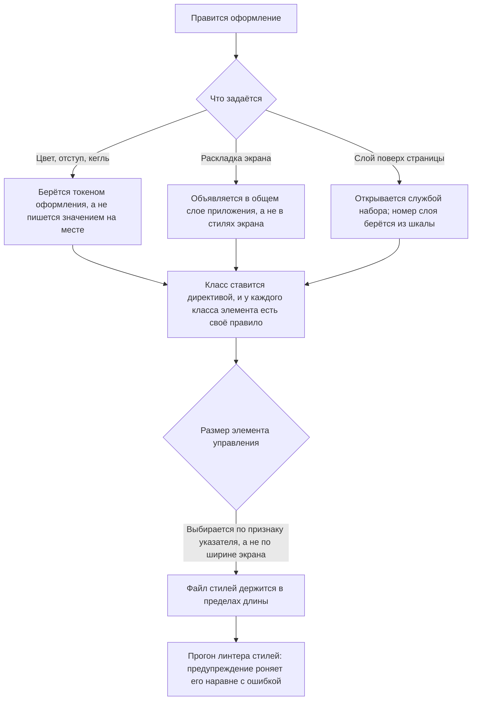

# Оформление — как это устроено здесь

Правило под закон `docs/constitution/frontend-application.md`. Закон говорит, что должно быть
верно; здесь — чем это названо в этом дереве и где лежит. Раскладка файла компонента —
`component-structure`, состояние — `angular-patterns`, окружение браузера —
`platform-access`, слой обращения к серверу — `api-layer`. Все пять под одним законом.

## Как это называется здесь

| В законе                        | Здесь                                                                                                                                        |
| ------------------------------- | -------------------------------------------------------------------------------------------------------------------------------------------- |
| общий набор значений оформления | шкалы кита `--rt-*`; своё поверх них — `--<префикс>-*` в `styles.scss` приложения                                                            |
| класс в разметке                | директивы `rtBlock` и `rtElem` из `@rt-tools`, а не строка в атрибуте                                                                        |
| правило стилей                  | объявление `&__<элемент>` в `.scss` — своём или в общем слое приложения                                                                      |
| общий слой раскладки            | `apps/<app>/src/styles/`: `<префикс>-page`, `<префикс>-form`, `<префикс>-panel`, `<префикс>-window` у админки, `<префикс>-site-page` у сайта |

## Где это лежит

В этом дереве — таблица в `implementation.md` рядом. Пути живут там, а не здесь: правило
переносится между репозиториями, раскладка — нет, и путь, названный в правиле, врёт в первом
же дереве, которое держит код иначе.

## Ход

Ход правки оформления: откуда берётся значение, где живёт раскладка и чем открывается
всплывающее.

## Как закон применяется здесь

- **Оформление берётся токеном `--rt-*`, а не пишется значением на месте.** Составные
  значения — `box-shadow`, `text-shadow` — берутся готовым токеном целиком, а не собираются
  из частей.
  <!-- rt-when: *.scss *.css -->

- **У каждого класса элемента есть своё правило стилей.** Класс без правила выглядит рабочим
  и молча ничего не делает.
  <!-- rt-when: *.scss *.css -->

- **Класс ставится директивой, а не строкой в атрибуте.** Имя блока `rtElem` получает
  инъекцией от ближайшего предка с `rtBlock`, и повторить этот разбор по тексту шаблона нечем.
  <!-- rt-when: *.html *.scss -->

- **Раскладка объявлена в общем слое приложения, а не в стилях экрана.** У компонента экрана
  вне кита файл стилей по умолчанию пустой.
  <!-- rt-when: *.scss *.css -->

- **Шторку и окно открывает служба кита, а не номер слоя.** Числа шкалы сравниваются только
  между соседями по разметке; служба выносит разметку наружу, к `<body>`, и сравнивать её
  становится не с чем.
  <!-- rt-when: *.ts *.scss -->

- **Номер слоя берётся из шкалы, а не пишется числом в файле компонента.** Шкала — единственное
  место, где слои видно рядом: написанное на месте число в неё не попадает, и следующий узел
  занимает тот же номер, ничего об этом не узнав.
  <!-- rt-when: *.scss *.css -->

- **Размер элемента управления выбирается по признаку указателя, а не по ширине экрана.**
  Планшет в ландшафте шире порога узкого вьюпорта, а нажимают по нему пальцем: `pointer: coarse`
  отвечает про способ нажатия, ширина — про место под раскладку. Ступени берутся у кита, а не
  назначаются пикселями.
  <!-- rt-when: *.scss *.css -->

- **Файл стилей не длиннее 500 строк.** Предел общий с кодом и текстами, но stylelint длину не
  судит вовсе — держит его проверка дерева. Выросший файл экрана делится по блокам, а общая
  раскладка уходит в свой слой.
  <!-- rt-when: *.scss *.css -->

- **Предупреждение stylelint роняет прогон наравне с ошибкой.** `!important` объявлен
  предупреждением, а прогон идёт с `--max-warnings 0`: иначе запрет читается как пожелание —
  два таких предупреждения лежали в дереве, а `npm run stylelint` возвращал ноль и гейтом не был.
  <!-- rt-when: *.scss *.css -->

## Чего из закона здесь нет

Проверка «класс без правила» считает совпадение по имени элемента, а не по паре «блок —
элемент»: класс, у которого правило есть, но у чужого блока, она пропускает. Обратное
направление — снятие правила у живого класса — не проверяется вовсе и ловится чтением шаблона.

## Паттерны

- `styling-bem-layout` — экран на общем слое раскладки, блоки приложения.
- `styling-bem-component` — стили компонента кита, `:host`, модификаторы, язык оформления сайта.
- `styling-bem-sheet` — шторка и окно поверх страницы: чем открываются, подложка, замер.

## Ловушки

- **`rtElem` без предка с `rtBlock` роняет отрисовку в рантайме** — сборка и линт молчат.
- **Спроецированный узел блока-предка не имеет.** `rtElem` берёт имя блока инъекцией от
  ближайшего предка **по месту объявления шаблона**, а не по месту вставки: элемент, который
  экран объявляет у себя и отдаёт в проекцию чужого компонента, ищет `rtBlock` в своём шаблоне
  и не находит. Отрисовка падает в рантайме, сборка и линт зелёные. Класс на такой узел
  вешается правилом по селектору кита в общем слое раскладки, а не директивой.
- **Элемент с `backdrop-filter` или своим `z-index` замыкает потомков в свой слой.** Липкая
  шапка с размытием — самый частый случай: номер слоя у того, что лежит внутри неё,
  сравнивается не с соседями по странице, а только с соседями внутри шапки, и нижняя панель
  накрывает открытую шторку вместе с её кнопкой. Проверяется это `elementFromPoint` в центре
  кнопки: сборка, линт и скриншот показывают тут целую страницу.
- **До узла, вынесенного к `<body>`, стили компонента не достают.** Превью и заглушку переноса
  кладёт туда библиотека, а правила компонента заскоуплены атрибутом: файл выглядит рабочим и
  не красит ничего. Такие правила объявляются в общем слое приложения. Ни сборка, ни линт, ни
  проверка «класс без правила» этого не видят: класса такого в шаблоне нет вовсе, и пролежать
  это может несколько задач подряд.
- **Имя токена не сверяется ничем.** Ссылка на несуществующий токен собирается, проходит
  stylelint и проверку класса без правила, а свойство молча берёт наследованное значение:
  правило выглядит написанным и не красит ничего. Ловится это только замером в браузере, а
  имена берутся из объявлений кита, а не по догадке о том, как токен должен был бы называться.
- **`rtBlock` на `<ng-container>` класса не ставит вовсе:** узел это комментарий, и имя блока
  он только объявляет потомкам. Класс блока экрана вешает хост через `host: { class: … }`.
- **`justify-content: center` во flex-контейнере с `overflow-x` уводит первые элементы за
  нулевой скролл** — доскроллить до них невозможно. В прокручиваемых лентах —
  `justify-content: safe center`.
- **`scrollbar-gutter: stable` на корне не заводить:** резерв под полосу прокрутки сужает
  содержащий блок для `position: fixed`, и попап, выровненный по правому краю, встаёт на
  ширину резерва левее своей кнопки.
- **`& + :host` невалиден:** изнутри компонента до соседнего хоста не дотянуться. Разделитель
  между повторяющимися хостами — `:host(:not(:first-of-type))`.
- **`[attr.aria-disabled]` визуального состояния не даёт:** браузер стилизует `:disabled`, но
  атрибуты `aria-*` — нет. К каждому `aria-disabled` заводится правило `[aria-disabled='true']`.
- **Гарнитуру с `body` элементы формы не наследуют:** браузер задаёт `button`, `input`,
  `select` и `textarea` свой шрифт. Наследование включено глобально — сбрасывать его нельзя.
- **Комментарии-выключатели stylelint не ставятся.** Селекторы объединяются вложенностью.
- **При переносе стилей новых объявлений не появляется** — только перемещение существующих.
