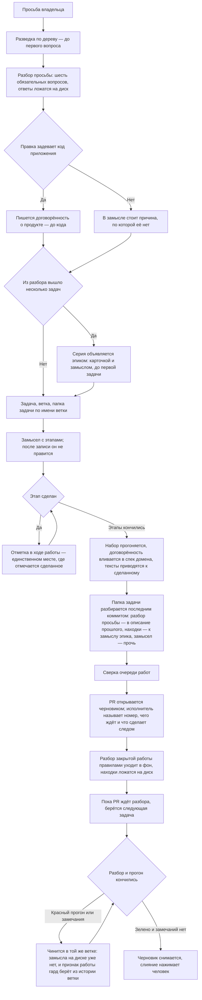

# Ведение работы — как это устроено здесь

Правило под закон `docs/constitution/work-conduct.md`. Закон говорит, что должно быть верно
про ход работы; здесь — чем это названо в этом дереве, где лежит и что из закона у нас не
проверяется.

**Холодная часть:** `pitfalls.md` рядом — ловушки и поведение по разборам происшествий.
Грузится по требованию, а не вместе с правилом: при обычном решении она не нужна — она нужна
тому, кто разбирает промах или спорит с гардом.

**Требует:** `hooks/task-flow-guard.sh`, `hooks/task-context-load.sh`, `hooks/grill-gate.sh`, `hooks/window-fill-guard.sh`, `hooks/turn-exit-guard.sh`

## Как это называется здесь

| В законе                                      | Здесь                                                                                                                         |
| --------------------------------------------- | ----------------------------------------------------------------------------------------------------------------------------- |
| просьба владельца                             | то, с чего начинается работа; разбирается командой `/grill-me` до первой правки                                               |
| понимание, записанное там, где идёт работа    | `docs/tasks/<ветка>/grill.md` — просьба дословно, ответы владельца его словами, решения с доводами                            |
| замысел                                       | `docs/tasks/<ветка>/plan.md` — след задачи и этапы с признаками готовности; после написания не правится                       |
| ход работы                                    | `docs/tasks/<ветка>/progress.md` — «Где стоим», решения по ходу, записи заходов; единственное место, где отмечается сделанное |
| договорённость о продукте, записанная до кода | `docs/specs/<домен>/proposed/<фича>/` — спек фичи; переживает мерж и вливается в спек домена                                  |
| эпик — работа шире одной ветки                | карточка в очереди работ с меткой эпика и замысел эпика рядом с ней: возможность, состав задач и их порядок                   |
| замысел эпика                                 | запись вне папки задачи — та умирает с мержем, а эпик её переживает; каталог для неё называет компаньон правила               |
| папка задачи до заведения задачи              | `docs/tasks/_draft-<slug>/` — вне истории, пока номера нет                                                                    |
| разведка                                      | заход `Explore` или `general-purpose` до первого вопроса владельцу                                                            |
| разбор замысла ролями                         | `.claude/workflows/plan.js` — нужность, договорённость, критика, замысел                                                      |

## Где это лежит

В этом дереве — таблица в `implementation.md` рядом. Пути живут там, а не здесь: правило
переносится между репозиториями, раскладка — нет, и путь, названный в правиле, врёт в первом
же дереве, которое держит код иначе.

## Состояния работы

Единица работы — состояние, а не шаг. У состояния есть вход, обязательное действие и выход, и
пока действие не сделано, работа стоит в том же состоянии. Список шагов этого не давал: шаг
кончался, а что делать дальше, выводилось из соседних строк.

Состояние объявляется в разделе «Где стоим» хода работы машиночитаемой строкой
``- **Состояние:** `этап-идёт` `` и перезаписывается вместе с ним.

| Состояние                 | Вход в него                                     | Обязательное действие                                  | Ведёт паттерн      |
| ------------------------- | ----------------------------------------------- | ------------------------------------------------------ | ------------------ |
| `просьба-не-разобрана`    | реплика владельца о новой работе                | разведка по дереву, затем вопросы                      | `task-flow-start`  |
| `разбор-закрыт`           | ответы владельца лежат на диске                 | договорённость о продукте либо причина её отсутствия   | `task-flow-start`  |
| `договорённость-записана` | драфт лежит или причина названа                 | завести задачу, ветку и папку                          | `task-flow-start`  |
| `задача-взята`            | задача в колонке работы, ветка по номеру, папка | написать замысел                                       | `task-flow-start`  |
| `замысел-записан`         | замысел лежит и после записи не правится        | делать первый этап                                     | `task-flow-start`  |
| `этап-идёт`               | этап начат                                      | доделать этап и отметить в ходе работы                 | `task-flow-resume` |
| `этапы-кончились`         | все этапы отмечены                              | прогнать набор, влить договорённость, привести тексты  | `task-flow-close`  |
| `разбор-кончился`         | набор зелёный, тексты приведены                 | разобрать папку последним коммитом                     | `task-flow-archive` |
| `папка-разобрана`         | папки в ветке нет, запись в архиве есть         | открыть PR черновиком                                  | `task-flow-close`  |
| `работа-отдана`           | PR открыт черновиком                            | взять следующую задачу                                 | `task-flow-resume` |
| `влито`                   | PR слит человеком                               | разбор работы правилами и сверка очереди               | `task-flow-archive` |

Ни у одного состояния обязательное действие не звучит как «ждать»: ожидание чужого шага
состоянием работы не является — прогон, разбор владельцем и слияние идут без исполнителя и от
взгляда быстрее не становятся, поэтому в `работа-отдана` обязательное действие смотрит на
следующую задачу, а не на открытый PR. Заполнение окна захода состоянием тоже не бывает: заход
кончается передачей, работа остаётся в том состоянии, в каком стояла, а следующий заход читает
строку и продолжает с неё. Чем ход кончается и что его концом не бывает — правило
`turn-conduct` под тем же законом.

Перечень показывается владельцу в начале работы, и на нём же отмечается, где стоим: иначе после
шести вопросов не видно ни того, что будет дальше, ни сколько всего впереди.

Последние два состояния объявить на диске уже нечем: ход работы уезжает вместе с папкой, а
папка разбирается раньше, чем открывается PR. Признак у них поэтому в истории ветки — коммит
разбора папки, — и читает его гард, а не строка в файле. Цена названа прямо: с этой минуты и до
слияния состояние работы виду не подлежит, и хвост из четырёх шагов — открыть PR, дождаться
прогона, снять черновик, попросить влить — держится паттерном, а не объявлением.

## Ход

Ход работы от просьбы владельца до закрытия: где стоит разбор, что требует гард и куда девается
папка задачи.

## Как закон применяется здесь

- **Правка кода приложения отбивается, пока работа не дошла до состояния, в котором код
  правится.** Гард требует четыре вещи: папку задачи по имени ветки, замысел в ней, объявленное
  в ходе работы состояние и названную в замысле договорённость о продукте.
- **Гард судит объявленный переход, а не наличие файлов.** Артефакт на диске не говорит, дошла
  ли работа до правки кода: пустой замысел, положенный ради снятия отказа, лежит так же, как
  написанный. Отказ снимает объявленное состояние, и снимают его три — `этап-идёт`,
  `этапы-кончились` и `разбор-кончился`. Четвёртый путь у отказа не состояние, а история ветки:
  папка, разобранная её коммитом, означает отданную работу, и правка по замечаниям разбора идёт
  без замысла на диске — объявить состояние после уборки уже нечем. Прогон бывает красным, а
  разбор — с замечаниями, и починка идёт в ту же ветку.
- **Отказ по состоянию называет обязательное действие того состояния, которое объявлено.**
  Исполнитель, которому сказано только «не в том состоянии», перепишет строку состояния вместо
  того, чтобы сделать шаг.
- **Именем состояния считается только слово из перечня.** Своё слово не говорит ни о входе, ни
  о выходе, ни об обязательном действии, а перечень называет все три.
- **Состояние судится раньше договорённости и её обхода.** Строка о неизменном поведении
  снимает требование договорённости о продукте, а не требование дойти до правки кода.
- **Влитая договорённость ветку не запирает.** После вливания директории «предложено» на диске
  нет, а замысел на неё ссылается до конца работы: гард отличает влитое от незаведённого по
  истории ветки и пропускает первое. Иначе последний коммит PR закрывал бы дорогу правкам
  по замечаниям разбора.
- **Договорённость требуется по путям правки, а не по оценке задачи.** `apps/**` и `libs/**`
  — признак; правила, тексты, обвязка и зависимости под него не подпадают. Обход — строка
  `**Поведение:** не меняется — <причина владельца>` в замысле; пустая причина не
  принимается.
- **Папка задачи заводится под любую работу, без исключений.** Прежде правило судило по числу
  заходов: работа в один коммит помещалась в тело PR и папки не заводила. Исключение,
  у которого есть хоть одна законная форма, исполняется как разрешение — за один заход оно
  дважды стало поводом обойти отказ гарда, вместо того чтобы завести папку и пойти дальше.
  Заводится она всегда и до первой правки; сколько заходов уйдёт на работу, заранее не знает
  никто.
- **Папка задачи разбирается последним коммитом до открытия PR, а не после одобрения.** Прежде
  она стояла после: пока идёт разбор, замысел нужен на диске, иначе правку по замечаниям
  отбивает гард. Но кнопку слияния нажимает человек на хостинге, куда гард не достаёт, и
  вливает он, как только видит зелёное, — закрывающему коммиту места не остаётся вовсе. Трижды
  подряд папка уехала в главную ветку неразобранной, и разобрать её было уже некому: работа
  перешла к следующей задаче, а PR закрылся. Цена перестановки названа прямо: замысла с этой
  минуты на диске нет, и признак отданной работы гард берёт из истории ветки.
- **Открыв PR, исполнитель называет владельцу три вещи: номер, чего ждёт и что сделает
  следом.** Ждёт он прогона — до его конца о работе ничего не известно, кроме того, что она
  запушена. Следом идёт снятие черновика. Сказанное так владелец читает однозначно, а зелёный
  прогон на странице — нет: он говорит, что не сломано, и молчит о том, что кнопка слияния у
  черновика заблокирована.
- **Просьба о слиянии — отдельный ход, и раньше зелёного прогона её не бывает.** Порядок один:
  папка задачи разобрана и запушена → PR открыт черновиком → прогон зелёный → черновик снят →
  исполнитель просит влить, называя номер. До этой просьбы работа не готова, сколько бы зелёного
  на её странице ни было.
- **PR открывается черновиком, а не в конце работы.** Пока правка кода не выложена в PR,
  владелец её не видит вовсе: ветка не приходит ему во входящие и обсуждения не имеет.
  Открытый PR при этом читается как приглашение влить — поэтому незаконченная работа идёт
  черновиком, и владельцу не приходится спрашивать, кончилась ли она. Черновик снимается тем
  ходом, которым исполнитель говорит, что решение готово.
- **Гард замысла — нижняя граница требования, а не его предел.** Он требует папку только под
  правку кода приложения, и работа, которая туда не доходит, проходит мимо него — но папку
  заводит всё равно: статья правила говорит «под любую работу, без исключений». Прочитанный
  как признак, гард становится разрешением работать без замысла везде, куда он не смотрит.
- **Взятая задача ходом не кончается.** Заведение задачи, ветки, колонки и папки — подготовка к
  работе, а не работа: они переводят её в состояние записанного замысла, где обязательное
  действие уже другое — делать первый этап. Граница состояния выглядит законченным куском лучше
  всякой другой вехи, а владельцу отчёт о взятой задаче неотличим от остановки: он видит
  исполнителя стоящим. Держит это страж выхода хода — он такой ход не выпускает и называет в
  отказе первый этап замысла.
- **Сделанное отмечается только в ходе работы.** «Где стоим» перезаписывается каждым заходом,
  а не дописывается: это первое, что читает следующий заход.
- **Слово для нового понятия ищется в словаре дерева.** Общую часть словаря везёт пакет,
  предметную дописывает дерево надстройкой; словарь уезжает в контекст на запуске сессии
  целиком, поэтому «не читал» основанием не бывает.
- **Папка задачи заводится черновиком и получает номер командой.** До конца разбора
  неизвестно, сколько задач из него выйдет, поэтому номер не может быть первым;
  `npm run task:new` переименовывает черновик и проставляет шапку замысла. Папку он и собирает —
  с образца, снимая с копий шапку раскладки: оставленная в копии, она отбивает первую же правку
  разбора просьбы, а отказ уводит править образец пакета вместо копии под задачу.
- **Брошенный разбор виден.** Черновик старше недели перечисляет сверка очереди работ —
  задачи за ним ещё нет, и спросить о нём некого.
- **Следующая задача берётся из замысла эпика, а список очереди работ спрашивается только там,
  где эпика нет.** Список отсортирован номером, и свежие задачи в нём наверху — по нему первая
  задача чужого эпика неотличима от своей. Замысел открывается перед взятием и отвечает за один
  вызов; кончившийся эпик называется владельцу тем же ходом, которым берётся работа вне его.
- **Эпик не закрывается по признаку, подтверждённому только чтением.** Признак, который
  проверяется глазами, называется проверенным лишь вместе с командой или замером и их выводом.
  Пометка «подтверждается живым замером» — обещание проверки, а не проверка.
- **Задачи эпика заводятся все разом, тем же ходом, что и сам эпик.** Заведение по одной прячет
  объём: на борде эпик из десяти задач выглядит одной. Номера возвращаются в раздел порядка
  задач замысла той же правкой — без них «взять следующую» отвечает названием, а не карточкой.
  Метку эпика несёт только его карточка: задачи внутри помечаются по своему роду, как всякие
  другие, и принадлежность их эпику держит замысел.

- **Замысел эпика лежит там, где его найдут без сети и после мержа.** Карточка в очереди работ
  говорит, что эпик есть, но порядка задач не держит; папка задачи держала бы его ровно до
  слияния первой из них. Каталог для замысла называет компаньон правила: у пакета своего пути
  нет, а замысел, положенный каждым заходом заново, теряет решения предыдущих.
- **Сборка по образцу начинается с чтения самого образца, а не пересказа о нём.** Пересказ
  лежит в разборе просьбы и в замысле эпика; читаются они оба, но образцом не считаются. Часть
  образца, которую работа повторяет, открывается целиком — обходом каталогов, а не одним файлом,
  за которым пришли. Расхождение, не найденное так, находит владелец на приёмке целой работой.
- **Путь к образцу лежит вне дерева и приходит в заход хуком запуска сессии.** Имя чужого
  дерева в файлы репозитория не пишется, поэтому ни замысел эпика, ни разбор просьбы его не
  держат: там законна ссылка без имени — «путь к образцу лежит вне дерева». Каталог для записи
  — тот же, где лежит передача захода; называет его компаньон правила. Не записанный так,
  образец теряется на первой же чистке контекста, и следующий заход собирает по памяти
  предыдущего.
- **Закрытая работа разбирается правилами, и это шаг закрытия, а не отдельная просьба.** Что
  грузилось, что помогло и чего не хватило, видно только тому заходу, который работу вёл; через
  сутки этого нет ни у кого. Разбор кончается правкой слоя правил или предложением наружу —
  разбор, из которого не вышло ни того ни другого, объясняет случившееся и ничего не меняет.
  Ведёт его роль разбора закрытой задачи, если дерево её разложило; не разложившее ведёт разбор
  само, и требование от этого не слабеет.
- **Разбор закрытой работы уходит в фон, а исполнитель берёт следующую задачу.** Роль работает
  своим ходом и у исполнителя ничего не спрашивает; держать ради неё заход незачем. Сводку для
  неё собирают до запуска — пока задача ещё в голове, — а вернувшиеся находки принимают одним
  ходом: записать и продолжить прежнее. Порядок и место записи — паттерн закрытия работы.
- **Находки разбора ждут владельца, а в пакет уезжает только сводка наблюдений.** Предложение —
  это заготовка правки чужого дерева, и часть заготовок отпадает при первом же чтении; уехавшая
  без разбора, она становится работой того, кто её не заказывал. Сводка наблюдений уезжает
  всегда: она говорит, чем пользовались и чем нет, и мнением не является.
- **Договорённость вливается в спек домена одним из последних коммитов ветки, до открытия
  PR.** К этому моменту код написан, привязки известны, и в главной ветке директория
  `proposed/` не появляется вовсе.
  Готовые к вливанию перечисляет `npm run check:specs`.
- **Папка закрытой задачи разбирается, а не переносится целиком.** В `docs/archive/` уезжает
  то, что объясняет состоявшееся решение; остальное удаляется. Неразобранную ловит сверка
  очереди работ.
- **Открытие PR отбивается, пока ветка везёт папку своей задачи.** Требование стоит здесь, а
  не на слиянии: слияние нажимает человек на хостинге, где гардов нет вовсе, и его отказ до
  владельца не доходит. На слиянии та же проверка остаётся вторым рубежом — она ловит слияние,
  идущее командой. Судится содержимое ветки, а не рабочее дерево: снесённая, но не
  закоммиченная папка въехала бы вместе с веткой.
- **Ветка, снёсшая папку, обязана прибавить запись в архив.** Снести дешевле, чем разобрать, и
  первым уходит разбор просьбы — единственная запись слов владельца. Что именно увезено,
  требование не судит: это судит владелец.
- **Обход — строка `Task-folder-skip: <причина>` в PR или в самой команде.**
  Работа, вливаемая частями, папку до конца не разбирает. Чтение из команды работает и без
  сети: единственный сетевой путь отбивал бы оффлайн то самое слияние, причина которого
  написана в PR. Пустая причина обходом не считается, а сам обход снимает отказ, но не
  гасит строку сверки очереди — иначе он через месяц становится рабочим путём.

## Чего из закона здесь нет

Полноту записанного понимания не проверяет ничто, и проверки на неё не будет: машине видно
наличие записи, но не то, что в ней закрыты все пробелы. Разбор из одной строки проходит гард
так же, как разбор на сто. То же с вопросом, который стоило задать и не задали, — он не
оставляет следа. Оба разобраны решениями в законе: судит владелец.

Гард судит по путям правки, а не по тому, меняет ли работа поведение на самом деле.
Рефакторинг, снаружи не видный, упирается в требование договорённости и проходит обходом с
причиной. Своего признака рефакторингу не заводится: оценку «поведение не меняется»
назначал бы тот, кому она мешает.

Ничто из самого разбора не проверяется, и всё это держится памятью того, кто его ведёт.
Разговор с владельцем инструментом не является — гард видит правку файла и ничего не знает
ни о том, была ли разведка до первого вопроса, ни о том, задан ли каждый из шести
обязательных вопросов, ни о том, ответил ли на них владелец. Образец разбора перечисляет их
таблицей, но пустая таблица проходит так же, как заполненная.

Гард разговора судит завершение хода, а не отправку вопроса. К моменту отказа вопрос уже у
владельца, и владелец видит его вместе с отбитым ходом: требование срабатывает, но исполняется
задним числом. Прозаический вопрос инструментом не является, и раньше поймать его нечем.
Отсюда порядок: правило работы читается первым движением захода, до первой реплики владельцу,
а не по отказу гарда; гард отмечает пропуск, но не отменяет его.

Неизменность замысла не стережёт ничто: `plan.md` правится тем же инструментом, что и
остальные тексты, и правка по ходу отличима от первоначальной записи только по истории.
Держится это тем же, чем и порядок разбора.

Приведение текстов к сделанному не проверяет ничто, и проверки на него не будет: что устарело
в правиле и в спеке, машине не видно — раздел «Чего из закона здесь нет» не читает ни одна
сверка, а «Что не входит» выглядит верным ровно так же, как в день, когда его писали. Держится
это шагом закрытия работы и следом задачи в замысле: там названо, что перечитать. Правило и
спек правятся в ветке, закон — нет: его статья приносится владельцу текстом, а работа идёт
дальше без неё.

Что именно перенесли в архив, не проверяется. Гард видит, что папка уезжает в главную ветку и
что ветка что-то в архив добавила, но не может судить, то ли это и стоило ли переносить именно
это. Сверять содержимое машине нечем — смотрит владелец на ревью. Отсюда же и обход: если
работа вливается частями, папку до конца не разбирают, а причина остаётся в PR.

Порядок отдачи работы дерево вправе перевернуть надстройкой, и тогда часть шагов пакета
перестаёт исполняться. Какие именно — не считает ничто: перечень отменяемого пишется руками, а
шаг, чья механика сломалась тем же решением, в него не попадает и продолжает читаться
действующим. Держится это чтением обоих текстов подряд — пакетного и надстройки — при каждой
правке порядка отдачи.

## Паттерны

- `task-flow-start` — разведка, разбор, договорённость, замысел, задача и ветка.
- `task-flow-resume` — возвращение к незаконченной работе новым заходом.
- `task-flow-close` — снятие черновика, вливание договорённости, приведение текстов.
- `task-flow-archive` — разбор папки задачи, переезд в описание прошлого, разбор правилами.
