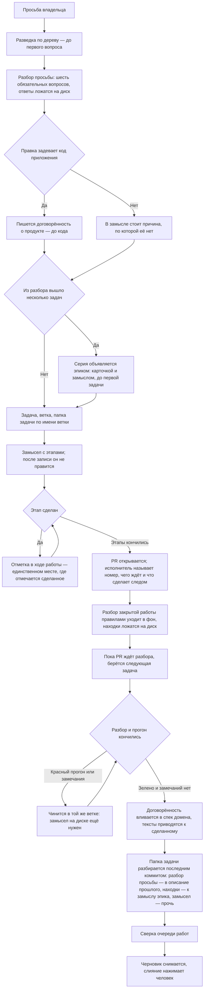

# Ведение работы — как это устроено здесь

Правило под закон `docs/constitution/work-conduct.md`. Закон говорит, что должно быть верно
про ход работы; здесь — чем это названо в этом дереве, где лежит и что из закона у нас не
проверяется.

**Требует:** `hooks/task-flow-guard.sh`, `hooks/task-context-load.sh`, `hooks/grill-gate.sh`, `hooks/window-fill-guard.sh`, `hooks/turn-exit-guard.sh`

## Как это называется здесь

| В законе                                      | Здесь                                                                                                                         |
| --------------------------------------------- | ----------------------------------------------------------------------------------------------------------------------------- |
| просьба владельца                             | то, с чего начинается работа; разбирается командой `/grill-me` до первой правки                                               |
| понимание, записанное там, где идёт работа    | `docs/tasks/<ветка>/grill.md` — просьба дословно, ответы владельца его словами, решения с доводами                            |
| замысел                                       | `docs/tasks/<ветка>/plan.md` — след задачи и этапы с признаками готовности; после написания не правится                       |
| ход работы                                    | `docs/tasks/<ветка>/progress.md` — «Где стоим», решения по ходу, записи заходов; единственное место, где отмечается сделанное |
| договорённость о продукте, записанная до кода | `docs/specs/<домен>/proposed/<фича>/` — спек фичи; переживает мерж и вливается в спек домена                                  |
| эпик — работа шире одной ветки                | карточка в очереди работ с меткой эпика и замысел эпика рядом с ней: возможность, состав задач и их порядок                   |
| замысел эпика                                 | запись вне папки задачи — та умирает с мержем, а эпик её переживает; каталог для неё называет компаньон правила               |
| папка задачи до заведения задачи              | `docs/tasks/_draft-<slug>/` — вне истории, пока номера нет                                                                    |
| разведка                                      | заход `Explore` или `general-purpose` до первого вопроса владельцу                                                            |
| разбор замысла ролями                         | `.claude/workflows/plan.js` — нужность, договорённость, критика, замысел                                                      |

## Где это лежит

В этом дереве — таблица в `implementation.md` рядом. Пути живут там, а не здесь: правило
переносится между репозиториями, раскладка — нет, и путь, названный в правиле, врёт в первом
же дереве, которое держит код иначе.

## Состояния работы

Единица работы — состояние, а не шаг. У состояния есть вход, обязательное действие и выход, и
пока действие не сделано, работа стоит в том же состоянии. Список шагов этого не давал: шаг
кончался, а что делать дальше, выводилось из соседних строк.

Состояние объявляется машиночитаемой строкой в разделе «Где стоим» хода работы и
перезаписывается вместе с ним:

```markdown
- **Состояние:** `этап-идёт`
```

| Состояние                 | Вход в него                                     | Обязательное действие                                  | Ведёт паттерн      |
| ------------------------- | ----------------------------------------------- | ------------------------------------------------------ | ------------------ |
| `просьба-не-разобрана`    | реплика владельца о новой работе                | разведка по дереву, затем вопросы                      | `task-flow-start`  |
| `разбор-закрыт`           | ответы владельца лежат на диске                 | договорённость о продукте либо причина её отсутствия   | `task-flow-start`  |
| `договорённость-записана` | драфт лежит или причина названа                 | завести задачу, ветку и папку                          | `task-flow-start`  |
| `задача-взята`            | задача в колонке работы, ветка по номеру, папка | написать замысел                                       | `task-flow-start`  |
| `замысел-записан`         | замысел лежит и после записи не правится        | делать первый этап                                     | `task-flow-start`  |
| `этап-идёт`               | этап начат                                      | доделать этап и отметить в ходе работы                 | `task-flow-resume` |
| `этапы-кончились`         | все этапы отмечены                              | прогнать набор и открыть PR черновиком                 | `task-flow-close`  |
| `работа-отдана`           | PR открыт черновиком                            | взять следующую задачу                                 | `task-flow-resume` |
| `разбор-кончился`         | прогон зелёный, замечаний нет                   | влить договорённость, привести тексты, разобрать папку | `task-flow-close`  |
| `папка-разобрана`         | папки в ветке нет, запись в архиве есть         | снять черновик и попросить влить                       | `task-flow-close`  |
| `влито`                   | PR слит человеком                               | разбор работы правилами и сверка очереди               | `task-flow-close`  |

Ни у одного состояния обязательное действие не звучит как «ждать»: ожидание чужого шага
состоянием работы не является. Прогон, разбор владельцем и слияние идут без исполнителя, и от
взгляда быстрее не становятся — поэтому в `работа-отдана` обязательное действие смотрит на
следующую задачу, а не на открытый PR.

Заполнение окна захода состоянием работы тоже не бывает: заход кончается передачей, работа
остаётся в том состоянии, в каком стояла, а следующий заход читает строку и продолжает с неё.
Ведёт закрытие захода паттерн `task-flow-handoff`.

Перечень показывается владельцу в начале работы, и на нём же отмечается, где стоим: иначе после
шести вопросов не видно ни того, что будет дальше, ни сколько всего впереди.

## Выходы хода

Ход кончается четырьмя способами, и других нет:

| Выход                                              | Чем подтверждается                                              |
| -------------------------------------------------- | --------------------------------------------------------------- |
| вопрос владельцу, ответа на который в правилах нет | вопрос задан, и за тот же ход правила читались                  |
| отказ гарда                                        | отказ назван владельцу, обход не искался                        |
| заполненное окно захода                            | ход работы дописан, передача написана                           |
| работа отдана, и следующая начата                  | PR открыт, и по следующей задаче сделано действие, а не сказано |

Всё остальное — продолжение хода, а не его конец. Веха ходом не кончается: ни коммит, ни
прочитанная договорённость, ни граница «прочитал — сейчас правлю», ни зелёная проверка. Слова
«иду дальше» и «работаю дальше» владелец читает как совершающееся действие, и писать их вместо
результата нельзя.

Три способа кончить ход выглядят работой и ею не являются: сводка о чужом шаге, меню при
назначенном порядке и объявление намерения. Что при этом должно быть верно — ниже, в статьях
о применении закона.

## Ход

Ход работы от просьбы владельца до закрытия: где стоит разбор, что требует гард и куда девается
папка задачи.



## Как закон применяется здесь

- **Правка кода приложения отбивается, пока работа не дошла до состояния, в котором код
  правится.** Гард требует четыре вещи: папку задачи по имени ветки, замысел в ней, объявленное
  в ходе работы состояние и названную в замысле договорённость о продукте.
- **Гард судит объявленный переход, а не наличие файлов.** Артефакт на диске не говорит, дошла
  ли работа до правки кода: пустой замысел, положенный ради снятия отказа, лежит так же, как
  написанный. Отказ снимает объявленное состояние, и снимают его четыре — `этап-идёт`,
  `этапы-кончились`, `работа-отдана` и `разбор-кончился`: прогон бывает красным, а разбор — с
  замечаниями, и починка идёт в ту же ветку.
- **Отказ по состоянию называет обязательное действие того состояния, которое объявлено.**
  Исполнитель, которому сказано только «не в том состоянии», перепишет строку состояния вместо
  того, чтобы сделать шаг.
- **Именем состояния считается только слово из перечня.** Своё слово не говорит ни о входе, ни
  о выходе, ни об обязательном действии, а перечень называет все три.
- **Состояние судится раньше договорённости и её обхода.** Строка о неизменном поведении
  снимает требование договорённости о продукте, а не требование дойти до правки кода.
- **Влитая договорённость ветку не запирает.** После вливания директории «предложено» на диске
  нет, а замысел на неё ссылается до конца работы: гард отличает влитое от незаведённого по
  истории ветки и пропускает первое. Иначе последний коммит PR закрывал бы дорогу правкам
  по замечаниям разбора.
- **Договорённость требуется по путям правки, а не по оценке задачи.** `apps/**` и `libs/**`
  — признак; правила, тексты, обвязка и зависимости под него не подпадают. Обход — строка
  `**Поведение:** не меняется — <причина владельца>` в замысле; пустая причина не
  принимается.
- **Папка задачи заводится под любую работу, без исключений.** Прежде правило судило по числу
  заходов: работа в один коммит помещалась в тело PR и папки не заводила. Исключение,
  у которого есть хоть одна законная форма, исполняется как разрешение — за один заход оно
  дважды стало поводом обойти отказ гарда, вместо того чтобы завести папку и пойти дальше.
  Заводится она всегда и до первой правки; сколько заходов уйдёт на работу, заранее не знает
  никто.
- **Открыв PR, исполнитель называет владельцу три вещи: номер, чего ждёт и что сделает
  следом.** Ждёт он прогона — до его конца о работе ничего не известно, кроме того, что она
  запушена. Следом идёт уборка: разбор папки задачи последним коммитом. Сказанное так владелец
  читает однозначно, а зелёный прогон на странице — нет: он говорит, что не сломано, и молчит
  о том, что ветка ждёт ещё одного коммита. Трижды подряд PR был влит внутри этого молчания.
- **Просьба о слиянии — отдельный ход, и раньше уборки её не бывает.** Порядок один: PR открыт
  черновиком → прогон зелёный → папка задачи разобрана и запушена → черновик снят →
  исполнитель просит влить, называя номер. До этой просьбы работа не готова, сколько бы зелёного
  на её странице ни было.
- **PR открывается черновиком, а не в конце работы.** Пока правка кода не выложена в PR,
  владелец её не видит вовсе: ветка не приходит ему во входящие и обсуждения не имеет.
  Открытый PR при этом читается как приглашение влить — поэтому незаконченная работа идёт
  черновиком, и владельцу не приходится спрашивать, кончилась ли она. Черновик снимается тем
  ходом, которым исполнитель говорит, что решение готово.
- **Гард замысла — нижняя граница требования, а не его предел.** Он требует папку только под
  правку кода приложения, и работа, которая туда не доходит, проходит мимо него — но папку
  заводит всё равно: статья правила говорит «под любую работу, без исключений». Прочитанный
  как признак, гард становится разрешением работать без замысла везде, куда он не смотрит.
- **Сводка о чужом шаге.** Прогон, разбор владельцем и слияние идут без исполнителя и от взгляда
  быстрее не становятся. Ход, кончившийся такой сводкой, владелец читает как работу: она полна,
  в ней названы номера и состояния, и пустоты за ней не видно. О чужом шаге говорят вместе с
  начатым своим, а не вместо него. За один заход это было нарушено четырежды, и готовая работа
  простояла в невлитом PR почти три часа.
- **Меню при назначенном порядке.** Выбор, предложенный владельцу, пока эпик не кончился, — это
  просьба назначить порядок заново. Работы в эпике не осталось — так и говорится: эпик
  кончился, — а не «чем займёмся».
- **Объявление намерения.** «Беру следующую задачу» — не то же самое, что взять её: фраза живёт
  до конца хода, а работа не двигается. Названо может быть только сделанное: номер заведённой
  задачи, имя заведённой ветки, переведённая колонка.

- **Прерывание работы владельцем называется вслух.** Пришло задание, останавливающее начатое, —
  исполнитель говорит, что стоит, на чём остановлено и что будет с прежней работой, и только
  потом берётся за новое. Молчание об этом владелец читает как «прежнее кончилось».
- **Остановка называется отдельной репликой.** Не строкой в конце отчёта: там она тонет —
  владелец читает отчёт как рассказ о сделанном. Называются три вещи: что стоит, чего оно ждёт
  и что владелец может решить.
- **Выходы хода стережёт страж, а не память исполнителя.** Он читает объявленное состояние
  работы и то, что за ход по ней сделано: правку файла или команду, меняющую дерево. Ход, в
  котором не было ни того ни другого, возвращается исполнителю вместе со следующим шагом из
  хода работы. Отданную и влитую работу страж не судит: она уже дождалась чужого шага.
- **Слово об остановке страж читает у владельца, а не у исполнителя.** Иначе остановку
  объявляет тот, кому она в эту минуту удобна, и запрет держится ровно до первого неудобства.
- **Ход о чужом шаге стережёт гард ожидания, а не память исполнителя.** Он отбивает завершение
  хода, в котором о чужом шаге сказано, а по следующей задаче не сделано ни одного действия —
  ни заведения задачи, ни ветки, ни папки, ни перевода колонки. Чужой шаг он узнаёт по двум
  признакам: в ходе открыт PR либо в ходе прочитан красный прогон. Оба берутся из самого хода:
  спросить хостинг было бы точнее, но сетевой вызов на завершении хода падает вместе со связью
  и отбивал бы работу вместо промаха, а вывод команды о прогоне в записи хода уже лежит. Слова
  «беру следующую задачу» гард действием не считает — ровно потому, что их и произносят вместо
  неё.
- **Конец прогона узнаётся возвратом фоновой команды, а не взглядом на страницу.** Ожидание,
  запущенное в фоне отдельным ходом, возвращает исполнителя к PR само; до тех пор ход занят
  следующей задачей. Взгляд на страницу этого не даёт: он либо повторяется вхолостую, либо не
  повторяется вовсе, и оба исхода со стороны выглядят одинаково — работа не двигается.
- **Отказ гарда кончает ход.** Другого пути к отбитой правке не ищут: ни командой оболочки, ни
  соседним инструментом, ни правкой самого гарда. Отбитая правка либо делается после того, как
  условие отказа выполнено, либо не делается вовсе — и тогда владельцу называется отказ, а не
  результат. Обход стоит дороже отказа: гард отбивает один файл, а обойдённый гард снимает
  требование со всего дерева и молчит об этом. Держится это не только памятью — гарды судят и
  команду оболочки, которая пишет файл.
- **Ход, в котором владельцу задан вопрос, не заканчивается, пока за этот же ход не читались
  законы и правила.** Чтением считается любой из трёх путей: загрузка правила, чтение файла
  законов или правил, поиск по ним. Отбивает гард разговора — на завершении хода, а не на
  инструменте вопроса: спрашивают чаще прозой, чем меню. Найденное ложится в раздел «Что уже
  сказано в правилах» разбора.
- **Действия, которые исполнитель не делает без слова владельца, перечислены в компаньоне
  правила.** Список у каждого дерева свой — пакет знает только требование, чтобы список был
  назван. Не названный, он выводится из общих слов, и «делай, что нужно по плану» становится
  разрешением на пуш и правку общих документов заодно с коммитом. Оценка «это безопасно» списка
  не заменяет: её назначает тот, кому она в эту минуту удобна, и она плывёт. За один заход одна
  и та же команда была сначала слишком опасной, чтобы её позвать, а через два хода —
  достаточно безопасной, чтобы позвать без спроса.
- **У отказа от необратимого действия есть безопасная часть, и она делается.** Требование
  спросить владельца относится к действию, а не к ходу: работа, у которой отделима часть без
  последствий, делится, а не откладывается целиком. Список вариантов, поданный вместо работы,
  читается как работа — тем полнее, чем аккуратнее он составлен: он пронумерован, в нём названы
  цифры, и именно поэтому пустота хода за ним не видна. Владельцу называется, что уже сделано и
  что осталось за его словом, — а не выбор из вариантов вместо и того и другого.
- **Ход, в котором исполнитель признал промах, не заканчивается, пока записи о происшествии
  нет.** Отбивает гард происшествия — на завершении хода: к моменту признания промах уже
  случился, и ловить раньше нечего. Признание ловится набором образцов, а не пониманием смысла;
  промах, признанный словами вне набора, гард пропускает, и это его известная граница, а не
  обещание.
- **Состояние незаконченной работы приходит в контекст на запуске сессии.** Замысел и ход
  работы отдаются целиком, разбор просьбы — путём. Ветка вида `<КЛЮЧ>-*` без папки даёт
  предупреждение с готовой командой, но сессию не рвёт.
- **Сделанное отмечается только в ходе работы.** «Где стоим» перезаписывается каждым заходом,
  а не дописывается: это первое, что читает следующий заход.
- **Заполнение окна захода стережёт гард, а не память исполнителя.** На первом пороге он
  напоминает выбирать точку остановки, на втором отбивает всё, кроме записи хода работы,
  передачи и команд поставки. Размер окна и оба порога дерево задаёт само; не задавшее размера
  стража не получает.
- **Заход закрывается передачей, которая лежит вне дерева.** Состояние работы коммитится ходом
  работы, а передача его пересказывает для вставки в новый заход: рабочее дерево, ветка,
  сделанное, следующий шаг и особенности захода. В историю она не едет — иначе рядом с ходом
  работы заводится вторая запись об одном и том же.
- **Слово для нового понятия ищется в словаре дерева.** Общую часть словаря везёт пакет,
  предметную дописывает дерево надстройкой; словарь уезжает в контекст на запуске сессии
  целиком, поэтому «не читал» основанием не бывает.
- **Папка задачи заводится черновиком и получает номер командой.** До конца разбора
  неизвестно, сколько задач из него выйдет, поэтому номер не может быть первым;
  `npm run task:new` переименовывает черновик и проставляет шапку замысла.
- **Брошенный разбор виден.** Черновик старше недели перечисляет сверка очереди работ —
  задачи за ним ещё нет, и спросить о нём некого.
- **Замысел эпика лежит там, где его найдут без сети и после мержа.** Карточка в очереди работ
  говорит, что эпик есть, но порядка задач не держит; папка задачи держала бы его ровно до
  слияния первой из них. Каталог для замысла называет компаньон правила: у пакета своего пути
  нет, а замысел, положенный каждым заходом заново, теряет решения предыдущих.
- **Сборка по образцу начинается с чтения самого образца, а не пересказа о нём.** Пересказ
  лежит в разборе просьбы и в замысле эпика; читаются они оба, но образцом не считаются. Часть
  образца, которую работа повторяет, открывается целиком — обходом каталогов, а не одним файлом,
  за которым пришли. Расхождение, не найденное так, находит владелец на приёмке целой работой.
- **Путь к образцу лежит вне дерева и приходит в заход хуком запуска сессии.** Имя чужого
  дерева в файлы репозитория не пишется, поэтому ни замысел эпика, ни разбор просьбы его не
  держат: там законна ссылка без имени — «путь к образцу лежит вне дерева». Каталог для записи
  — тот же, где лежит передача захода; называет его компаньон правила. Не записанный так,
  образец теряется на первой же чистке контекста, и следующий заход собирает по памяти
  предыдущего.
- **Закрытая работа разбирается правилами, и это шаг закрытия, а не отдельная просьба.** Что
  грузилось, что помогло и чего не хватило, видно только тому заходу, который работу вёл; через
  сутки этого нет ни у кого. Разбор кончается правкой слоя правил или предложением наружу —
  разбор, из которого не вышло ни того ни другого, объясняет случившееся и ничего не меняет.
  Ведёт его роль разбора закрытой задачи, если дерево её разложило; не разложившее ведёт разбор
  само, и требование от этого не слабеет.
- **Разбор закрытой работы уходит в фон, а исполнитель берёт следующую задачу.** Роль работает
  своим ходом и у исполнителя ничего не спрашивает; держать ради неё заход незачем. Сводку для
  неё собирают до запуска — пока задача ещё в голове, — а вернувшиеся находки принимают одним
  ходом: записать и продолжить прежнее. Порядок и место записи — паттерн закрытия работы.
- **Находки разбора ждут владельца, а в пакет уезжает только сводка наблюдений.** Предложение —
  это заготовка правки чужого дерева, и часть заготовок отпадает при первом же чтении; уехавшая
  без разбора, она становится работой того, кто её не заказывал. Сводка наблюдений уезжает
  всегда: она говорит, чем пользовались и чем нет, и мнением не является.
- **Договорённость вливается в спек домена последним коммитом PR.** К этому моменту код
  написан, привязки известны, и в главной ветке директория `proposed/` не появляется вовсе.
  Готовые к вливанию перечисляет `npm run check:specs`.
- **Папка закрытой задачи разбирается, а не переносится целиком.** В `docs/archive/` уезжает
  то, что объясняет состоявшееся решение; остальное удаляется. Неразобранную ловит сверка
  очереди работ.
- **Слияние отбивается, пока ветка везёт папку своей задачи.** Требование стоит на слиянии, а
  не на открытии PR: до слияния папка ещё нужна — правка по замечаниям разбора идёт в ту
  же ветку, а без замысла на диске её отбивает гард хода работы. На открытии PR о лежащей
  папке говорится вслух, и только. Судится содержимое ветки, а не рабочее дерево: снесённая,
  но не закоммиченная папка въехала бы вместе с веткой.
- **Ветка, снёсшая папку, обязана прибавить запись в архив.** Снести дешевле, чем разобрать, и
  первым уходит разбор просьбы — единственная запись слов владельца. Что именно увезено,
  требование не судит: это судит владелец.
- **Обход — строка `Task-folder-skip: <причина>` в PR или в самой команде слияния.**
  Работа, вливаемая частями, папку до конца не разбирает. Чтение из команды работает и без
  сети: единственный сетевой путь отбивал бы оффлайн то самое слияние, причина которого
  написана в PR. Пустая причина обходом не считается, а сам обход снимает отказ, но не
  гасит строку сверки очереди — иначе он через месяц становится рабочим путём.

## Чего из закона здесь нет

Полноту записанного понимания не проверяет ничто, и проверки на неё не будет: машине видно
наличие записи, но не то, что в ней закрыты все пробелы. Разбор из одной строки проходит гард
так же, как разбор на сто. То же с вопросом, который стоило задать и не задали, — он не
оставляет следа. Оба разобраны решениями в законе: судит владелец.

Гард судит по путям правки, а не по тому, меняет ли работа поведение на самом деле.
Рефакторинг, снаружи не видный, упирается в требование договорённости и проходит обходом с
причиной. Своего признака рефакторингу не заводится: оценку «поведение не меняется»
назначал бы тот, кому она мешает.

Ничто из самого разбора не проверяется, и всё это держится памятью того, кто его ведёт.
Разговор с владельцем инструментом не является — гард видит правку файла и ничего не знает
ни о том, была ли разведка до первого вопроса, ни о том, задан ли каждый из шести
обязательных вопросов, ни о том, ответил ли на них владелец. Образец разбора перечисляет их
таблицей, но пустая таблица проходит так же, как заполненная.

Гард разговора судит завершение хода, а не отправку вопроса. К моменту отказа вопрос уже у
владельца, и владелец видит его вместе с отбитым ходом: требование срабатывает, но исполняется
задним числом. Прозаический вопрос инструментом не является, и раньше поймать его нечем.
Отсюда порядок: правило работы читается первым движением захода, до первой реплики владельцу,
а не по отказу гарда; гард отмечает пропуск, но не отменяет его.

Неизменность замысла не стережёт ничто: `plan.md` правится тем же инструментом, что и
остальные тексты, и правка по ходу отличима от первоначальной записи только по истории.
Держится это тем же, чем и порядок разбора.

Приведение текстов к сделанному не проверяет ничто, и проверки на него не будет: что устарело
в правиле и в спеке, машине не видно — раздел «Чего из закона здесь нет» не читает ни одна
сверка, а «Что не входит» выглядит верным ровно так же, как в день, когда его писали. Держится
это шагом закрытия работы и следом задачи в замысле: там названо, что перечитать. Правило и
спек правятся в ветке, закон — нет: его статья приносится владельцу текстом, а работа идёт
дальше без неё.

Что именно перенесли в архив, не проверяется. Гард видит, что папка уезжает в главную ветку и
что ветка что-то в архив добавила, но не может судить, то ли это и стоило ли переносить именно
это. Сверять содержимое машине нечем — смотрит владелец на ревью. Отсюда же и обход: если
работа вливается частями, папку до конца не разбирают, а причина остаётся в PR.

## Паттерны

- `task-flow-start` — разведка, разбор, договорённость, замысел, задача и ветка.
- `task-flow-resume` — возвращение к незаконченной работе новым заходом.
- `task-flow-close` — вливание договорённости, разбор папки, переезд в архив.
- `task-flow-handoff` — закрытие захода по заполнению окна: точка остановки и передача.

## Ловушки

- **Папка называется именем ветки, один в один.** Хук запуска ищет её по
  `git branch --show-current`, и папка, названная иначе, не находится ничем: работа идёт с
  пустым контекстом, а владельца просят пересказать то, что уже записано.
- **Разбор просьбы задним числом не переписывается.** Пересказ незаметно подгоняется под уже
  сделанное, и сверять результат становится не с чем. Решение, изменённое по ходу, дописывается
  в ход работы, а не правится в разборе.
- **Договорённость о продукте не кладётся в папку задачи.** Папка умирает с мержем, а
  договорённость обязана его пережить: её сценарии получают номера в общей нумерации домена,
  и на них ссылаются заголовки тестов. Обратное тоже верно — ход работы не кладётся в
  `proposed/`: спек, в котором завелись шаги, снова становится планом и умирает после мержа.
- **У меню нет строки «вопрос не тот».** Меню годится для выбора значения из закрытого набора;
  пока постановка вопроса не подтверждена, отвергнуть её владельцу нечем — он выбирает из
  вариантов, выведенных из неверной посылки. Настройки владельца, требующие меню, требование
  не снимают: тогда к каждому вопросу добавляется свободный вариант, и он же — единственное
  место, где вопрос отвергается целиком. Три вопроса ушли одним меню, у одного постановка была
  ложной, и сказать «вопрос не тот» было нечем. Выбор слова, имени и термина узким вопросом не
  является никогда.
- **Субагент вопросов владельцу не задаёт.** Ни роли, ни конвейер до него не достучатся —
  они возвращают текст главному агенту. Поэтому разбор ведёт главный агент, а роли стоят по
  обе стороны от него.
- **Если дефект чинится правкой одного общего числа, спроси владельца, тем ли способом ты его
  чинишь.** Замер показывает, что дефект ушёл, — но не то, что причину вылечили. В одной
  задаче так ушли две правки подряд: сначала подняли общее число у соседнего узла, потом
  перенесли узел в другое место разметки. Обе владелец отверг, а нужный способ назвал сам.
  Спрашивают до правки, а не показывают замер после.
- **Эпик по теме читается до того, как решается раскладка.** Замысел эпика держит решения,
  которые пережили десяток задач, и разведка по коду их не находит: снятое решение следа в
  дереве не оставляет. Домен, заведённый генератором и снесённый через полчаса, стоял в замысле
  прямым запретом — но замысел открыли уже после того, как он был заведён во второй раз.
- **Работа, которая разбирает чужую папку задачи, разбирает и свою — одним коммитом.** Свою
  папку она заводит наравне со всеми: исключения из этого требования нет. Круг, которым
  исключение оправдывали, закрывается не отказом от папки, а порядком разбора: последний
  коммит снимает обе, и после работы неубранного не остаётся. Однажды такой разбор оставил
  свою папку, и на неё пришлось заводить третью задачу — лечится это порядком, а не правом
  работать без замысла на диске. Как разобрать две папки — паттерн `task-flow-close`.
- **Слово для нового понятия берётся из `docs/GLOSSARY.md` или заводится там же.** Третий файл
  папки задачи называется `progress.md`, а не `journal.md`, ровно поэтому: журнал в этом
  дереве один, и он другой.
- **Черновик папки задачи называется тем же коротким именем, что и будущая ветка.** Команда
  заведения ищет черновик по нему и, не найдя, молча собирает папку с образца: работа при этом
  идёт дальше, а разбор просьбы остаётся лежать в брошенном каталоге, и следующий заход
  расспрашивает владельца заново. Имя черновику дают словами просьбы, а ветке — терминологией
  договорённости; те же слова, да не те же.
